---
lab:
  title: 实验室 01：使用 Azure Boards 进行敏捷规划和项目组合管理
  module: 'Module 1: Get started on a DevOps transformation journey'
ms.openlocfilehash: b67811c9d2397ad082be78bb30d87955f4cba455
ms.sourcegitcommit: f72fcf5ee578f465b3495f3cf789b06c530e88a4
ms.translationtype: HT
ms.contentlocale: zh-CN
ms.lasthandoff: 03/04/2022
ms.locfileid: "139262442"
---
# 实验室 01：使用 Azure Boards 进行敏捷规划和项目组合管理
# 学生实验室手册

## 实验室概述

在本实验室中，你将了解 Azure Boards 提供的敏捷规划和项目组合管理工具和流程，以及它们如何帮助你快速规划、管理和跟踪整个团队的工作。 你将探索产品积压工作 (backlog)、冲刺 (sprint) 积压工作和任务板，它们可用于跟踪迭代过程中的工作流。 我们还将了解此版本中的工具如何得到增强，以便扩展到更大的团队和组织中。

## 目标

完成本实验室后，你将能够：

-   管理团队、领域和迭代
-   管理工作项
-   管理冲刺 (sprint) 和容量
-   自定义看板
-   定义仪表板
-   自定义团队流程

## 实验室时长

-   预计用时：**60 分钟**

## Instructions

### 准备工作

#### 登录到实验室虚拟机

请确保已使用以下凭据登录到 Windows 10 虚拟机：
    
-   用户名：Student
-   密码：Pa55w.rd

#### 查看本实验室所需的应用程序

确定你将在本实验室中使用的应用程序：
  
-   Microsoft Edge

#### 设置 Azure DevOps 组织

如果还没有可用于本实验室的 Azure DevOps 组织，请按照[创建组织或项目集合](https://docs.microsoft.com/en-us/azure/devops/organizations/accounts/create-organization?view=azure-devops)中的说明创建一个。

### 练习 0：配置实验室先决条件

在本练习中，你将设置实验室先决条件，其中包括基于 Azure DevOps 演示生成器模板的预配置的 Parts Unlimited 团队项目。

#### 任务 1：配置团队项目

在此任务中，你将使用 Azure DevOps 演示生成器，基于 Parts Unlimited 模板生成一个新项目。

1.  在实验室计算机上，启动 Web 浏览器并导航到 [<Azure DevOps 演示生成器](https://azuredevopsdemogenerator.azurewebsites.net)。 此实用工具将对以下过程进行自动化：在你的帐户中创建预填充了实验室所需内容（工作项、存储库等）的 Azure DevOps 项目。 

    > **注意**：有关此站点的详细信息，请参阅 https://docs.microsoft.com/en-us/azure/devops/demo-gen 。

1.  单击“登录”，并使用与你的 Azure DevOps 订阅相关联的 Microsoft 帐户登录。

    

1.  如果需要，在“Azure DevOps 演示生成器”页面上，单击“接受”以接受访问 Azure DevOps 订阅的权限请求 。
1.  在“新建项目”页面上的页面的“新建项目名称”文本框中，键入“使用 Azure Boards 进行敏捷规划和项目组合管理”，在“选择组织”下拉列表中选择你的 Azure DevOps 组织，然后单击“选择模板”    。
1.  在模板列表中，找到“PartsUnlimited”模板，然后单击“选择模板” 。

    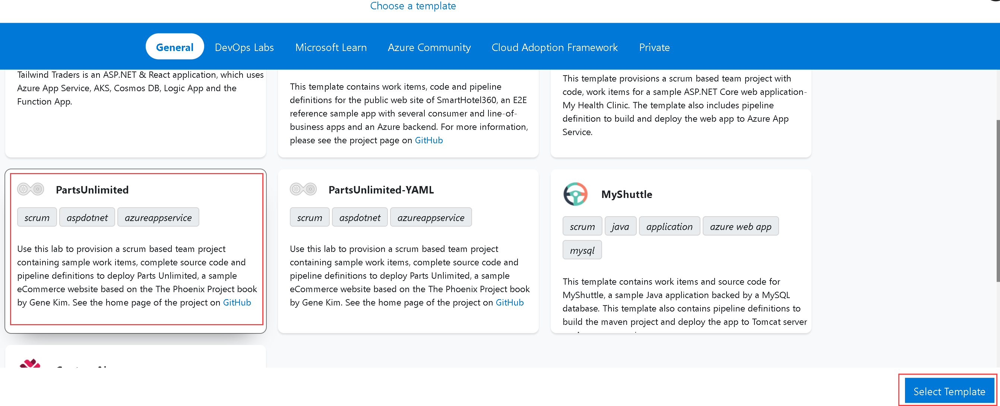

1.  返回“新建项目”页面，单击“创建项目” 

    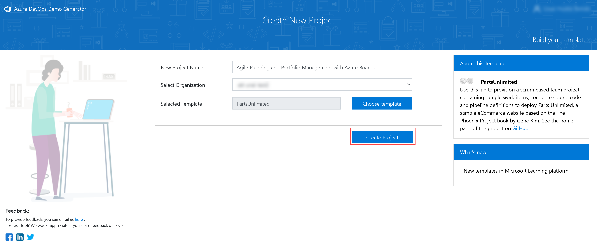

    > **注意**：等待此过程完成。 这大约需要 2 分钟。 如果该过程失败，请导航到你的 Azure DevOps 组织，删除项目并重试。

1.  在“新建项目”页面上，单击“导航到项目” 。

    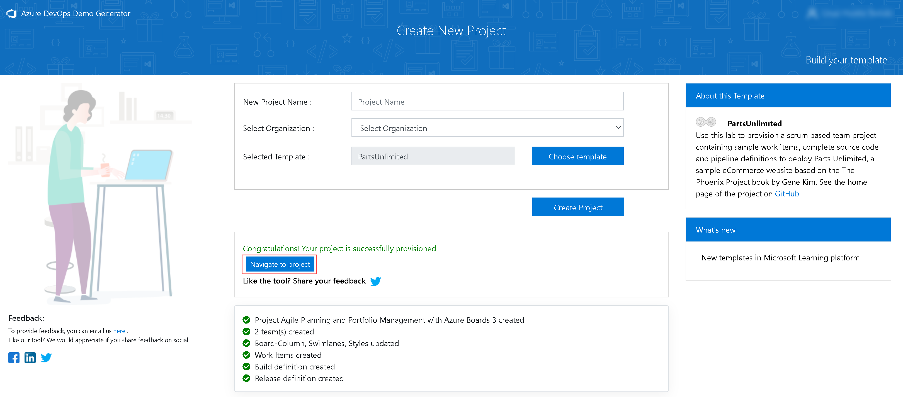

### 练习 1：管理敏捷项目

在本练习中，你将使用 Azure Boards 执行许多常见的敏捷规划和项目组合管理任务，包括管理团队、领域、迭代、工作项、冲刺和容量；自定义看板；定义仪表板；以及自定义团队流程。

#### 任务 1：管理团队、领域和迭代

在此任务中，你将创建一个新团队，并配置其领域和迭代。 

每个新项目都配置了默认团队，团队名称与项目名称一致。 你可以选择创建其他团队。 可向每个团队授予访问一套敏捷工具和团队资产的权限。 借助创建多个团队的功能，你可以灵活地在整个企业的自治和协作中选择适当的平衡。 

1.  验证 Web 浏览器是否显示你的 Azure DevOps 组织以及在上一练习中生成的“使用 Azure Boards 进行敏捷规划和项目组合管理”项目。 

    > **注意**：或者，你可以通过导航到 [https://dev.azure.com/`<your-Azure-DevOps-account-name>` /Agile%20Planning%20and%20Portfolio%20Management%20with%20Azure%20Boards) URL 直接访问项目页面，其中 `<your-Azure-DevOps-account-name>` 占位符代表帐户名称 . 

1.  单击左下角标有“项目设置”的齿轮图标，打开“项目设置”页面 。

    

1.  在“常规”部分，选择“团队”选项卡 。此项目中已有几个团队，但你需要为本实验室创建一个新团队。 单击“新建团队”。

    

1.  在“创建新团队”窗格的“团队名称”文本框中，键入 PUL-Web，将其他设置保留为默认值，然后单击“创建”   。

    

1.  在“团队”列表中，选择新创建的团队以查看其详细信息。

    > **注意**：默认情况下，新团队只有你一个成员。 你可以使用此视图来管理团队成员身份、通知和仪表板等功能。 

1.  单击 PUL-Web 页面顶部的“迭代和领域路径”链接，开始定义团队的计划和范围 。

    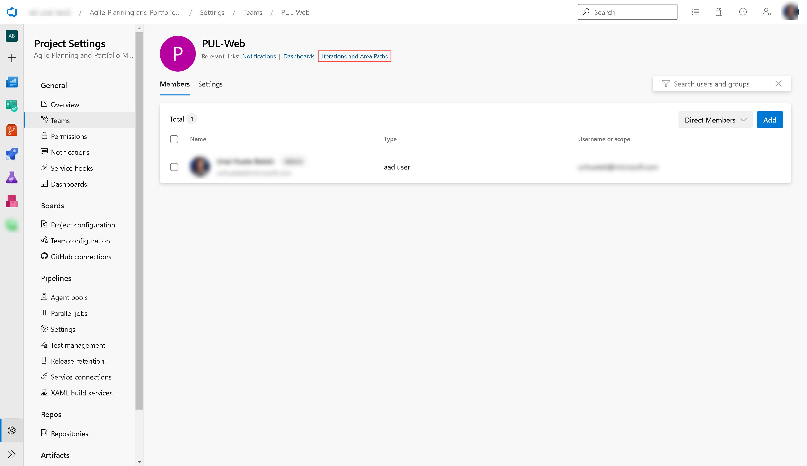

1.  在 Boards 窗格顶部，选择“迭代”选项卡，然后单击“+ 选择迭代”  。

    

1.  选择“使用 Azure Boards 进行敏捷规划和项目组合管理\冲刺 1”，然后单击“保存并关闭” 。 请注意，第一个冲刺已发生。 这是因为演示数据生成器专门用于生成项目历史记录，因此该冲刺发生在过去。

    > **注意**：新团队将使用已为其他团队生成的相同迭代计划，但是你也可以创建一个更适合自己组织的自定义迭代计划。

1.  重复上述步骤，添加“冲刺 2”和“冲刺 3” 。 第二个冲刺是当前的迭代，第三个冲刺将在不久的将来发生。

    

1.  返回 Boards 窗格，选择窗格顶部的“领域”选项卡 。你会看到此处有一个自动生成的领域，其名称与团队名称一致。
1.  单击“默认领域”条目旁边的省略号，然后在下拉列表中选择“包含子领域” 。 

    

    > **注意**：所有团队的默认设置都是排除子领域路径。 我们需要将此设置更改为包含子领域，以便团队可查看所有团队的全部工作项。 管理团队还可以选择不包含子领域，这会在将工作项分配到其中一个团队后尽快自动从工作项视图中删除这些工作项。

#### 任务 2：管理工作项

在此任务中，你将逐步完成常见的工作项管理任务。 

工作项在 Azure DevOps 中充当重要角色。 无论是描述要完成的工作、发布障碍、测试定义还是其他关键项，工作项都是现代项目的主要工具。 在此任务中，你将重点了解如何使用各种工作项来设置计划，以扩展包含产品训练部分的 Parts Unlimited 站点。 虽然构建公司产品/服务的此类重要部分让人望而生畏，但 Azure DevOps 和 Scrum 流程可显著简化管理。

> **注意**：此任务旨在说明可创建不同种类工作项的各种方式，以及演示平台提供的各项功能。 因此，这些步骤不应被视为项目管理的规范性指导。 这些功能足够灵活，可满足你的不同流程需求，让你可以随时进行探索和试验。

1.  在 Azure DevOps 门户的垂直导航窗格中，选择“Boards”图标并选择“工作项” 。
 
    > **注意**：可采用多种方法在 Azure DevOps 中创建工作项，我们将介绍其中一些方法。 创建工作项有时就像从仪表板触发一样简单。 

1.  在“工作项”窗口中，单击“+ 新建工作项”>“长篇故事” 。

    

1.  在“输入标题”文本框中，键入“产品培训” 。 
1.  选择左上角的“未分配”条目，在下拉列表中选择你的用户帐户，将新工作项分配给自己。 
1.  选择“领域”条目旁边的“使用 Azure Boards 进行敏捷规划和项目组合管理”条目，然后在下拉列表中选择 PUL-Web  。 这会将“领域”设置为“使用 Azure Boards 进行敏捷规划和项目组合管理\PUL-Web” 。 
1.  选择“迭代”条目旁边的“使用 Azure Boards 进行敏捷规划和项目组合管理”条目，然后在下拉列表中选择“冲刺 2”  。 这会将“迭代”设置为“使用 Azure Boards 进行敏捷规划和项目组合管理\冲刺 2” 。 
1.  单击“保存”  以完成更改。 请勿关闭它。

    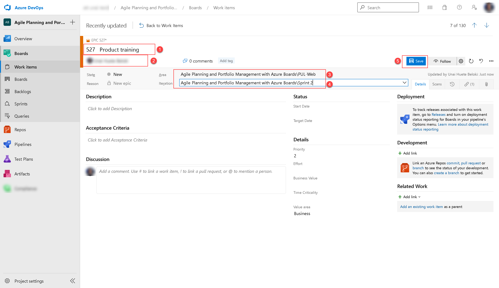

    > **注意**：通常，你会希望尽可能多地填充信息，但这些内容已足够用于完成本实验室的目的。

    > **注意**：工作项表单包括所有相关的工作项设置。 这包括有关向谁分配工作项的详细信息、工作项在许多参数中的状态、所有相关信息，以及自创建以来如何处理工作项的历史记录。 需要重点关注的其中一个领域是“相关工作”。 我们将介绍向此长篇故事添加功能的其中一种方法。 

1.  在右下角的“相关工作”部分，选择“添加链接”条目，然后在下拉列表中选择“新项目”  。
1.  在“添加链接”面板上，选择“工作项类型”下拉列表中的“功能”，在“标题”文本框中，键入“训练仪表板”并单击“确定”     。

 
    

    > **注意**：在“训练仪表板”面板上，请注意，分配、领域和迭代已设置为与该功能所基于的长篇故事相同的值  。 此外，该功能会自动链接到创建时所基于的父项。 

1.  在“训练仪表板”面板上，单击“保存并关闭” 。

    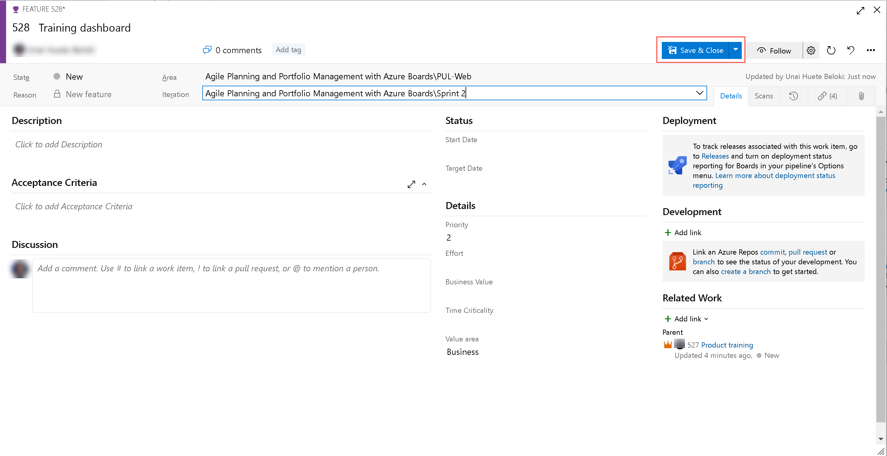

1.  在 Azure DevOps 门户的垂直导航窗格中，选择 Boards 项列表中的 Boards 。
1.  在 Boards 面板上，选择“PUL-Web 板”条目 。 这将为该特定团队打开板。

    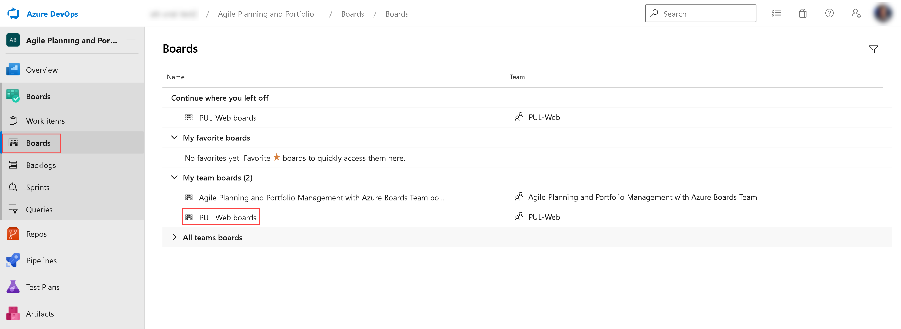

1.  在 Boards 面板的左上角，选择“积压工作项”条目，然后在下拉列表中选择“功能”  。 

    > **注意**：这样有助于轻松地将任务和其他工作项添加到功能中。

1.  将鼠标指针悬停在表示“训练仪表板”功能的矩形上方。 这将在其右上角显示省略号。
1.  单击省略号，然后在下拉列表中选择“添加产品积压工作项”。

    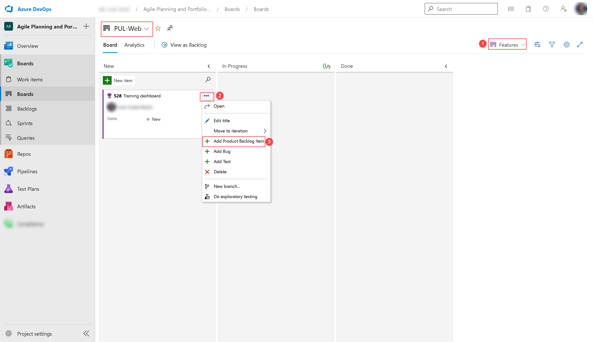

1.  在新产品积压工作项的文本框中，键入“作为客户，我想查看新教程”，然后按 Enter 键来保存条目 。 

    > **注意**：这会创建一个新的产品积压工作项 (PBI)，该工作项是功能的子项，可共享其领域和迭代。

1.  重复上一步，添加另外两个 PBI，这些 PBI 旨在使客户能够查看最近看过的教程以及请求新教程，它们的名称分别为“作为客户，我想查看最近看过的教程”和“作为客户，我想请求新教程” 。

    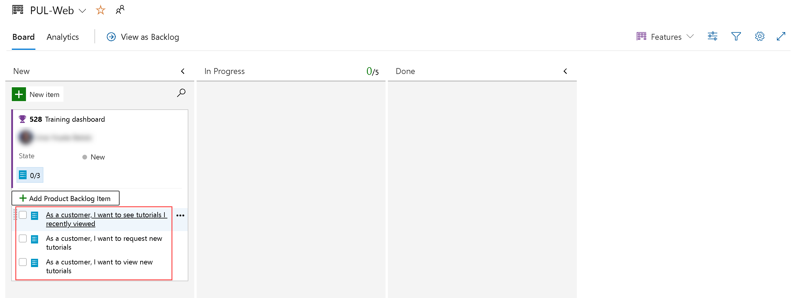

1.  在 Boards 面板的左上角，选择“功能”条目，然后在下拉列表中选择“积压工作项”  。

    > **注意**：积压工作项有一个状态，用于定义它们相对于完成所处的位置。 虽然你可以使用表单打开并编辑工作项，但直接将卡拖动到板上更简单。 

1.  在 PUL-Web 面板的“板”选项卡上，将名为“作为客户，我想查看新教程”的第一个工作项从“新建”拖动到“已批准”阶段    。

    

    > **注意**：你还可以展开工作项卡，方便地获取可编辑的详细信息。

1.  将鼠标指针悬停在表示已移动至“已批准”阶段的工作项的矩形上方。 这将显示朝下的插入符号。 
1.  单击朝下的插入符号展开工作项卡，选择“未分配”条目，然后在用户帐户列表中选择你的帐户，将已移动的 PBI 分配给自己。
1.  在 PUL-Web 面板的“板”选项卡上，将名为“作为客户，我想查看最近看过的教程”的第二个工作项从“新建”拖动到“已提交”阶段    。
1.  在 PUL-Web 面板的“板”选项卡上，将名为“作为客户，我想请求新教程”的第三个工作项从“新建”拖动到“完成”阶段    。

    

    > **注意**：任务板是积压工作的一种视图。 也可以使用表格视图。

1.  在 PUL-Web 窗格的“板”选项卡上，单击窗格顶部的“作为积压工作查看”，以表格形式显示积压工作  。

    

    > **注意**：你可以直接使用 PUL-Web 面板“积压工作”选项卡标签下的加号来查看这些工作项下的嵌套任务 。 

    > **注意**：你可以直接使用第一个积压工作项左侧的第二个加号来向其添加新任务。

1.  在 PUL-Web 窗格的“积压工作”选项卡上，在窗格左上角单击顶部的第二个加号，即第一个工作项旁边的加号 。 这会显示“新建任务”面板。

    

1.  在“新建任务”面板顶部，在“输入标题”文本框中，键入“为最新教程添加页面”  。 
1.  在“新建任务”面板的“剩余工时”文本框中，键入“5”  。
1.  在“新建任务”面板的“活动”下拉列表中，选择“开发”  。 
1.  在“新建任务”面板上，单击“保存并关闭” 。

    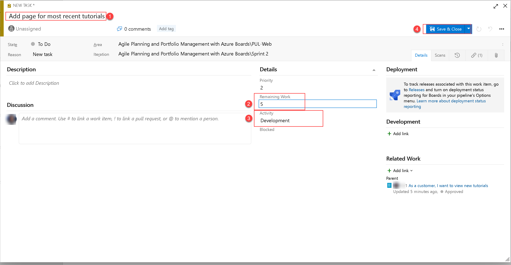

1.  重复最后五个步骤，添加另一个名为“针对最新教程优化数据查询”的任务。 将其“剩余工时”设置为“3”，将其“活动”设置为“设计”   。 完成后，单击“保存并关闭”。

#### 任务 3：管理冲刺 (sprint) 和容量

在此任务中，你将逐步完成常见的冲刺和容量管理任务。

团队会在冲刺规划会议（通常在冲刺的第一天举行）期间生成冲刺积压工作。 每个冲刺都对应有时间限制的时间间隔，可支持团队使用敏捷流程和工具进行工作。 在规划会议期间，产品所有者与团队协作确定要在冲刺中完成的故事或积压工作项。

规划会议通常由两部分组成。 在第一部分，团队和产品所有者会根据之前的冲刺经验，确定团队认为可以在冲刺中完成的积压工作项。 这些项会被添加到冲刺积压工作。 在第二部分，团队会确定如何开发并测试每个工作项。 然后，他们会定义和估计完成每个工作项所需的任务。 最后，团队致力于根据这些估计实现部分或全部工作项。

冲刺积压工作应包含团队在分配的时间内成功规划和完成工作所需的全部信息，而不必在最后匆忙赶工。 在规划冲刺之前，你会希望事先已创建和估计积压工作，并确定了优先级以及定义了冲刺。 

1.  在 Azure DevOps 门户的垂直导航窗格中，选择 Boards 图标，并在 Boards 项列表中选择“冲刺”  。
1.  在“冲刺”视图的“任务面板”选项卡上，选择工具栏右侧的“查看选项”符号（漏斗图标左侧），然后在“查看选项”下拉列表中，选择“工作详细信息”条目    。

    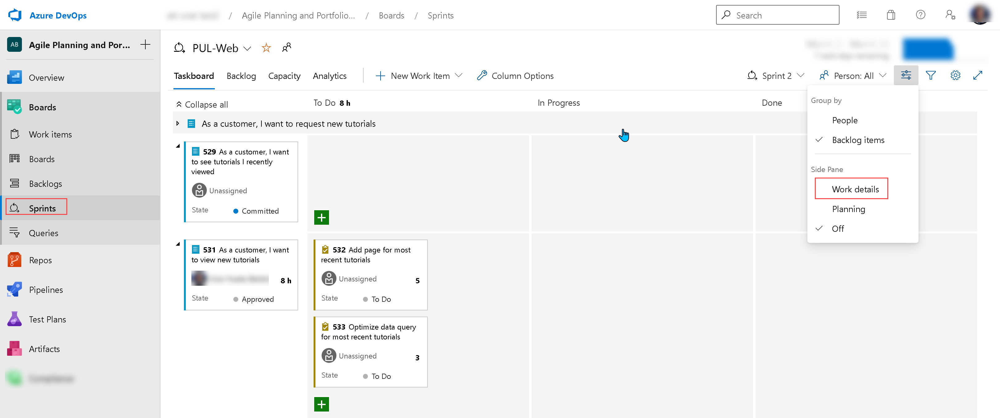

    > **注意**：当前冲刺的范围十分有限。 “待办”阶段包含两个任务。 目前，这两个任务均未分配。 它们都在“未分配”条目右侧显示一个数值，表示估计的剩余工时。 

1.  在表示“为最新教程添加页面”的矩形中，单击“未分配”条目，然后在用户帐户列表中，选择你的帐户，将任务分配给自己 。
1.  为自己分配“为最新教程任务添加页”。 

    > **注意**：这会自动更新“工作详情”窗格的 **“工作者: 分配到”部分** 。

1.  选择“冲刺”视图的“容量”选项卡 。 

    > **注意**：通过此视图，你能够定义用户可进行的活动以及所处的容量级别。 

1.  在“冲刺”视图的“容量”选项卡上，在“活动”标签下的“未分配”下拉列表中，选择“开发”，然后在“每天的容量”文本框中键入“1”      。 

    > **注意**：这表示每天 1 小时的开发工作量。 请注意，如果用户所进行的工作不仅仅是开发，则可为每位用户添加其他活动。 

    > **注意**：假设你要去度假。 

1.  在“冲刺”视图的“容量”选项卡上，在表示你的用户帐户的条目旁边的“休息日”列中，单击“0 天”条目   。 这会显示一个面板，你可在其中设置休息日。
1.  在显示的面板中，使用日历视图在当前冲刺期间（接下来的三周内）将你的假期设置为跨五个工作日，完成后单击“确定”。

    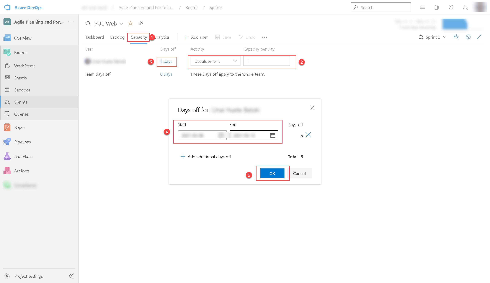

1.  返回到“冲刺”视图的“容量”选项卡，单击“保存”  。
1.  选择“冲刺”视图的“任务面板”选项卡 。

    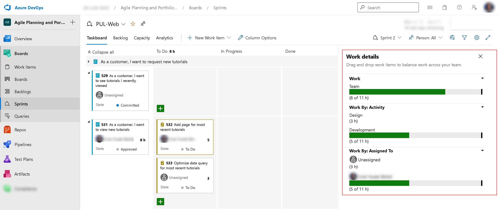

    > **注意**：请注意，已更新“工作详细信息”面板，以反映可用的带宽。 “工作详细信息”面板中显示的实际数字可能有所不同，但是由于你已分配每天 1 小时，因此总冲刺容量将等于冲刺结束前剩余的工作日天数。 记下这个值，你将在后续步骤中用到。

    > **注意**：该板的一项便捷功能是你可以轻松地在线更新关键数据。 定期更新“剩余工时”估计是一个不错的做法，可反映每个任务的预期时长。 假设你已查看“为最新教程添加页面”任务的工作，并且发现它实际所需的时间将比初始预期用时更长。 

1.  在“冲刺”视图的“任务面板”选项卡上，在表示“为最新教程添加页面”的方框中，将估计的小时数设置为与你在上一步中确定的冲刺总容量一致  。

    

    > **注意**：这会自动将“开发”和你的个人容量扩展至它们的最大值。 因为容量足以覆盖分配的任务，所以它们将保持绿色状态。 但是，由于“针对最新教程优化数据查询”任务需要额外 3 个小时，因此会超出团队总容量 。

    > **注意**：解决此容量问题的一种方法是将任务移到将来的迭代。 可采用多种方法来完成此操作。 例如，你可以在此处打开任务，并在提供任务详细信息访问权限的面板中对任务进行编辑。 另一种方法是使用“积压工作”视图，其中提供可移动任务的内嵌菜单选项。 但是现在请勿移动任务。

1.  在“冲刺”视图的“任务面板”选项卡上，选择工具栏右侧的“查看选项”符号（漏斗图标左侧），然后在“查看选项”下拉列表中，选择“人员”条目    。

    

    > **注意**：这会调整视图，以便你可以按人员而非按积压工作项来查看任务进度。

    > **注意**：此外还提供许多自定义项。 

1.  单击“配置团队设置”齿轮图标（位于漏斗图标右侧）。
1.  在“设置”面板上，选择“样式”选项卡，单击“+ 样式规则”，在“规则名称”标签下的“名称”文本框中，键入“开发”，然后在“卡片颜色”下拉列表中选择绿色矩形      。 

    > **注意**：如果所有卡片均符合下方设置的规则条件（在“规则条件”部分），此操作会将这些卡片设置为绿色。

1.  在“规则条件”部分中，在“字段”下拉列表中选择“活动”，在“运算符”下拉列表中选择“=”，然后在“值”下拉列表中选择“开发”      。 

    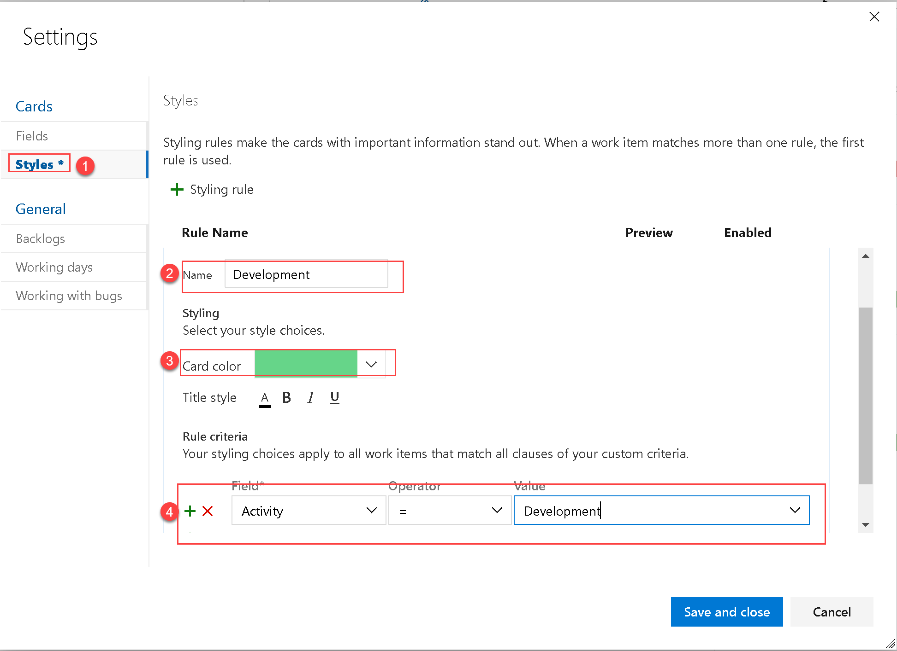

    > **注意**：这会将分配到“开发”活动的所有卡片设置为绿色。

1.  在“设置”面板上，选择“积压工作”选项卡 。 

    > **注意**：通过此选项卡上的条目，你可以设置可用于导航的级别。 默认情况下，不包含长篇故事，但你可以对此进行更改。

1.  在“设置”面板上，选择“工作日”选项卡 。 

    > **注意**：通过此选项卡的条目，你可以指定团队遵循的“工作日”。 这会应用于容量和燃尽计算。

1.  在“设置”面板上，选择“处理 bug”选项卡 。 

    > **注意**：通过此选项卡上的条目，你可以指定 bug 在板上的显示方式。

1.  在“设置”面板上，单击“保存并关闭”以保存样式规则 。

    > **注意**：与“开发”相关联的任务现在显示为绿色，易于识别。

#### 任务 4：自定义看板

在此任务中，你将逐步完成自定义看板的过程。

为了最大限度地提高团队持续交付高质量软件的能力，看板强调了两个主要做法。 第一个做法是可视化工作流，这要求你映射团队的工作流阶段并配置要匹配的看板。 第二个做法是限制正在进行的工作量，这要求你设置正在进行的工作 (WIP) 限制。 然后，你就可以在看板上跟踪进度，并监视关键指标，以缩短提前期或周期时间。 看板会将积压工作 (backlog) 转变为交互式标识板，并提供可视的工作流。 随着工作从创意阶段进行到完成，你将更新面板上的项。 每一列代表一个工作阶段，每张卡片代表该工作阶段的一个用户故事（蓝色卡片）或 bug（红色卡片）。 但是，随着时间的迁移，每个团队都会开发其自己的流程，因此自定义看板以匹配团队工作方式的能力对于成功交付至关重要。

1.  在 Azure DevOps 门户的垂直导航窗格中，选择 Boards 项列表中的 Boards 。
1.  在 Boards 面板上，单击“配置团队设置”齿轮图标（位于漏斗图标右侧） 。

    > **注意**：团队强调与数据相关的工作，因此需要特别注意任何与访问或存储数据相关联的任务。 

1.  在“设置”面板上，选择“标记颜色”选项卡，单击“+ 标记颜色”，在“标记”文本框中键入“数据”，并保留默认颜色    。

    

    > **注意**：当积压工作项或 bug 具有“数据”标记时，将突出显示该标记。

1.  在“设置”面板上，选择“注释”选项卡 。

    > **注意**：你可以指定要包括在卡片上的注释，以使其更易于阅读和导航。 启用注释时，通过单击每张卡片上的可视化项，可轻松访问该类型的子工作项。

1.  在“设置”面板上，选择“测试”选项卡 。

    > **注意**：通过“测试”选项卡，你可以配置测试在卡片上的显示方式和行为方式。

1.  在“设置”面板上，单击“保存并关闭”以保存样式规则 。
1.  在 PUL-Web 面板的“板”选项卡上，右键单击表示“作为客户，我想查看新教程”积压工作项的矩形，然后选择“打开”   。
1.  在“作为客户，我想查看新教程”面板上，在面板顶部的“0 注释”条目右侧，单击“添加标记”  。
1.  在生成的文本框中，键入“数据”并按 Enter 键 。 
1.  重复上一步，添加 ux 标记。 
1.  在“作为客户，我想查看新教程”面板上，单击“保存并关闭” 。

    

    > **注意**：这两个标记目前在卡片上是可见的，根据配置，其中以黄色突出显示了“数据”标记。

1.  在 Boards 面板上，单击“配置团队设置”齿轮图标（位于漏斗图标右侧） 。
1.  在“设置”面板上，选择“列”选项卡 。 

    > **注意**：通过此部分，你可以向工作流添加新阶段。 

1.  单击“+ 列”，在“列名称”标签下的“名称”文本框中，键入“已批准 QA”，然后在“WIP 限制”文本框中，键入“1”     

    > **注意**：正在进行的工作限制为 1，表示目前此阶段中应该只有一个工作项。 你通常会将此限制设置为更高的值，但只有两个工作项可演示该功能。 

1.  在“设置”面板的“列”选项卡上，在“已提交”和“完成”之间拖放新创建的选项卡   。
1.  在“设置”面板上，单击“保存并关闭” 。

    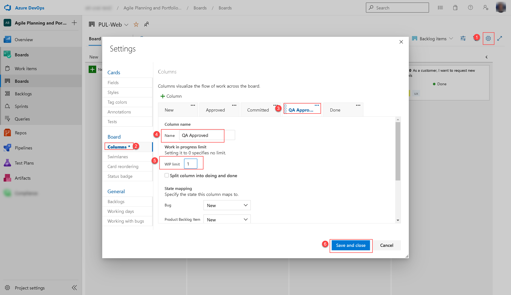

    > **注意**：验证现在是否可在工作流中看到该新阶段。

1.  将“作为客户，我想查看最近看过的教程”工作项从“已提交”阶段拖放到“已批准 QA”阶段  。
1.  将“作为客户，我想查看新教程”工作项从“已批准 QA”阶段拖放到“完成”阶段  。

    

    > **注意**：此阶段当前已超过其 WIP 限制，并且其颜色已变为红色，表示警告。

1.  将“作为客户，我想查看最近看过的教程”工作项移回至“已提交” 。
1.  在 Boards 面板上，单击“配置团队设置”齿轮图标（位于漏斗图标右侧） 。
1.  在“设置”面板上，返回到“列”选项卡，然后选择“已批准 QA”选项卡  。 

    > **注意**：工作移动至列中的时间与工作开始的时间之间存在滞后时间。 若要计算该滞后时间并显示正在进行的工作的实际状态，可启用拆分列。 拆分后，每列将包含两个子列：“进行中”和“完成” 。 通过拆分列，你的团队可实现拉取模型。 如果没有拆分列，团队会向前推进工作，以表明他们已完成工作阶段。 但是，将工作推进到下一阶段并不意味着团队成员需要立即开始处理该项目。 

1.  在“已批准 QA”选项卡上，选中“将列拆分为‘进行中’和‘完成’”复选框以创建两个单独的列 。

    > **注意**：如果你的团队在工作从某个阶段进入下一阶段时更新此工作的状态，则有助于他们就“完成”的含义达成共识。 通过指定每个看板列的“完成的定义”条件，你可在将某个项移动至下游阶段之前帮助共享要完成的重要任务。 

1.  在面板底部的“已批准 QA”选项卡上，在“完成的定义”文本框中，键入“通过所有测试”  **\*\*\*\*** 。 
1.  在“设置”面板上，单击“保存并关闭” 。

    

    > **注意**：“已批准 QA”阶段现在具有“进行中”和“完成”列  。 你还可以单击列标题旁边的信息符号（里面包含字母 i 的圆圈），以阅读“完成的定义” 。

1.  在 Boards 面板上，单击“配置团队设置”齿轮图标（位于漏斗图标右侧） 。

    > **注意**：通过看板，你可以可视化工作从新建到完成所经历的流程。 添加泳道时，还可以可视化支持不同服务级别类的工作状态。 你可以创建泳道来表示任何支持跟踪需求的其他维度。 

1.  在“设置”面板上，选择“泳道”选项卡 。 
1.  在“泳道”选项卡上，单击“+ 泳道”，在“泳道名称”标签下的“名称”文本框中，键入“加速”    。 
1.  在“设置”面板上，单击“保存并关闭” 。

    

1.  返回到 Boards 面板的“版块”选项卡，将“已提交”工作项拖放到加速泳道的“已批准 QA \| 执行”阶段，以便在 QA 带宽可用时被识别为优先项    。

    > **注意**：如果你想查看包含更多工作项的更精细的板，请在 Boards 面板的“板”选项卡上，选择左上角的 PUL-Web，然后在团队下拉列表中，选择“通过 Azure Boards 团队进行敏捷规划和项目组合管理”   。 此板为你提供一个可进行试验并查看结果的操场。

#### 任务 5：自定义团队流程

在此任务中，我们将创建基于 Scrum 的自定义流程。 此流程将包含积压工作项字段，专门用于跟踪专用的 PartsUnlimited 票证 ID。

在 Azure DevOps 中，你可通过流程自定义工作跟踪体验。 流程可定义工作项跟踪系统的构建基块以及可通过 Azure DevOps 访问的其他子系统。 创建团队项目时，可选择包含项目所需构建基块的流程。 Azure DevOps 支持两种流程类型。 第一种为核心系统流程（Scrum、Agile 和 CMMI），它们是只读流程，无法进行自定义。 第二种类型为继承流程，由你基于核心系统流程创建，其中包含自定义流程设置的选项。 

同一组织共享所有流程。 即，一个或多个团队项目可引用单个流程。 你无需自定义单个团队项目，可直接自定义流程。 对流程所做的更改会自动更新引用该流程的所有团队项目。 创建继承流程之后，你可对其进行自定义、基于该流程创建团队项目，以及迁移现有团队项目以引用该流程。 Git 团队项目无法自定义，除非将其迁移到继承流程。

1.  在 Azure DevOps 页面上，单击左上角的 Azure DevOps 徽标，导航到帐户根目录页。
1.  在页面左下角，单击“组织设置”。

    

1.  在“组织设置”垂直菜单的 Boards 部分，选择“流程”  。
1.  在“所有流程”窗格上，选择“Scrum”条目右侧的省略号，然后在下拉菜单中，选择“创建继承流程”  。

    
    
1.  在“从 Scrum 创建继承流程”面板中，在“流程名称(必填)”文本框中键入“自定义 Scrum”，然后单击“创建流程”   。
1.  返回到“所有流程”窗格，单击“自定义 Scrum”条目 。 

    > **注意**：你可能需要刷新浏览器，以便新流程处于可见状态。

1.  在“所有流程”>“自定义 Scrum”窗格上，选择“产品积压工作项” 。

    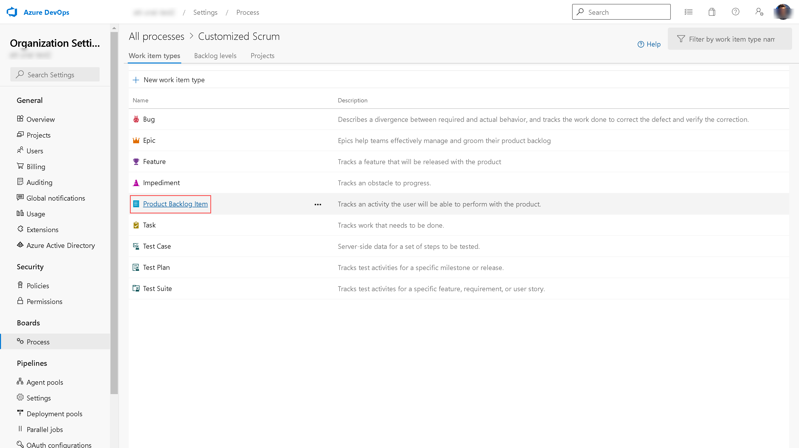
    
1.  在“所有流程”>“自定义 Scrum”>“产品积压工作项”窗格上，单击“新建字段” 。
1.  在“向产品积压工作项添加字段”面板上，在“定义”选项卡上“创建字段”部分的“名称”文本框中，键入“PUL 票证 ID”    。

    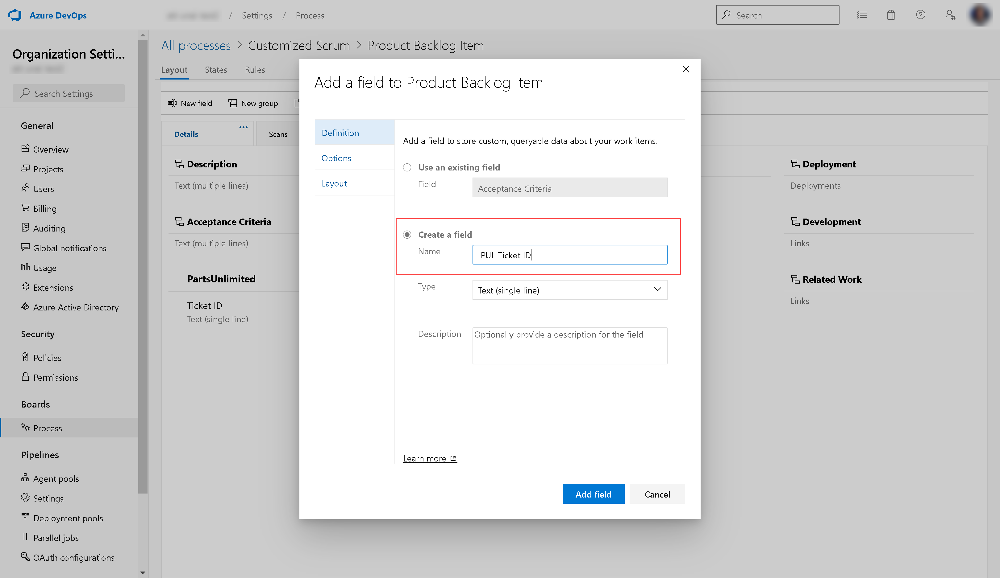
    
1.  在“向产品积压工作项添加字段”面板上，单击“布局” 。 
1.  在“向产品积压工作项添加字段”面板上，在“布局”选项卡的“标签”文本框中，键入“票证 Id”，选择“创建新组”选项，在“组”文本框中键入 PartsUnlimited，然后单击“添加字段”       。

    

    > **注意**：配置自定义流程后，现在可切换到“使用 Azure Boards 进行敏捷规划和项目组合管理”项目来使用它。 

1.  使用位于“所有流程”>“自定义 Scrum”>“产品积压工作项”窗格顶部的痕迹导航路径，返回到“所有流程”根目录 。
1.  在“所有流程”窗格上，选择“Scrum”条目 。

    

    > **注意**：当前项目使用 Scrum。

1.  在“所有流程”>“Scrum”窗格上，选择“项目”选项卡 。
1.  在项目列表中，在包含“使用 Azure Boards 进行敏捷规划和项目组合管理”条目的行中，选择省略号，然后选择“更改流程” 。
1.  在“更改项目流程”窗格上，在“选择目标流程”下拉列表中，选择“自定义 Scrum”流程，单击“保存”，然后单击“关闭”    。

    

1.  单击左上角的 Azure DevOps 徽标，返回到帐户根目录页。
1.  在“项目”选项卡上，选择表示“使用 Azure Boards 进行敏捷规划和项目组合管理”项目的条目 。
1.  在“使用 Azure Boards 进行敏捷规划和项目组合管理”页面左侧的垂直菜单中，选择 Boards 并确保显示“工作项”窗格  。
1.  在工作项列表中，单击第一个积压工作项。
1.  验证目前 PartsUnlimited 组下是否有“票证 ID”字段，该字段在流程自定义期间定义 。 可以将此视为任何其他文本字段。

    

    > **注意**：保存工作项之后，Azure DevOps 还会保存新的自定义信息，以便此信息可用于查询并通过 Azure DevOps 的其余部分进行使用。

### 练习 2（可选）：定义仪表板

在此任务中，你将逐步完成创建仪表板及其核心组件的过程。

通过仪表板，团队可以可视化状态并监视整个项目的进度。 你可以快速做出明智的决策，而无需深入查看团队项目站点的其他部分。 “概述”页面提供对默认团队仪表板的访问权限，你可通过添加、删除或重新排列磁贴来自定义该仪表板。 每个磁贴都对应一个小组件，可提供对一个或多个功能的访问权限。

1.  在 Azure DevOps 门户的垂直导航窗格中，选择“概述”图标，并在“概述”项列表中选择“仪表板”  。
1.  如有必要，在“仪表板”窗格左上角的“通过 Azure Boards 团队进行敏捷规划和项目组合管理”部分，选择“通过 Azure Boards 团队进行敏捷规划和项目组合管理 - 概述”并查看现有仪表板  。

    

1.  在“仪表板”窗格中，选择“使用 Azure Boards 进行敏捷规划和项目组合管理 - 概述”旁边的下拉菜单标题，然后选择“+ 新建仪表板”  。

    

1.  在“创建仪表板”窗格上的“名称”文本框中，键入“产品训练”，在“团队”下拉列表中选择 PUL-Web 团队，然后单击“创建”     。

    

1.  在新的仪表板窗格上，单击“添加小组件”。
1.  在“添加小组件”面板上的“搜索”文本框中，键入“冲刺”，查找专门处理冲刺的现有小组件  。 在结果列表中，选择“冲刺概述”并单击“添加” 。
1.  在表示新添加的小组件的矩形中，单击“设置”齿轮图标，并查看“配置”窗格 。

    > **注意**：自定义项级别因小组件而异。 

1.  在“配置”窗格上，单击“关闭”，无需进行任何更改 。
1.  返回到“添加小组件”窗格，在“搜索”文本框中再次键入“冲刺”，查找专门处理冲刺的现有小组件  。 在结果列表中，选择“冲刺容量”并单击“添加” 。
1.  在“仪表板”视图中，单击窗格顶部的“完成编辑” 。

    

    > **注意**：你现在可在自定义仪表板上查看当前冲刺的两个重要方面。

    > **注意**：自定义仪表板的另一种方法是基于工作项查询生成图表，然后将这些图表共享到仪表板。 

1.  在 Azure DevOps 门户的垂直导航窗格中，选择 Boards 图标，并在 Boards 项列表中选择“查询”  。
1.  在“查询”窗格上，单击“+ 新建查询” 。
1.  在“查询”>“我的查询”窗格的“编辑器”选项卡上，在“工作项类型”行的“值”下拉列表中，选择“任务”    。
1.  在“查询”>“我的查询”窗格的“编辑器”选项卡上，在第二行的“字段”列中，选择“区域路径”，然后在相应的“值”下拉列表中，选择“使用 Azure Boards 进行敏捷规划和项目组合管理\\ PUL-Web”     。
1.  单击“保存查询”。

    

1.  在“新建查询”面板的“输入名称”文本框中，键入“Web 任务”，在“文件夹”下拉列表中选择“共享的查询”，然后单击“确定”     。
1.  选择“图表”选项卡，并单击“+ 新建图表” 。
1.  在“配置图表”面板上的“名称”文本框中，键入“Web 任务 - 按分配”，在“分组依据”下拉列表中选择“分配到”，然后单击“确定”以保存更改     。

    

    > **注意**：你现在可将此图表添加到仪表板。
#### 审阅

在本实验室中，你已使用 Azure Boards 执行许多常见的敏捷规划和项目组合管理任务，包括管理团队、领域、迭代、工作项、冲刺和容量；自定义看板；定义仪表板；以及自定义团队流程。
