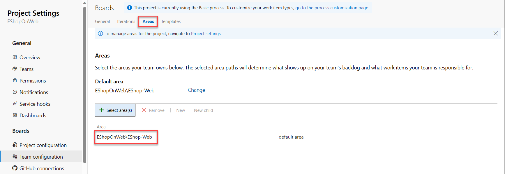
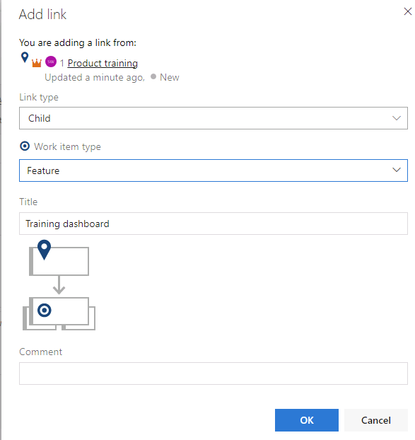
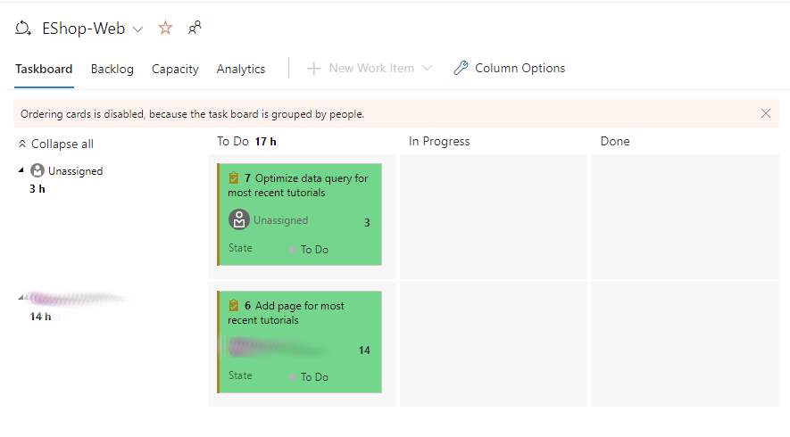
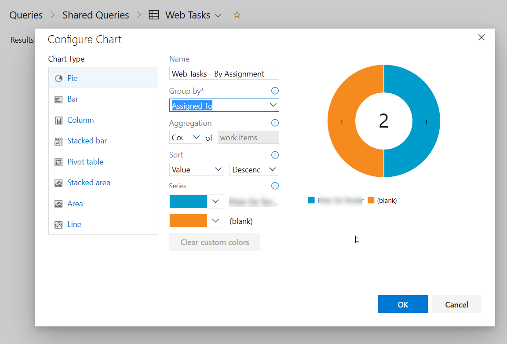

---
lab:
  title: 使用 Azure Boards 进行敏捷规划和项目组合管理
  module: 'Module 01: Implement development for enterprise DevOps'
---

# 使用 Azure Boards 进行敏捷规划和项目组合管理

## 实验室要求

- 本实验室需要使用 Microsoft Edge 或[支持 Azure DevOps 的浏览器](https://docs.microsoft.com/azure/devops/server/compatibility?view=azure-devops#web-portal-supported-browsers)。

- 设置 Azure DevOps 组织：如果还没有可用于本实验室的 Azure DevOps 组织，请按照[创建组织或项目集合](https://docs.microsoft.com/azure/devops/organizations/accounts/create-organization?view=azure-devops)中的说明创建一个。

## 实验室概述

在本实验室中，你将了解 Azure Boards 提供的敏捷规划和项目组合管理工具和流程，以及它们如何帮助你快速规划、管理和跟踪整个团队的工作。 你将探索产品积压工作 (backlog)、冲刺 (sprint) 积压工作和任务板，可用于跟踪迭代期间的工作流。 我们还将了解此版本中的增强工具，以便扩展到更大的团队和组织中。

## 目标

完成本实验室后，你将能够：

- 管理团队、领域和迭代。
- 管理工作项。
- 管理冲刺 (sprint) 和容量。
- 自定义看板。
- 定义仪表板。
- 自定义团队流程。

## 预计用时：60 分钟

## 说明

### 练习 0：（如已完成，则跳过）配置实验室先决条件

在本练习中，你将设置实验室先决条件，其中包括设置新的 Azure DevOps 项目，该项目的存储库基于 [eShopOnWeb](https://github.com/MicrosoftLearning/eShopOnWeb)。

#### 任务 1：（如果已完成，请跳过此任务）创建和配置团队项目

在此任务中，你将创建一个 eShopOnWeb Azure DevOps 项目，供多个实验室使用。

1. 在实验室计算机上，在浏览器窗口中打开 Azure DevOps 组织。 单击“新建项目”。 将项目命名为“eShopOnWeb”。 将“可见性”选项定义为“专用”。
1. 单击“高级”，并将“Scrum”指定为“工作项流程”。
 单击“创建”。

    

### 练习 1：管理敏捷项目

在本练习中，你将使用 Azure Boards 执行许多常见的敏捷规划和项目组合管理任务，包括管理团队、领域、迭代、工作项、冲刺和容量；自定义看板；定义仪表板；以及自定义团队流程。

#### 任务 1：管理团队、领域和迭代

在此任务中，你将创建一个新团队，并配置其领域和迭代。

每个新项目都配置了默认团队，团队名称与项目名称一致。 你可以选择创建其他团队。 可向每个团队授予访问一套敏捷工具和团队资产的权限。 借助创建多个团队的功能，你可以灵活地在整个企业的自治和协作中选择适当的平衡。

1. 在实验室计算机上，启动 Web 浏览器并导航到 Azure DevOps 门户 `https://aex.dev.azure.com`。

   > **注意**：使用与 Azure DevOps 订阅关联的 Microsoft 帐户登录。

1. 在 Azure DevOps 组织下打开 **eShopOnWeb** 项目。

    > **注意**：或者，可以通过导航到 <https://dev.azure.com/YOUR-AZURE-DEVOPS-ORGANIZATION/PROJECT-NAME> URL 直接访问项目页，其中 YOUR-AZURE-DEVOPS-ORGANIZATION 占位符表示帐户名称，PROJECT-NAME 占位符表示项目的名称。

1. 单击左下角标有“项目设置”的齿轮图标，打开“项目设置”页面 。

     

1. 在“常规”部分中，选择“团队”选项卡。******** 此项目中已有一个默认团队：eShopOnWeb 团队，但你需要为本实验室创建一个新团队。**** 单击“新建团队”。

    

1. 在“**创建新团队**”窗格的“**团队名称**”文本框中，键入“**`EShop-Web`**”，将其他设置保留为默认值，然后单击“**创建**”。

    

1. 在“团队”列表中，选择新创建的团队以查看其详细信息。

    > **注意**：默认情况下，新团队只有你一个成员。 你可以使用此视图来管理团队成员身份、通知和仪表板等功能。

1. 单击“EShop-Web”页顶部的“迭代和区域路径”链接，开始定义团队的计划和范围。

    

1. 在 Boards 窗格顶部，选择“迭代”选项卡，然后单击“+ 选择迭代”  。

    

1. 选择“eShopOnWeb\冲刺 1”，然后单击“保存并关闭”。******** 请注意，第一个冲刺将在迭代列表中显示，但“日期”尚未设置。
1. 选择“冲刺 1”，然后单击省略号 (...)。在上下文菜单中，选择“编辑”。

     

    > 注意：将开始日期指定为上周的第一个工作日，并为每个冲刺包括 3 个完整的工作周。 例如，如果 3 月 6 日是冲刺的第一个工作日，它会一直持续到 3 月 24 日。 冲刺 2 从 3 月 27 日开始，距离 3 月 6 日还有 3 周。

1. 重复上述步骤，添加“冲刺 2”和“冲刺 3” 。 你可以说，我们目前处于第一个冲刺的第 2 周。

    

1. 还是在“项目设置 / Boards / 团队配置”窗格中，在窗格顶部选择“领域”选项卡。******** 你会看到此处有一个自动生成的领域，其名称与团队名称一致。

    

1. 单击“默认区域”条目旁边的省略号 (...)，然后在下拉列表中选择“包含子区域”。

    

    > **注意**：所有团队的默认设置都是排除子领域路径。 我们需要将此设置更改为包含子领域，以便团队可查看所有团队的全部工作项。 管理团队还可以选择不包含子领域，这会在将工作项分配到其中一个团队后尽快自动从工作项视图中删除这些工作项。

#### 任务 2：管理工作项

在此任务中，你将逐步完成常见的工作项管理任务。

工作项在 Azure DevOps 中充当重要角色。 无论是描述要完成的工作、发布障碍、测试定义还是其他关键项，工作项都是现代项目的主要工具。 在此任务中，你将重点了解如何使用各种工作项来设置计划，以扩展包含产品培训部分的 eShopOnWeb 站点。 虽然构建公司产品/服务的此类重要部分让人望而生畏，但 Azure DevOps 和 Scrum 流程可显著简化管理。

> **注意**：此任务旨在说明可创建不同种类工作项的各种方式，以及演示平台提供的各项功能。 因此，这些步骤不应被视为项目管理的规范性指导。 这些功能足够灵活，可满足你的不同流程需求，让你可以随时进行探索和试验。

1. 单击 Azure DevOps 门户左上角的项目名称，返回到项目主页。

1. 在 Azure DevOps 门户的垂直导航窗格中，选择“Boards”图标并选择“工作项” 。

    > **注意**：可采用多种方法在 Azure DevOps 中创建工作项，我们将介绍其中一些方法。 创建工作项有时就像从仪表板触发一样简单。

1. 在“工作项”窗口中，单击“+ 新建工作项”>“长篇故事” 。

    

1. 在“**输入标题**”文本框中，键入“**`Product training`**”。
1. 选择左上角的“**未选中任何人**”条目，在下拉列表中选择你的用户帐户，将新工作项分配给自己。 如果未以你的姓名开头，请开始键入姓名，然后单击“搜索”****。
1. 在“区域”项的旁边，选择“eShopOnWeb”项，然后在下拉列表中选择“EShop-WEB”。 这会将“区域”设置为“eShopOnWeb\EShop-WEB”。
1. 在“迭代”项的旁边，选择“eShopOnWeb”项，然后在下拉列表中选择“冲刺 2”。 这会将“迭代”设置为“eShopOnWeb\冲刺 2”。
1. 单击“保存” **** 以完成更改。 请勿关闭它。

    

    > **注意**：通常，你会希望尽可能多地填充信息，但这些内容已足够用于完成本实验室的目的。

    > **注意**：工作项表单包括所有相关的工作项设置。 这包括有关向谁分配工作项的详细信息、工作项在许多参数中的状态、所有相关信息，以及自创建以来如何处理工作项的历史记录。 需要重点关注的其中一个领域是“相关工作”。 我们将介绍向此长篇故事添加功能的其中一种方法。

1. 在右下角的“相关工作”部分，选择“添加链接”条目，然后在下拉列表中选择“新项目”  。
1. 在“添加链接”面板的“链接类型”下拉列表中，选择“子级”。 接着，在“**工作项类型**”下拉列表中选择“**功能**”，在“**标题**”文本框中键入**`Training dashboard`**。

    

1. 单击“**添加链接**”以保存子项。

    

    > **注意**：在“训练仪表板”面板上，请注意，分配、领域和迭代已设置为与该功能所基于的长篇故事相同的值  。 此外，该功能会自动链接到创建时所基于的父项。

1. 在（新增功能）“**训练仪表板**”面板上，单击“**保存并关闭**”。

1. 在 Azure DevOps 门户的垂直导航窗格中，在“版块”项列表中选择“版块”。 .
1. 在“版块”面板上，选择“EShop-WEB 版块”项。 这将为该特定团队打开板。

    

1. 在 Boards 面板的左上角，选择“积压工作项”条目，然后在下拉列表中选择“功能”  。

    > **注意**：这样有助于轻松地将任务和其他工作项添加到功能中。

1. 将鼠标指针悬停在表示“训练仪表板”功能的矩形上方。 这将在它的右上角显示省略号 (...)。
1. 单击省略号 (...)，然后在下拉列表中选择“添加产品积压工作项”。

    

1. 在新的产品积压工作项的文本框中，键入“**`As a customer, I want to view new tutorials`**”，然后按 **Enter** 键来保存条目。

    > **注意**：这会创建一个新的产品积压工作项 (PBI)，该工作项是功能的子项，可共享其领域和迭代。

1. 重复上一步，添加另外两个 PBI，这些 PBI 旨在使客户能够查看最近看过的教程以及请求新教程，它们的名称分别为“**`As a customer, I want to see tutorials I recently viewed`**”和“**`As a customer, I want to request new tutorials`**”。

    

1. 在 Boards 面板的左上角，选择“功能”条目，然后在下拉列表中选择“积压工作项”  。

     

    > **注意**：积压工作项有一个状态，用于定义它们相对于完成所处的位置。 虽然你可以使用表单打开并编辑工作项，但直接将卡拖动到板上更简单。

1. 在“EShop-WEB”面板的“版块”选项卡上，将名为“作为客户，我想查看新教程”的第一个工作项从“新建”拖动到“已批准”阶段。

    

    > **注意**：你还可以展开工作项卡，方便地获取可编辑的详细信息。

1. 将鼠标指针悬停在表示已移动至“已批准”阶段的工作项的矩形上方。 这将显示朝下的插入符号。
1. 单击向下箭头符号以展开工作项卡，将“未分配”条目替换为你的姓名，然后选择你的帐户以将移动的 PBI 分配给自己****。
1. 在“EShop-WEB”面板的“版块”选项卡上，将名为“作为客户，我想查看最近看过的教程”的第二个工作项从“新建”拖动到“已提交”阶段。
1. 在“EShop-WEB”面板的“版块”选项卡上，将名为“作为客户，我想请求新教程”的第三个工作项从“新建”拖动到“完成”阶段。

    

    > **注意**：任务板是积压工作的一种视图。 也可以使用表格视图。

1. 在“EShop-WEB”窗格的“版块”选项卡上，单击窗格顶部的“作为积压工作查看”，以表格形式显示积压工作。

    

    > 注意：你可以直接使用“EShop-WEB”面板“积压工作”选项卡标签下的加号来查看这些工作项下的嵌套任务。

    > **注意**：你可以直接使用第一个积压工作项左侧的第二个加号来向其添加新任务。

1. 在“EShop-WEB”窗格的“积压工作”选项卡上，在窗格左上角单击第一个工作项旁边的加号。******** 这会显示“新建任务”面板。

    

1. 在“**新建任务**”面板顶部，在“**输入标题**”文本框中，键入“**`Add page for most recent tutorials`**”。
1. 在“新建任务”面板的“剩余工时”文本框中，键入“5”  。
1. 在“新建任务”面板的“活动”下拉列表中，选择“开发”  。
1. 在“**新建任务**”面板上，单击“**保存并关闭**”。

    

1. 重复最后五个步骤以添加名为 **`Optimize data query for most recent tutorials`** 的另一个任务。 将其“剩余工时”设置为“3”，将其“活动”设置为“设计”   。 完成后，单击“**保存并关闭**”。

#### 任务 3：管理冲刺 (sprint) 和容量

在此任务中，你将逐步完成常见的冲刺和容量管理任务。

团队会在冲刺规划会议（通常在冲刺的第一天举行）期间生成冲刺积压工作。 每个冲刺都对应有时间限制的时间间隔，可支持团队使用敏捷流程和工具进行工作。 在规划会议期间，产品所有者与团队协作确定要在冲刺中完成的故事或积压工作项。

规划会议通常由两部分组成。 在第一部分，团队和产品所有者会根据之前的冲刺经验，确定团队认为可以在冲刺中完成的积压工作项。 这些项会被添加到冲刺积压工作。 在第二部分，团队会确定如何开发并测试每个工作项。 然后，他们会定义和估计完成每个工作项所需的任务。 最后，团队致力于根据这些估计实现部分或全部工作项。

冲刺积压工作应包含团队在分配的时间内成功规划和完成工作所需的全部信息，而不必在最后匆忙赶工。 在规划冲刺之前，你会希望事先已创建和估计积压工作，并确定了优先级以及定义了冲刺。

1. 在 Azure DevOps 门户的垂直导航窗格中，选择 Boards 图标，并在 Boards 项列表中选择“冲刺”  。
1. 在“冲刺”视图的“任务面板”选项卡上，选择工具栏右侧的“查看选项”符号（漏斗图标左侧），然后在“查看选项”下拉列表中，选择“工作详细信息”条目    。 选择“Sprint 2”作为筛选器。****

    

    > **注意**：当前冲刺的范围十分有限。 “待办”阶段包含两个任务。 目前，这两个任务均未分配。 它们都在“未分配”条目右侧显示一个数值，表示估计的剩余工时。

1. 在“待办事项”列中，注意“为最新教程添加页面”任务项，单击“未分配”条目，然后在用户帐户列表中选择你的帐户，将该任务分配给自己。************

1. 选择“冲刺”视图的“容量”选项卡 。

    

    > **注意**：通过此视图，你能够定义用户可进行的活动以及所处的容量级别。

1. 在“**冲刺**”视图的“**容量**”选项卡上，对于你的用户帐户，请将“**活动**”字段设置为“**开发**”，并在“**每日产能**”文本框中键入“**1**”。 然后单击**保存**。

    > **注意**：这表示每天 1 小时的开发工作量。 请注意，如果用户所进行的工作不仅仅是开发，则可为每位用户添加其他活动。

    

    > **注意**：假设你也要去度假。 这也应该添加到容量视图中。

1. 在“冲刺”视图的“容量”选项卡上，在表示你的用户帐户的条目旁边的“休息日”列中，单击“0 天”条目   。 这会显示一个面板，你可在其中设置休息日。
1. 在显示的面板中，使用日历视图在当前冲刺期间（接下来的三周内）将你的假期设置为跨五个工作日，完成后单击“确定”。

    

1. 返回到“冲刺”视图的“容量”选项卡，单击“保存”  。
1. 选择“冲刺”视图的“任务面板”选项卡 。

    

    > **注意**：请注意，已更新“工作详细信息”面板，以反映可用的带宽。 “工作详细信息”面板中显示的实际数字可能有所不同，但是由于你已分配每天 1 小时，因此总冲刺容量将等于冲刺结束前剩余的工作日天数。 记下这个值，你将在后续步骤中用到。

    > **注意**：该板的一项便捷功能是你可以轻松地在线更新关键数据。 定期更新“剩余工时”估计是一个不错的做法，可反映每个任务的预期时长。 假设你已查看“为最新教程添加页面”任务的工作，并且发现它实际所需的时间将比初始预期用时更长。

1. 在“冲刺”视图的“任务面板”选项卡上，在表示“为最新教程添加页面”的方框中，将估计的小时数设置为 14，与你在上一步中确定的冲刺总容量保持一致。

    

    > **注意**：这会自动将“开发”和你的个人容量扩展至它们的最大值。 因为容量足以覆盖分配的任务，所以它们将保持绿色状态。 但是，由于“针对最新教程优化数据查询”任务需要额外 3 个小时，因此会超出团队总容量 。

    > **注意**：解决此容量问题的一种方法是将任务移到将来的迭代。 可采用多种方法来完成此操作。 例如，你可以在此处打开任务，并在提供任务详细信息访问权限的面板中对任务进行编辑。 另一种方法是使用“积压工作”视图，其中提供可移动任务的内嵌菜单选项。 但是现在请勿移动任务。

1. 在“**冲刺**”视图的“**任务面板**”选项卡上，选择工具栏右侧的“**查看选项**”符号（紧靠漏斗图标左侧），然后在“**查看选项**”下拉列表中，选择“**分配到**”条目。

    > **注意**：这会调整视图，以便你可以按人员而非按积压工作项来查看任务进度。

    > **注意**：此外还提供许多自定义项。

1. 单击“配置团队设置”齿轮图标（位于漏斗图标右侧）。
1. 在“**设置**”面板上，选择“**样式**”选项卡，单击“**+ 样式规则**”，在“**规则名称**”标签下的“**名称**”文本框中，键入“**`Development`**”，然后在“**颜色**”下拉列表中选择绿色矩形。

    > **备注**：如果卡片符合规则名称下方直接设置的规则标准，此操作会将这些卡片设置为绿色。

1. 在规则名称下的部分，在“**字段**”下拉列表中，选择“**活动**”，在“**运算符**”下拉列表中，选择 **=**，在“**值**”下拉列表中，选择“**开发**”。

    

1. 单击“**保存**”以保存设置并关闭。

    

    > **注意**：这会将分配到“开发”活动的所有卡片设置为绿色。

1. 返回至“**设置**”面板，选择“**常规**”选项卡，然后在“**积压工作**”部分下查看和配置导航级别。

    > **备注**：默认情况下，不包含长篇故事，但可以对此进行更改。

1. 在“**设置**”面板中，选择“**常规**”选项卡，在“**工作日**”部分中指定团队遵循的工作日。

    > **备注**：这会应用于产能和燃尽计算。

1. 在“**设置**”面板中，选择“**常规**”选项卡，然后在“**使用 Bug**”部分下，可以指定如何管理积压工作和 Boards 中的 Bug。

    > **注意**：通过此选项卡上的条目，你可以指定 bug 在板上的显示方式。

1. 在“**设置**”面板上，单击“**保存**”以保存并关闭样式规则。

    > **注意**：与“开发”相关联的任务现在显示为绿色，易于识别。

#### 任务 4：自定义看板

在此任务中，你将逐步完成自定义看板的过程。

为了最大限度地提高团队持续交付高质量软件的能力，看板强调了两个主要做法。 第一个做法是可视化工作流，这要求你映射团队的工作流阶段并配置要匹配的看板。 第二个做法是限制正在进行的工作量，这要求你设置正在进行的工作 (WIP) 限制。 然后，你就可以在看板上跟踪进度，并监视关键指标，以缩短提前期或周期时间。 看板会将积压工作 (backlog) 转变为交互式标识板，并提供可视的工作流。 随着工作从创意阶段进行到完成，你将更新面板上的项。 每一列代表一个工作阶段，每张卡片代表该工作阶段的一个用户故事（蓝色卡片）或 bug（红色卡片）。 但是，随着时间的迁移，每个团队都会开发其自己的流程，因此自定义看板以匹配团队工作方式的能力对于成功交付至关重要。

1. 在 Azure DevOps 门户的垂直导航窗格中，选择 Boards 项列表中的 Boards 。
1. 在“Boards”面板上，单击“配置看板设置”齿轮图标（紧挨在漏斗图标右侧）。********

    > **注意**：团队强调与数据相关的工作，因此需要特别注意任何与访问或存储数据相关联的任务。

1. 在“**设置**”面板中，选择“**标记颜色**”选项卡，单击“**+ 添加标记颜色**”，在“**标记**”文本框中，键入“**`data`**”并选择黄色矩形。

    

    > **注意**：当积压工作项或 bug 具有“数据”标记时，将突出显示该标记。

1. 选择“**注释**”选项卡。

    > **注意**：你可以指定要包括在卡片上的注释，以使其更易于阅读和导航。 启用注释时，通过单击每张卡片上的可视化项，可轻松访问该类型的子工作项。

1. 选择“测试”选项卡。

    > **注意**：通过“测试”选项卡，你可以配置测试在卡片上的显示方式和行为方式。

1. 单击“**保存**”以保存设置并关闭。
1. 在“EShop-WEB”面板的“看板”选项卡上，打开表示“作为客户，我想查看新教程”积压工作项的“工作项”。************
1. 在详细项视图的面板顶部，在“0 条注释”条目右侧，单击“添加标记”。********
1. 在生成的文本框中，键入“**`data`**”并按 **Enter** 键。
1. 重复上一步，添加 **`ux`** 标记。
1. 单击“**保存并关闭**”以保存这些编辑。

    

    > **注意**：这两个标记目前在卡片上是可见的，根据配置，其中以黄色突出显示了“数据”标记。

1. 在“Boards”面板上，单击“配置看板设置”齿轮图标（紧挨在漏斗图标右侧）。********
1. 在“设置”面板上，选择“列”选项卡 。

    > **注意**：通过此部分，你可以向工作流添加新阶段。

1. 单击“**+ 添加列**”，在“**列名称**”标签下的“**名称**”文本框中，键入“**`QA Approved`**”，然后在“**WIP 限制**”文本框中，键入“**1**”

    > **注意**：正在进行的工作限制为 1，表示目前此阶段中应该只有一个工作项。 你通常会将此限制设置为更高的值，但只有两个工作项可演示该功能。

    

1. 请注意你创建的“QA 已批准”列旁边的省略号。**** 两次选择“向右移动”，将“QA 已批准”列置于“已提交”和“完成”之间。************
1. 单击“**保存**”以保存设置并关闭。

1. 在“Boards 门户”上，“QA 已批准”列现在已显示在看板视图中********。
1. 将“作为客户，我想查看最近看过的教程”工作项从“已提交”阶段拖放到“已批准 QA”阶段  。
1. 将“作为客户，我想查看新教程”工作项从“已批准”阶段拖放到“已批准 QA”阶段  。

    

    > **注意**：此阶段当前已超过其 WIP 限制，并且其颜色已变为红色，表示警告。

1. 将“作为客户，我想查看最近看过的教程”工作项移回至“已提交” 。
1. 在“Boards”面板上，单击“配置看板设置”齿轮图标（紧挨在漏斗图标右侧）。********
1. 在“设置”面板上，返回到“列”选项卡，然后选择“已批准 QA”选项卡  。

    > **注意**：工作移动至列中的时间与工作开始的时间之间存在滞后时间。 若要计算该滞后时间并显示正在进行的工作的实际状态，可启用拆分列。 拆分后，每列将包含两个子列：“进行中”和“完成” 。 通过拆分列，你的团队可实现拉取模型。 如果没有拆分列，团队会向前推进工作，以表明他们已完成工作阶段。 但是，将工作推进到下一阶段并不意味着团队成员需要立即开始处理该项目。

1. 在“已批准 QA”选项卡上，选中“将列拆分为‘进行中’和‘完成’”复选框以创建两个单独的列 。

    > **注意**：如果你的团队在工作从某个阶段进入下一阶段时更新此工作的状态，则有助于他们就“完成”的含义达成共识。 通过指定每个看板列的“完成的定义”条件，你可在将某个项移动至下游阶段之前帮助共享要完成的重要任务。

1. 在面板底部的“**已批准 QA**”选项卡上，在“**完成的定义**”文本框中，键入“**`Passes **all** tests`**”。
1. 单击“**保存**”以保存设置并关闭。

    

    > **注意**：“已批准 QA”阶段现在具有“进行中”和“完成”列  。 你还可以单击列标题旁边的信息符号（里面包含字母 i 的圆圈），以阅读“完成的定义” 。 可能需要刷新浏览器才能看到更改。

    

1. 在“Boards”面板上，单击“配置看板设置”齿轮图标（紧挨在漏斗图标右侧）。********

    > **注意**：通过看板，你可以可视化工作从新建到完成所经历的流程。 添加泳道时，还可以可视化支持不同服务级别类的工作状态。 你可以创建泳道来表示任何支持跟踪需求的其他维度。

1. 在“设置”面板上，选择“泳道”选项卡 。
1. 在“**泳道**”选项卡上，单击“**+ 添加泳道**”，在“**泳道名称**”标签下的“**名称**”文本框中，键入“**`Expedite`**”。
1. 在“**颜色**”下拉列表中选择**绿色**矩形。
1. 单击“**保存**”以保存设置并关闭。

    

1. 返回到 Boards 面板的“版块”选项卡，将“已提交”工作项拖放到加速泳道的“已批准 QA \| 执行”阶段，以便在 QA 带宽可用时被识别为优先项    。

    > **注意**：可能需要刷新浏览器才能使泳道可见。

在本练习中，你学习了如何使用看板以易于理解和跟踪进度的方式可视化工作流。 还了解了如何配置面板以支持团队的流程，以及如何设置正在进行的工作 (WIP) 限制，确保团队不会面对工作不知所措。

### 练习 2：定义仪表板

#### 任务 1：创建并自定义仪表板

在此任务中，你将逐步完成创建仪表板及其核心组件的过程。

通过仪表板，团队可以可视化状态并监视整个项目的进度。 你可以快速做出明智的决策，而无需深入查看团队项目站点的其他部分。 “概述”页面提供对默认团队仪表板的访问权限，你可通过添加、删除或重新排列磁贴来自定义该仪表板。 每个磁贴都对应一个小组件，可提供对一个或多个功能的访问权限。

1. 在 Azure DevOps 门户的垂直导航窗格中，选择“概述”图标，并在“概述”项列表中选择“仪表板”  。
1. 选择 **eShopOnWeb 团队**的“**概述**”并查看现有仪表板。

    

1. 在“**仪表板**”窗格中的右上角，选择“**+ 新建仪表板**”。

1. 在“**创建仪表板**”窗格上的“**名称**”文本框中，键入“**`Product training`**”，在“**团队**”下拉列表中选择“**EShop-WEB**”团队，然后单击“**创建**”。

    

1. 在新的仪表板窗格上，单击“添加小组件”。
1. 在“**添加小组件**”面板上的“**搜索小组件**”文本框中，键入“**`sprint`**”以查找专门处理冲刺的现有小组件。 在结果列表中，选择“冲刺概述”并单击“添加” 。
1. 在表示新添加的小组件的矩形中，单击“设置”齿轮图标，并查看“配置”窗格 。

    > **注意**：自定义项级别因小组件而异。

1. 在“配置”窗格上，单击“关闭”，无需进行任何更改 。
1. 返回到“**添加小组件**”窗格，在“**搜索**”文本框中再次键入“**`sprint`**”，查找专门处理冲刺的现有小组件。 在结果列表中，选择“冲刺容量”并单击“添加” 。

    > **注意**：如果小组件显示“设置容量以使用冲刺容量小组件”，则可以选择“**设置容量**”链接来设置容量。 将活动设置为“开发”，将容量设置为 1。 单击“**保存**”并返回到仪表板。
    
1. 在“仪表板”视图中，单击窗格顶部的“完成编辑” 。

    

    > **注意**：你现在可在自定义仪表板上查看当前冲刺的两个重要方面。

    > **注意**：自定义仪表板的另一种方法是基于工作项查询生成图表，然后将这些图表共享到仪表板。

1. 在 Azure DevOps 门户的垂直导航窗格中，选择 Boards 图标，并在 Boards 项列表中选择“查询”  。
1. 在“查询”窗格上，单击“+ 新建查询” 。
1. 在“查询”>“我的查询”窗格的“编辑器”选项卡上，在“工作项类型”行的“值”下拉列表中，选择“任务”    。
1. 单击“**添加新子句**”，然后在“**字段**”列中选择“**区域路径**”，然后在相应的“**值**”下拉列表中选择 **eShopOnWeb\\EShop-WEB**。
1. 单击“ **保存**”。

    

1. 在“**输入名称**”文本框中，键入“**`Web tasks`**”，在“**文件夹**”下拉列表中选择“**共享查询**”，然后单击“**确定**”。
1. 在“**查询 > 共享查询**”窗格中，单击“**Web 任务**”以打开查询。
1. 选择“**图表**”选项卡，并单击“**新建图表**”。
1. 在“**配置图表**”面板上的“**名称**”文本框中，键入“**`Web tasks - By assignment`**”，在“**分组依据**”下拉列表中选择“**分配到**”，然后单击“**保存图表**”以保存更改。

    

    > **注意**：你现在可将此图表添加到仪表板。

1. 从“概述”菜单中返回到“仪表板”部分。******** 在“EShop-Web”部分中，选择你之前使用的“产品培训”仪表板以将其打开。********

1. 在顶部菜单中单击“编辑”。 从“**添加小组件**”列表中，搜索**`Chart`**”，然后选择“**工作项图表**”。 单击“添加”将此小组件添加到 EShop-Web 仪表板。****

1. 单击“工作项图表”中的“配置”（齿轮）以打开小组件设置。********

1. 按原样接受标题。 在“查询”下，选择“共享查询/Web 任务”。******** 对于“图表类型”，请保留“饼图”。**** 在“分组依据”下，选择“分配到”。******** 保留“聚合(计数)”和“排序(值/升序)”默认设置。

1. 单击“保存”以确认配置。****

1. 请注意，查询结果饼图将显示在仪表板上。 按顶部的“完成编辑”按钮以保存更改。********

## 审阅

在本实验室中，你已使用 Azure Boards 执行许多常见的敏捷规划和项目组合管理任务，包括管理团队、领域、迭代、工作项、冲刺和容量；自定义看板；以及定义仪表板。
