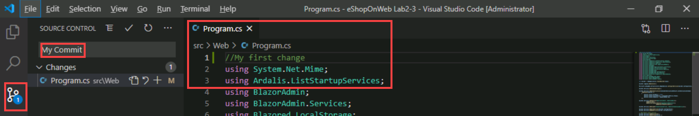

---
lab:
  title: 在 Azure Repos 中使用 Git 进行版本控制
  module: 'Module 01: Implement development for enterprise DevOps'
---

# 在 Azure Repos 中使用 Git 进行版本控制

## 学生实验室手册

## 实验室要求

- 本实验室需要使用 Microsoft Edge 或[支持 Azure DevOps 的浏览器](https://docs.microsoft.com/azure/devops/server/compatibility)。

- 设置 Azure DevOps 组织：如果还没有可用于本实验室的 Azure DevOps 组织，请按照[创建组织或项目集合](https://docs.microsoft.com/azure/devops/organizations/accounts/create-organization)中的说明创建一个。

- 如果尚未安装 Git 2.29.2 或更高版本，请启动 Web 浏览器，导航到[适用于 Windows 的 Git 下载页面](https://gitforwindows.org/)以进行下载和安装。
- 如果尚未安装 Visual Studio Code，请从 Web 浏览器窗口导航到 [Visual Studio Code 下载页面](https://code.visualstudio.com/)以进行下载和安装。
- 如果尚未安装 Visual Studio C# 扩展，请从 Web 浏览器窗口导航到 [C# 扩展安装页面](https://marketplace.visualstudio.com/items?itemName=ms-dotnettools.csharp)并安装该扩展。

## 实验室概述

Azure DevOps 支持两种类型的版本控制：Git 和 Team Foundation 版本控制 (TFVC)。 下面简要概述了两个版本的控制系统：

- **Team Foundation 版本控制 (TFVC)** ：TFVC 是一个集中式版本控制系统。 通常，团队成员的开发计算机上的每个文件只有一个版本。 历史数据仅在服务器上维护。 分支是基于路径的，并且在服务器上创建。

- **Git**：Git 是一种分布式版本控制系统。 Git 存储库可存在于本地（开发人员的计算机上）。 每个开发人员在其开发计算机上拥有源存储库的副本。 开发人员可在其开发计算机上提交每个变更集并执行版本控制操作（如历史记录和比较），无需网络连接。

Git 是新项目的默认版本控制提供程序。 除非需要 TFVC 中的集中式版本控制功能，否则应在项目中使用 Git 进行版本控制。

在本实验室中，你将了解如何建立本地 Git 存储库，且该存储库可以轻松地与 Azure DevOps 中的集中式 Git 存储库同步。 另外，你还将了解 Git 分支和合并支持。 你将使用 Visual Studio Code，但是相同的过程适用于任何与 Git 兼容的客户端的使用。

## 目标

完成本实验室后，你将能够：

- 克隆现有存储库。
- 使用提交功能保存工作。
- 查看更改历史记录。
- 使用 Visual Studio Code 处理分支。

## 预计用时：60 分钟

## 说明

### 练习 0：配置实验室先决条件

在本练习中，你将设置实验室先决条件，其中包括设置新的 Azure DevOps 项目，该项目的存储库基于 [eShopOnWeb](https://github.com/MicrosoftLearning/eShopOnWeb)。

#### 任务 1：（如果已完成，请跳过此任务）创建和配置团队项目

在此任务中，你将创建一个 eShopOnWeb Azure DevOps 项目，供多个实验室使用。

1. 在实验室计算机上，在浏览器窗口中打开 Azure DevOps 组织。 单击“新建项目”。 将项目命名为 eShopOnWeb，然后在“工作项进程”下拉列表中选择“Scrum”。 单击“创建”。

    

#### 任务 2：（如果已完成，请跳过此任务）导入 eShopOnWeb Git 存储库

在此任务中，你将导入将由多个实验室使用的 eShopOnWeb Git 存储库。

1. 在实验室计算机上，在浏览器窗口中打开 Azure DevOps 组织和以前创建的 eShopOnWeb 项目。 单击“Repos > 文件”、“导入”。 在“导入 Git 存储库”窗口中，粘贴以下 URL <https://github.com/MicrosoftLearning/eShopOnWeb.git> 并单击“导入”：

    

1. 存储库按以下方式组织：
    - .ado 文件夹包含 Azure DevOps YAML 管道
    - .devcontainer 文件夹容器设置，用于使用容器（在 VS Code 或 GitHub Codespaces 中本地进行）开发
    - infra 文件夹包含某些实验室方案中使用的 Bicep 和 ARM 基础结构即代码模板。****
    - .github 文件夹容器 YAML GitHub 工作流定义。
    - src 文件夹包含用于实验室方案的 .NET 8 网站。****

#### 任务 3：（如果已完成，请跳过此任务）将主分支设置为默认分支

1. 转到“Repos”>“分支”。
1. 将鼠标指针悬停在主分支上，然后单击列右侧的省略号。
1. 单击“设置为默认分支”。

#### 任务 3：配置 Git 和 Visual Studio Code

在此任务中，你将安装并配置 Git 和 Visual Studio Code，包括配置 Git 凭据帮助器，以安全地存储用于与 Azure DevOps 进行通信的 Git 凭据。 如果你已实现这些先决条件，则可直接继续执行下一个任务。

1. 在实验室计算机上，打开“Visual Studio Code”。
1. 在 Visual Studio Code 界面中，从主菜单中选择“终端”\|“新建终端”，以打开“终端”窗格 。
1. 通过检查“终端”窗格右上角的下拉列表是否显示“1: powershell”，确保当前终端正在运行 PowerShell

    > **注意**：若要将当前终端 shell 更改为 PowerShell，请单击“终端”窗格右上角的下拉列表，然后单击“选择默认 Shell”  。 在“Visual Studio Code”窗口的顶部，选择首选终端 shell“Windows PowerShell”，然后单击下拉列表右侧的加号，以使用所选的默认 shell 打开新的终端。

1. 在“终端”窗格中，运行以下命令来配置凭据帮助器。

    ```git
    git config --global credential.helper wincred
    ```

1. 在“终端”窗格中运行以下命令，为 Git 提交配置用户名和电子邮件（将括号中的占位符替换为首选用户名和电子邮件，删除 < 和 > 符号）：

    ```git
    git config --global user.name "<John Doe>"
    git config --global user.email <johndoe@example.com>
    ```

### 练习 1：克隆现有存储库

在本练习中，你将使用 Visual Studio Code 来克隆在上一练习中预配的 Git 存储库。

#### 任务 1：克隆现有存储库

在此任务中，你将逐步完成使用 Visual Studio Code 克隆 Git 存储库的过程。

1. 切换到显示 Azure DevOps 组织以及在上一个练习中生成的“eShopOnWeb”项目的 Web 浏览器。
1. 在 Azure DevOps 门户的垂直导航窗格中，选择“Repos”图标。

1. 在“eShopOnWeb”存储库窗格的右上角，单击“克隆”。

    

    > **注意**：获取 Git 存储库的本地副本的过程称为“克隆”。 每个主流开发工具都支持此功能，并且将能够连接到 Azure Repos 来获取可使用的最新资源。

1. 在“克隆存储库”面板上，在已选择 HTTPS 命令行选项的情况下，单击存储库克隆 URL 旁边的“复制到剪贴板”按钮  。

    > **注意**：可以将此 URL 与任何与 Git 兼容的工具一起使用，以获取代码库的副本。

1. 关闭“克隆存储库”面板。
1. 切换到在实验室计算机上运行的 Visual Studio Code。
1. 单击“查看”菜单标题，然后在下拉菜单中单击“命令面板” 。

    > **注意**：命令面板提供了一种轻松便捷的方式来访问各种任务，包括作为第三方扩展实现的任务。 可使用键盘快捷键 Ctrl+Shift+P 或 F1 来打开它 。

1. 在命令面板提示符下，运行“Git:**Clone”命令**。

    

    > **注意**：要查看所有相关命令，可以从键入 Git 开始。

1. 在“提供存储库 URL 或选择存储库源”文本框中，粘贴之前在此任务中复制的存储库克隆 URL，并按 Enter 键 。
1. 在“选择文件夹”对话框中，导航到 C: 驱动器，创建名为 Git 的新文件夹并选择它，然后单击“保存为存储库目标”************。
1. 根据提示登录到 Azure DevOps 帐户。
1. 克隆过程完成后，如果系统出现提示，请在 Visual Studio Code 中单击“打开”以打开克隆的存储库。

    > **注意**：你可能会收到的有关项目加载问题的警告，可以忽略它们。 解决方案可能不适合生成，但我们将专注于使用 Git，因此不需要生成项目。

### 练习 2：使用提交功能保存工作

在此练习中，你将逐步了解几种方案，这些方案涉及使用 Visual Studio Code 暂存和提交更改。

当你对文件进行更改时，Git 会将更改记录在本地存储库中。 可以通过暂存更改来选择要提交的更改。 提交始终针对本地 Git 存储库进行，因此你不必担心提交是完美的或准备与他人共享。 可以在继续工作时进行更多提交，并在准备好共享更改时将其推送给其他人。

Git 提交包含以下内容：

- 提交中更改的文件。 Git 通过提交将所有文件更改的内容保留在存储库中。 这样可加快提交速度并允许智能合并。
- 对父提交的引用。 Git 使用这些引用来管理代码历史记录。
- 描述提交的消息。 在创建提交时将此消息提供给 Git。 使此消息具有描述性是个好主意，但要强调重点。

#### 任务 1：提交更改

在此任务中，你将使用 Visual Studio Code 提交更改。

1. 在 Visual Studio Code 窗口中的垂直工具栏的顶部，选择“资源管理器”选项卡，导航到 /eShopOnWeb/src/Web/Program.cs 文件并选中它。 这将自动在详细信息窗格中显示其内容。
1. 在第一行添加以下注释：

    ```csharp
    // My first change
    ```

    > **注意**：注释的内容并不重要，因为目标只是进行更改。

1. 按 **Ctrl+S** 保存更改。
1. 在 Visual Studio Code 窗口中，选择“源代码管理”选项卡以验证 Git 识别出了对驻留在 Git 存储库本地克隆中的文件所做的最新更改。
1. 在“源代码管理”选项卡处于选中状态的情况下，在窗格顶部的文本框中，键入“我的提交”作为提交消息，然后按 Ctrl+Enter 在本地进行提交  。

    

1. 如果系统提示你选择是否要自动暂存更改并直接提交，请单击“始终”。

    > **注意**：我们将在实验室的后面部分讨论暂存。

1. 请注意，在“Visual Studio Code”窗口左下角的“main”标签右侧，有一个“同步更改”图标，该图标呈圆形，其中包含两个指向相反方向的垂直箭头，而指向上方的箭头旁边有一个数字 1。 单击该图标，如果系统出现提示询问是否继续，请单击“确定”以将提交推送到“origin/main”，或从其中拉取提交。

#### 任务 2：查看提交

在此任务中，你将使用 Azure DevOps 门户查看提交。

1. 切换到显示 Azure DevOps 界面的 Web 浏览器窗口。
1. 在 Azure DevOps 门户的垂直导航窗格中的“Repos”部分，选择“提交” 。
1. 验证提交是否显示在列表的顶部。

    

#### 任务 3：暂存更改

在此任务中，你将使用 Visual Studio Code 探索如何使用暂存更改。 通过暂存更改，可以选择性地将某些文件添加到提交中，而忽略其他文件中所做的更改。

1. 切换回“Visual Studio Code”窗口。
1. 通过更改下面的第一个注释并保存文件来更新打开的 Program.cs 类。

    ```csharp
        //My second change
    ```

1. 在 Visual Studio Code 窗口中，切换回“资源管理器”选项卡，导航到 /eShopOnWeb/src/Web/Constants.cs 文件并选中它。 这将自动在详细信息窗格中显示其内容。
1. 在第一行向 Constants.cs 文件添加注释并保存该文件。

    ```csharp
    // My third change
    ```

1. 在 Visual Studio Code 窗口中，切换到“源代码管理”选项卡，将鼠标指针悬停在 Program.cs 条目上，然后单击该条目右侧的加号。

    > 注意：这只会将更改暂存到 Program.cs 文件，以便为不包括 Constants.cs 的提交做准备。

1. 在“源代码管理”选项卡处于选中状态的情况下，在窗格顶部的文本框中，键入“添加的注释”作为提交消息 。

    

1. 在“源代码管理”选项卡顶部，单击省略号，在下拉菜单中选择“提交”，然后在级联菜单中选择“提交暂存内容”  。
1. 在“Visual Studio Code”窗口的左下角，单击“同步更改”按钮以将提交的更改与服务器同步，如果系统出现提示询问是否继续，请单击“确定”以将提交推送到“origin/main”，或从其中拉取提交。

    > **注意**：请注意，由于只提交了暂存的更改，因此其他更改仍在等待同步。

### 练习 3：回顾历史记录

在此练习中，你将使用 Azure DevOps 门户查看提交的历史记录。

Git 使用每次提交中存储的父级引用信息来管理开发的完整历史记录。 你可以轻松地查看此提交历史记录，以了解进行文件更改的时间，并使用终端或许多可用 Visual Studio Code 扩展之一来确定代码版本之间的差异。 还可以使用 Azure DevOps 门户查看更改。

Git 对“分支和合并”功能的使用通过拉取请求起作用，因此开发的提交历史记录不一定会按时间顺序排列。 使用历史记录比较版本时，请考虑两次提交之间的文件更改，而不是两个时间点之间的文件更改。 主分支中文件的最新更改可能来自两周前在功能分支中创建的提交，而该提交昨天已被合并。

#### 任务 1：比较文件

在此任务中，你将使用 Azure DevOps 门户逐步浏览提交历史记录。

1. 在 Visual Studio Code 窗口的“源代码管理”选项卡处于打开状态时，选择代表该文件的非暂存版本的 Constants.cs。

    

    > **注意**：将打开一个比较视图，使你可以轻松找到所做的更改。 在本例中，它只是一条注释。

1. 切换到显示 Azure DevOps 门户的“提交”窗格的 Web 浏览器窗口，以查看源分支和合并 。 这些内容便捷地直观呈现了对源进行更改的时间和更改方式。
1. 向下滚动到“我的提交”条目（之前已推送），并将鼠标指针悬停在其上方以显示右侧的省略号。
1. 单击省略号，在下拉菜单中，选择“浏览文件”，然后查看结果。

    

    > **注意**：该视图表示与提交相对应的源的状态，你可以通过它查看和下载每个源文件。

### 练习 4：处理分支

在此练习中，你将通过使用 Visual Studio Code 和 Azure DevOps 门户逐步完成涉及分支管理的场景。

可以从 Azure DevOps 门户中 Azure Repos 的“分支”视图，在 Azure DevOps Git 存储库中进行管理 。 你还可以自定义视图以跟踪你最关心的分支，以便能够掌握团队所做的更改。

向分支提交更改不会影响其他分支，你可以与他人共享分支，而不必将更改合并到主项目中。 你还可以创建新分支，以将对功能的更改或 bug 修复与主分支和其他工作隔离。 由于分支是轻量级的，因此在分支之间进行切换既快捷又容易。 当使用分支时，Git 不会创建源的多个副本，而是在你开始使用分支时使用提交中存储的历史记录信息在分支上重新创建文件。 Git 工作流应创建并使用分支来管理功能和 bug 修复。 Git 工作流的其余部分（例如共享代码和使用拉取请求查看代码）全都通过分支进行。 通过隔离分支中的工作，只需更改当前分支即可非常轻松地更改正在处理的内容。

#### 任务 1：在本地存储库中创建一个新分支

在此任务中，你将使用 Visual Studio Code 创建一个分支。

1. 切换到在实验室计算机上运行的 Visual Studio Code。
1. 在“源代码管理”选项卡处于选中状态的情况下，在 Visual Studio Code 窗口的左下角，单击“main”。
1. 在弹出窗口中，选择“+ 从其中创建新分支…”。

    

1. 在“选择引用以从中创建分支”文本框中，选择“master”作为引用分支。********
1. 在“分支名称”文本框中，键入“开发”以指定新分支，然后按 Enter  。

    > **注意**：此时，你将自动切换到“开发”分支。

#### 任务 2：删除分支

在此任务中，你将使用 Visual Studio Code 处理在上一个任务中创建的分支。

Git 会跟踪你正在处理的分支，并确保在签出分支时，文件与该分支上的最新提交匹配。 通过分支，你可以同时使用同一本地 Git 存储库中的多个版本的源代码。 你可以使用 Visual Studio Code 来发布、签出和删除分支。

1. 在“Visual Studio Code”窗口中，在“源代码管理”选项卡处于选中状态的情况下，在 Visual Studio Code 窗口的左下角单击“发布更改”图标（位于表示新创建的分支的“开发”标签的正右侧）   。
1. 切换到显示 Azure DevOps 门户的“提交”窗格的 Web 浏览器窗口，然后选择“分支”  。
1. 在“分支”窗格的“挖掘”选项卡上，验证分支列表中是否包含“开发”  。
1. 将鼠标指针悬停在“开发”分支条目上，以显示右侧的省略号。
1. 单击省略号，在弹出菜单中选择“删除分支”，并在出现确认提示时单击“删除” 。

    

1. 切换回“Visual Studio Code”窗口，并在“源代码管理”选项卡处于选中状态的情况下，在 Visual Studio Code 窗口的左下角单击“开发”条目  。 这将在 Visual Studio Code 窗口的上部显示现有分支。
1. 验证现在是否列出了两个“开发”分支。
1. 转到显示“分支”的“我的”选项卡的 Web 浏览器********
1. 在“分支”窗格的“我的”选项卡上，选择“全部”选项卡  。
1. 在“分支”窗格的“全部”选项卡上，在“搜索分支名称”文本框中，键入“开发”。
1. 查看“已删除的分支”部分，此部分包含表示新创建的分支的条目。
1. 在“已删除的分支”部分，将鼠标指针悬停在“开发”分支条目上方，以显示右侧的省略号。
1. 单击弹出菜单中的省略号，选择“还原分支”。

    

    > **注意**：只要你知道某个已删除分支的确切名称，就可以使用此功能还原该分支。

#### 任务 4：分支策略

在此任务中，你将使用 Azure DevOps 门户将策略添加到主分支，并且仅允许使用符合定义的策略的拉取请求进行更改。 你想确保分支中的更改在合并之前经过了检查。

为了简单起见，我们将直接在 Web 浏览器存储库编辑器上工作（直接在源中工作），而不是在 VS 代码中使用本地克隆（建议用于真实场景）。

1. 切换到在 Azure DevOps 门户中显示“分支”窗格的“我的”选项卡的 Web 浏览器 。
1. 在“分支”窗格的“我的”选项卡上，将鼠标指针悬停在主分支条目上方，以显示右侧的省略号。
1. 单击弹出菜单中的省略号，选择“分支策略”。

    

1. 在存储库设置的 main 选项卡上，启用“要求最小审阅者数”选项。 添加 1 个审阅者并选中“允许请求者批准其自己的更改”框（因为你是实验室项目中的唯一用户）
1. 在存储库设置的 main 选项卡上，启用“检查链接的工作项”选项，并将其保留为“必需”选项。

    

#### 任务 5：测试分支策略

在此任务中，你将使用 Azure DevOps 门户测试策略并创建第一个拉取请求。

1. 在 Azure DevOps 门户的垂直导航窗格中，在“Repos > 文件”中，确保选中主分支（显示内容上方的下拉列表）。
1. 若要确保策略有效，请尝试进行更改并在主分支上提交，导航到 /eShopOnWeb/src/Web/Program.cs 文件并选中它。 这将自动在详细信息窗格中显示其内容。
1. 在第一行添加以下注释：

    ```csharp
    // Testing main branch policy
    ```

1. 单击“提交 > 提交”。 你将看到一条警告：只能使用拉取请求完成对主分支的更改。

    

1. 单击“取消”以跳过提交。

#### 任务 6：使用拉取请求

在此任务中，你将使用 Azure DevOps 门户创建拉取请求，并使用开发分支将更改合并到受保护的主分支中。 Azure DevOps 工作项将链接到更改，以便能够通过代码活动跟踪待处理工作。

1. 在 Azure DevOps 门户的垂直导航窗格中的“Boards”部分，选择“工作项”。
1. 单击“+ 新建工作项”>“产品积压工作项”。 在标题字段中，编写“测试我的第一个 PR”，然后单击“保存”。
1. 现在，返回到 Azure DevOps 门户的垂直导航窗格，在“Repos > 文件”中，确保选中开发分支。
1. 导航到 /eShopOnWeb/src/Web/Program.cs 文件，并在第一行进行以下更改：

    ```csharp
    // Testing my first PR
    ```

1. 单击“提交>提交”（保留默认提交消息）。 这次提交有效，开发分支没有策略。
1. 此时会弹出一条消息，建议创建拉取请求（因为与主分支相比，开发分支现已在更改方面领先）。 单击“创建拉取请求”。

    

1. 在“新建拉取请求”选项卡中，保留默认值并单击“创建”。
1. 拉取请求将根据应用于目标主分支的策略显示一些失败/挂起的要求。
    - 建议的更改应具有链接的工作项
    - 至少 1 个用户应查看并批准更改。

1. 在右侧选项中，单击“工作项”旁边的 + 按钮。 单击之前创建的工作项将其链接到拉取请求。 你将看到其中一个要求更改状态。

    

1. 接下来，打开“文件”选项卡以查看建议的更改。 在更完整的拉取请求中，你将能够逐个查看文件（标记为已审阅），并打开可能不清楚的行的注释（将鼠标悬停在行号上可以选择发布注释）。
1. 返回到“概述”选项卡，然后在右上角单击“批准”。 所有要求都将更改为绿色。 现在，可以单击“完成”。
1. 在“完成拉取请求”选项卡上，将在完成合并之前提供多个选项：
    - 合并类型：提供 4 种合并类型，可在[此处](https://learn.microsoft.com/azure/devops/repos/git/complete-pull-requests?view=azure-devops&tabs=browser#complete-a-pull-request)查看它们或观察给定的动画。 选择“合并(无快进)”。
    - 完成后选项：
        - 选中“完成关联的工作项...”。它将关联的 PBI 移动到“完成”状态。

1. 单击“完成合并”

#### 任务 7：应用标记

产品团队已决定，当前版本的网站应发布为 v1.1.0-beta。

1. 在 Azure DevOps 门户的垂直导航窗格中，在“Repos”部分中，选择“标记” 。
1. 在“标记”窗格中，单击“新建标记” 。
1. 在“创建标记”面板中，在“名称”文本框中键入“v1.1.0-beta”，在“基于”下拉列表中，保留“main”条目处于选中状态，在“说明”文本框中，键入“Beta 版本 v1.1.0”，然后单击“创建”。

    > 注意：现已在此版本中标记存储库（最新提交链接到标记）。 你可以基于各种理由对提交进行标记，并且通过 Azure DevOps，可灵活地编辑和删除它们以及管理其权限。

### 练习 5：移除分支策略

按照顺序完成提供的各个课程实验室时，在此实验室期间配置的分支策略将阻止将来实验室中的练习。 因此，我们希望你移除配置的分支策略。

1. 在 Azure DevOps eShopOnWeb 项目视图中，导航到“Repos”并选择“分支”************。 选择“**分支**”窗格的“**我的**”选项卡。
1. 在“**分支**”窗格的“**我的**”选项卡上，将鼠标指针悬停在**主**分支条目上方，以显示右侧的省略号 (...)。
1. 单击弹出菜单中的省略号，选择“分支策略”。

    

1. 在存储库设置的“**主**”选项卡上，禁用“**要求最小审阅者数**”选项。
1. 在存储库设置的“**主**”选项卡上，禁用“**检查链接的工作项**”选项。

    

1. 现已禁用/移除主分支的分支策略。

## 审阅

在本实验室中，你使用了 Azure DevOps 门户来管理分支和存储库。
