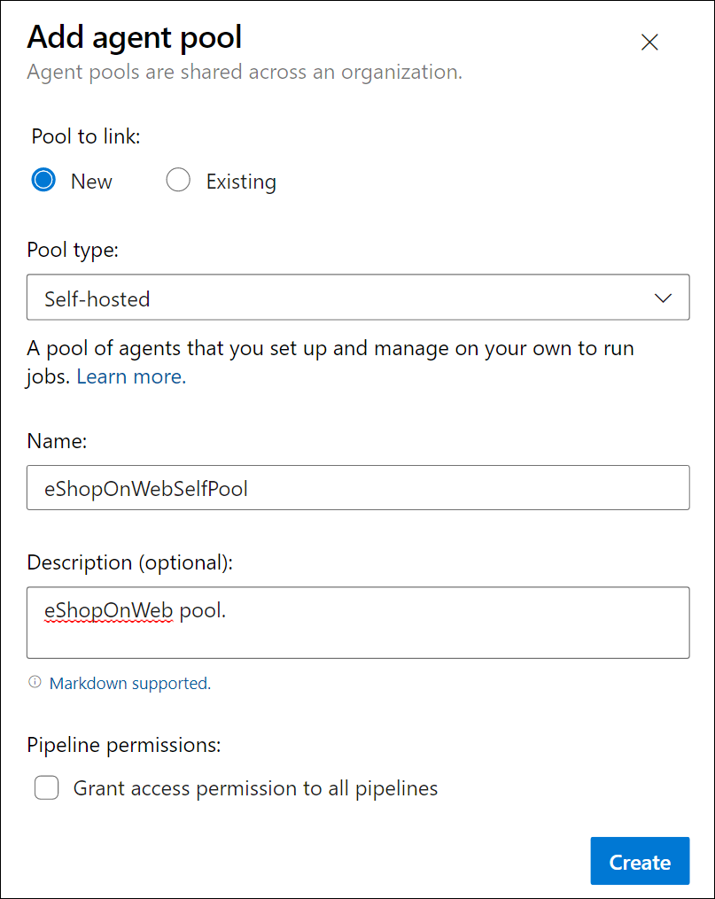
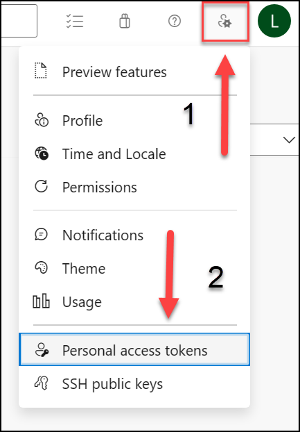

---
lab:
  title: 配置代理池并了解管道样式
  module: 'Module 02: Implement CI with Azure Pipelines and GitHub Actions'
---

# 配置代理池并了解管道样式

## 实验室要求

- 本实验室需要使用 Microsoft Edge 或[支持 Azure DevOps 的浏览器](https://docs.microsoft.com/azure/devops/server/compatibility)。

- 设置 Azure DevOps 组织：如果还没有可用于本实验室的 Azure DevOps 组织，请按照[创建组织或项目集合](https://docs.microsoft.com/azure/devops/organizations/accounts/create-organization)中的说明创建一个。

- [适用于 Windows 的 Git 下载页面](https://gitforwindows.org/)。 此应用程序将作为本实验室先决条件安装。

- [Visual Studio Code](https://code.visualstudio.com/)。 此应用程序将作为本实验室先决条件安装。

## 实验室概述

通过基于 YAML 的管道，你能够以代码形式完全实现 CI/CD，其中管道定义与 Azure DevOps 项目的代码驻留在同一存储库中。 基于 YAML 的管道支持经典管道的多种功能，例如拉取请求、代码评审、历史记录、分支和模板。

无论选择哪种管道样式，都需要代理才能使用 Azure Pipelines 生成代码或部署解决方案。 代理可托管一次运行一项作业的计算资源。 作业可直接在代理的主机上运行，也可在容器中运行。 你可以选择使用 Microsoft 为你托管的托管代理来运行作业，也可以实现你自己设置和管理的自托管代理。

在本实验室中，你将了解如何通过 YAML 管道实现和使用自托管代理。

## 目标

完成本实验室后，你将能够：

- 实现基于 YAML 的管道。
- 实现自托管代理。

## 预计用时：30 分钟

## 说明

### 练习 0：（如已完成，则跳过）配置实验室先决条件

在本练习中，你将设置实验室先决条件，其中包括设置新的 Azure DevOps 项目，该项目的存储库基于 [eShopOnWeb](https://github.com/MicrosoftLearning/eShopOnWeb)。

#### 任务 1：（如果已完成，请跳过此任务）创建和配置团队项目

在此任务中，你将创建一个 eShopOnWeb Azure DevOps 项目，供多个实验室使用。

1. 在实验室计算机上，在浏览器窗口中打开 Azure DevOps 组织。 单击“新建项目”。 将项目命名为 eShopOnWeb，并将其他字段保留默认值。 单击“创建”。

#### 任务 2：（如果已完成，请跳过此任务）导入 eShopOnWeb Git 存储库

在此任务中，你将导入将由多个实验室使用的 eShopOnWeb Git 存储库。

1. 在实验室计算机上，在浏览器窗口中打开 Azure DevOps 组织和以前创建的 eShopOnWeb 项目。 单击“**Repos > 文件**”、“**导入存储库**”。 选择“**导入**”。 在“导入 Git 存储库”窗口中，粘贴以下 URL <https://github.com/MicrosoftLearning/eShopOnWeb.git> 并单击“导入”：

1. 存储库按以下方式组织：
    - .ado 文件夹包含 Azure DevOps YAML 管道。
    - 设置 .devcontainer 文件夹容器，使用容器（在 VS Code 或 GitHub Codespaces 中本地进行）开发。
    - infra 文件夹包含某些实验室方案中使用的 Bicep 和 ARM 基础结构即代码模板。****
    - .github 文件夹容器 YAML GitHub 工作流定义。
    - src 文件夹包含实验室方案中使用的 .NET 8 网站。****

#### 任务 3：（如果已完成，请跳过此任务）将主分支设置为默认分支

1. 转到“Repos”>“分支”****。
1. 将鼠标指针悬停在主分支上，然后单击列右侧的省略号。
1. 单击“设置为默认分支”。

### 练习 1：创建代理并配置代理池

在本练习中，你将创建一个 Azure 虚拟机 (VM)，并使用它来创建代理和配置代理池。

#### 任务 1：创建并连接到 Azure VM

1. 在浏览器中，打开 `https://portal.azure.com` 处的 Azure 门户。 如果系统提示，请使用具有 Azure 订阅的“所有者”角色的帐户登录。

1. 在“**搜索资源、服务和文档 (G+/)**”框中，键入 **`Virtual Machines`** 并从下拉列表中选择它。

1. 选择“创建”按钮。

1. 选择**具有预设配置的 Azure 虚拟机**。

    

1. 选择“**开发/测试**”作为工作负载环境，将“**常规用途**”作为工作负载类型。

1. 选择“**继续创建 VM**”按钮，在“**基本信息**”选项卡上执行以下操作，然后选择“**管理**”：

   | 设置 | 操作 |
   | -- | -- |
   | “订阅”下拉列表 | 选择 Azure 订阅。 |
   | “资源组”部分 | 创建名为 **rg-eshoponweb-agentpool** 的新资源组。 |
   | **虚拟机名称** 文本框 | 输入首选项名称，例如 **`eshoponweb-vm`**。 |
   | “区域”下拉列表 | 可以选择离你最近的 [azure](https://azure.microsoft.com/explore/global-infrastructure/geographies) 区域。 例如，“eastus”、“eastasia”、“westus”等。 |
   | **可用性选项**下拉列表 | 选择“无需基础结构冗余”。 |
   | **安全性类型**下拉列表 | 选择“**受信任启动虚拟机**”选项。 |
   | “映像”下拉列表 | 选择 **Windows Server 2022 Datacenter:Azure Edition - x64 Gen2** 映像。 |
   | **大小**下拉列表 | 为了测试，选择最便宜的**标准**大小。 |
   | **用户名**文本框 | 输入你偏好的用户名 |
   | **密码**文本框 | 输入你偏好的密码 |
   | **公共入站端口**部分 | 选择“允许所选端口”  。 |
   | **选择入站端口**下拉列表 | 选择“RDP (3389)”。 |

1. 在“**管理**”选项卡上的“**标识**”部分中，选中“**启用系统分配的托管标识**”复选框，然后选择“**查看 + 创建**”：

1. 在“查看 + 创建”选项卡上，选择“创建”。

   > **注意**：等待预配过程完成。 这大约需要 2 分钟。

1. 在 Azure 门户中，导航到显示新创建的 Azure VM 配置的页面。

1. 在 Azure VM 页上，选择“**连接**”，在下拉菜单中选择“**连接**”，然后选择“**下载 RDP 文件**”。

1. 使用下载的 RDP 文件与在 Azure VM 中运行的操作系统建立远程桌面会话。

#### 任务 2：创建代理池

1. 在与 Azure VM 的远程桌面会话中，启动 Microsoft Edge Web 浏览器。

1. 在 Web 浏览器中，导航到 `https://aex.dev.azure.com` 处的 Azure DevOps 门户，然后登录以访问你的组织。

   > **备注**：如果是第一次访问 Azure DevOps 门户，可能需要创建配置文件。

1. 打开 **eShopOnWeb** 项目，然后从左侧底部菜单中选择“**项目设置**”。

1. 在“**管道 > 代理池**”中，选择“**添加池**”按钮。

1. 选择“**自托管**”池类型。

1. 提供代理池的名称，例如 **eShopOnWebSelfPool**，并添加可选说明。

1. 不选中“**授予对所有管道的访问权限**”选项。

   

   > **备注**：不建议对生产环境中的所有管道授予访问权限。 它仅在此实验室中用于简化管道的配置。

1. 选择“**创建**”按钮以创建代理池。

#### 任务 3：下载并提取代理安装文件

1. 在 Azure DevOps 门户中，选择新建的代理池，然后选择“**代理**”选项卡。

1. 选择“**新建代理**”按钮，然后在新的弹出窗口中选择“**下载代理**”和“**下载**”按钮。

   > **备注**：按照安装说明安装代理。

1. 启动 PowerShell 会话并运行以下命令创建名为 **agent** 的文件夹。

   ```powershell
   mkdir agent ; cd agent        
   ```

   > **备注**：请确保位于要安装代理的文件夹，例如 C:\agent。

1. 运行以下命令以提取下载的代理安装程序文件的内容：

   ```powershell
   Add-Type -AssemblyName System.IO.Compression.FileSystem ; [System.IO.Compression.ZipFile]::ExtractToDirectory("$HOME\Downloads\vsts-agent-win-x64-3.245.0.zip", "$PWD")
   ```

   > **备注**：如果将代理下载到其他位置（或下载的版本不同），请相应地调整上述命令。

#### 任务 4：创建 PAT 令牌

> **备注**：配置代理之前，需要创建 PAT 令牌（除非已有）。 若要创建 PAT 令牌，请执行以下步骤：

1. 在与 Azure VM 的远程桌面会话中，打开另一个浏览器窗口，导航到 Azure DevOps 门户（网址为 `https://aex.dev.azure.com`），然后访问你的组织和项目。

1. 从右侧顶部菜单中选择“**用户设置**”（就在你的用户头像图标左侧）。

1. 选择“**个人访问令牌**”菜单项。

   

1. 选择“**新建令牌**”按钮。

1. 提供令牌的名称，例如 **eShopOnWebToken**。

1. 选择要使用该令牌的 Azure DevOps 组织。

1. 设置令牌的到期日期（仅用于配置代理）。

1. 选择自定义的范围。

1. 选择以显示所有范围。

1. 选择“**代理池(读取和管理)**”范围。

1. 选择“**创建**”按钮以创建令牌。

1. 复制令牌值并将其保存在安全的位置（你将无法再次看到它）。 只能重新生成令牌）。

   

   > [!IMPORTANT]
   > 仅对代理配置使用最低特权选项“**代理池 (读取和管理)**”。 此外，如果这是令牌的唯一用途，请确保为令牌设置最短的到期日期。 如果需要再次配置代理，则可以创建另一个具有相同特权的令牌。

#### 任务 5：配置代理

1. 在与 Azure VM 的远程桌面会话中，切换回 PowerShell 窗口。 如有必要，请将当前目录更改为你在本练习前面将代理安装文件提取到的目录。

1. 若要将代理配置为无人参与运行，请调用以下命令：

   ```powershell
   .\config.cmd
   ```

   > **备注**：如果要以交互方式运行代理，请改用 `.\run.cmd`。

1. 若要配置代理，请在出现提示时执行以下操作：

   - 以“`https://aex.dev.azure.com`{你的组织名称}”格式输入 Azure DevOps 组织的 URL（**服务器 URL**）。
   - 接受默认身份验证类型 (**`PAT`**)。
   - 输入你在上一步中创建的 PAT 令牌的值。
   - 输入在本练习前面创建的代理池名称 **`eShopOnWebSelfPool`**。
   - 输入代理名称 **`eShopOnWebSelfAgent`**。
   - 接受默认代理工作文件夹 (_work)。
   - 输入 **Y** 将代理配置为作为服务运行。
   - 输入 **Y** 为代理服务启用 SERVICE_SID_TYPE_UNRESTRICTED。
   - 输入 **`NT AUTHORITY\SYSTEM`** 以设置服务的安全性上下文。

   > [!IMPORTANT]
   > 通常，配置服务安全性上下文时，应遵循最低特权原则。

   - 接受默认选项 (**N**)，以允许服务在配置完成后立即启动。

   

   > **备注**：完成代理配置过程可能需要几分钟时间。 完成后，会看到一条消息，指示代理正在作为服务运行。

   > [!IMPORTANT] 如果看到一条错误消息，指出代理未运行，则可能需要手动启动服务。 为此，请在 Windows 控制面板中打开“**服务**”小程序，找到名为 **Azure DevOps 代理 (eShopOnWebSelfAgent)** 的服务，然后启动它。

   > [!IMPORTANT] 如果代理无法启动，可能需要为代理工作目录选择其他文件夹。 为此，请重新运行代理配置脚本并选择其他文件夹。

1. 切换到显示 Azure DevOps 门户的 Web 浏览器，导航到代理池并单击“**代理**”选项卡，检查代理状态。此时应会在列表中看到新代理。

   

   > **备注**：有关 Windows 代理的更多详细信息，请参阅：[自托管 Windows 代理](https://learn.microsoft.com/azure/devops/pipelines/agents/windows-agent)

   > [!IMPORTANT]
   > 为了使代理能够从 Azure DevOps 管道生成和部署 Azure 资源（你将在接下来的实验室中逐步完成这部分），需要在托管代理的 Azure VM 的操作系统中安装 Azure CLI。

1. 启动 Web 浏览器并导航到[在 Windows 上安装 Azure CLI](https://learn.microsoft.com/en-us/cli/azure/install-azure-cli-windows?tabs=azure-cli&pivots=msi#install-or-update) 页面。

1. 下载并安装 Azure CLI。

1. （可选）如果需要，请运行以下 PowerShell 命令以安装 Azure CLI：

   ```powershell
   $ProgressPreference = 'SilentlyContinue'; Invoke-WebRequest -Uri https://aka.ms/installazurecliwindows -OutFile .\AzureCLI.msi; Start-Process msiexec.exe -Wait -ArgumentList '/I AzureCLI.msi /quiet'; Remove-Item .\AzureCLI.msi
   ```

   > **备注**：如果使用不同版本的 Azure CLI，可能需要相应地调整上述命令。

1. 在 Web 浏览器中，导航到 `https://dotnet.microsoft.com/en-us/download/dotnet/thank-you/sdk-8.0.403-windows-x64-installer` 处的 Microsoft .NET 8.0 SDK 安装程序页面。

   > [!IMPORTANT]
   > 需要在托管代理的 Azure VM 上安装 .NET 8.0 SDK（或更高版本）。 这是在即将推出的实验室中生成 eShopOnWeb 应用程序所必需的。 应用程序生成所需的任何其他工具或 SDK 也应安装在 Azure VM 上。

1. 下载并安装 Microsoft .NET 8.0 SDK。

### 练习 2：创作基于 YAML 的 Azure Pipelines

在本练习中，你将使用基于 YAML 的模板创建应用程序生命周期生成管道。

#### 任务 1：创建 Azure DevOps YAML 管道

在此任务中，将为 **eShopOnWeb** 项目创建基于 YAML 的管道。

1. 在打开了“eShopOnWeb”项目的 Azure DevOps 门户中，在 Web 浏览器左侧的垂直导航窗格中，单击“管道”********。
1. 单击“创建管道”**** 按钮（如果尚未创建任何其他管道）或单击“新建管道”**** 以创建其他新管道。

1. 在“你的代码在哪里?”窗格上，单击“Azure Repos Git” 。
1. 在“选择存储库”窗格中，单击“eShopOnWeb”。
1. 在“**配置管道**”窗格上，选择“**现有 Azure Pipelines YAML 文件**”。
1. 在“**选择现有 YAML 文件**”上，对“分支”选择“**主**”，对“路径”选择 **/.ado/eshoponweb-ci-pr.yml**。
1. 单击“继续” 。
1. 在“**查看管道 YAML**”窗格中，查看示例管道。 这是一个相当直截了当的 .NET 应用程序生成管道，它可以执行以下操作：

   - 单个阶段：生成
   - 单个作业：生成
   - 生成作业中的 4 个任务：
   - Dotnet Restore
   - Dotnet Build
   - DotNet 测试
   - Dotnet Publish

1. 在“**查看管道 YAML**”窗格上，单击“**保存**”按钮旁边方向朝下的插入符号，单击“**保存**”。

    > **备注**：我们目前只是创建管道定义，而不运行它。 你将首先设置 Azure DevOps 代理池，并在后面的练习中运行管道。

#### 任务 2：使用自托管代理池更新 YAML 管道

1. 在 Azure DevOps 门户中，导航到“eShopOnWeb”**** 项目，然后从左侧菜单中选择“管道”****。
1. 单击上一任务中针对管道创建的“编辑”**** 按钮。
1. 在“eShopOnWeb”**** 编辑窗格上，在基于 YAML 的现有管道中，移除第 13 行，其中显示 **vmImage: ubuntu-latest** 指定目标代理池以下内容，指定新建的自托管代理池：

    ```yaml
    pool: 
      name: eShopOnWebSelfPool
      demands: Agent.Name -equals eShopOnWebSelfAgent
    ```

    > **警告**：请小心复制/粘贴，确保缩进与上面所示相同。

    

1. 在“eShopOnWeb”编辑窗格上，在窗格右上角单击“验证并保存”********。 然后单击**保存**。
1. 在“eShopOnWeb”**** 编辑窗格上，在窗格右上角单击“运行管道”****。

    > **备注**：管道将在上一练习中创建的自托管代理池上运行。
1. 打开管道运行并监视作业，直到作业成功完成。

    > **备注**：如果收到权限提示，请单击“允许”**** 以允许管道运行。

1. 管道运行完成后，查看输出并验证管道是否成功运行。

## 审阅

在本实验室中，你了解了如何通过 YAML 管道实现和使用自托管代理。
