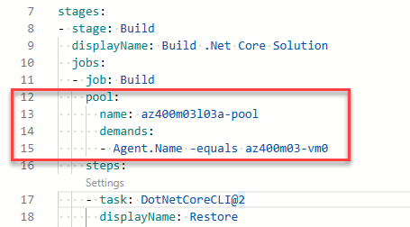

---
lab:
  title: 配置代理池并了解管道样式
  module: 'Module 03: Implement CI with Azure Pipelines and GitHub Actions'
---

# 配置代理池并了解管道样式

## 学生实验室手册

## 实验室要求

- 本实验室需要使用 Microsoft Edge 或[支持 Azure DevOps 的浏览器](https://docs.microsoft.com/azure/devops/server/compatibility)。

- 设置 Azure DevOps 组织：如果还没有可用于本实验室的 Azure DevOps 组织，请按照[创建组织或项目集合](https://docs.microsoft.com/azure/devops/organizations/accounts/create-organization)中的说明创建一个。

- [适用于 Windows 的 Git 下载页面](https://gitforwindows.org/)。 此应用程序将作为本实验室先决条件安装。

- [Visual Studio Code](https://code.visualstudio.com/)。 此应用程序将作为本实验室先决条件安装。

## 实验室概述

通过基于 YAML 的管道，你能够以代码形式完全实现 CI/CD，其中管道定义与 Azure DevOps 项目的代码驻留在同一存储库中。 基于 YAML 的管道支持经典管道的多种功能，例如拉取请求、代码评审、历史记录、分支和模板。

无论选择哪种管道样式，都需要代理才能使用 Azure Pipelines 生成代码或部署解决方案。 代理可托管一次运行一项作业的计算资源。 作业可直接在代理的主机上运行，也可在容器中运行。 你可以选择使用 Microsoft 为你托管的托管代理来运行作业，也可以实现你自己设置和管理的自托管代理。

在本实验室中，你将了解如何通过 YAML 管道实现和使用自托管代理。

## 目标

完成本实验室后，你将能够：

- 实现基于 YAML 的管道。
- 实现自托管代理。

## 预计用时：45 分钟

## 说明

### 练习 0：配置实验室先决条件

在本练习中，你将设置实验室先决条件，其中包括设置新的 Azure DevOps 项目，该项目的存储库基于 [eShopOnWeb](https://github.com/MicrosoftLearning/eShopOnWeb)。

#### 任务 1：（如果已完成，请跳过此任务）创建和配置团队项目

在此任务中，你将创建一个 eShopOnWeb Azure DevOps 项目，供多个实验室使用。

1. 在实验室计算机上，在浏览器窗口中打开 Azure DevOps 组织。 单击“新建项目”。 将项目命名为 eShopOnWeb，并将其他字段保留默认值。 单击“创建”。

#### 任务 2：（如果已完成，请跳过此任务）导入 eShopOnWeb Git 存储库

在此任务中，你将导入将由多个实验室使用的 eShopOnWeb Git 存储库。

1. 在实验室计算机上，在浏览器窗口中打开 Azure DevOps 组织和以前创建的 eShopOnWeb 项目。 单击“Repos”>“文件”，然后单击“导入存储库”。 选择“导入”  。 在“导入 Git 存储库”窗口中，粘贴以下 URL <https://github.com/MicrosoftLearning/eShopOnWeb.git> 并单击“导入”：

1. 存储库按以下方式组织：
    - .ado 文件夹包含 Azure DevOps YAML 管道。
    - 设置 .devcontainer 文件夹容器，使用容器（在 VS Code 或 GitHub Codespaces 中本地进行）开发。
    - infra 文件夹包含某些实验室方案中使用的 Bicep 和 ARM 基础结构即代码模板。****
    - .github 文件夹容器 YAML GitHub 工作流定义。
    - src 文件夹包含实验室方案中使用的 .NET 8 网站。****

### 练习 1：创作基于 YAML 的 Azure Pipelines

在本练习中，你将使用基于 YAML 的模板创建应用程序生命周期生成管道。

#### 任务 1：创建 Azure DevOps YAML 管道

在此任务中，你将创建基于模板的 Azure DevOps YAML 管道。

1. 在打开了“eShopOnWeb”项目的 Azure DevOps 门户中，在 Web 浏览器左侧的垂直导航窗格中，单击“管道”********。
1. 单击“创建管道”**** 按钮（如果尚未创建任何其他管道）或单击“新建管道”**** 以创建其他新管道。

1. 在“你的代码在哪里?”窗格上，单击“Azure Repos Git” 。
1. 在“选择存储库”窗格中，单击“eShopOnWeb”。
1. 在“**配置管道**”窗格上，选择“**现有 Azure Pipelines YAML 文件**”。
1. 在“**选择现有 YAML 文件**”上，对“分支”选择“**主**”，对“路径”选择 **/.ado/eshoponweb-ci-pr.yml**。
1. 单击“继续” 。
1. 在“**查看管道 YAML**”窗格中，查看示例管道。 这是一个相当直截了当的 .NET 应用程序生成管道，它可以执行以下操作：

   - 单个阶段：生成
   - 单个作业：生成
   - 生成作业中的 3 个任务：
   - Dotnet Restore
   - Dotnet Build
   - Dotnet Publish

1. 在“**查看管道 YAML**”窗格上，单击“**保存**”按钮旁边方向朝下的插入符号，单击“**保存**”。

    > 注意：我们目前只是创建管道定义，而不运行它。 你将首先设置 Azure DevOps 代理池，并在后面的练习中运行管道。 

### 练习 2：管理 Azure DevOps 代理池

在本练习中，你将实现自托管的 Azure DevOps 代理。

#### 任务 1：配置 Azure DevOps 自托管代理

在此任务中，你要将实验室虚拟机配置为 Azure DevOps 自托管代理，并使用它来运行生成管道。

1. 在实验室虚拟机（实验室 VM）或你自己的计算机中，启动 Web 浏览器，导航到 [Azure DevOps 门户](https://dev.azure.com)，并使用与你的 Azure DevOps 组织相关联的 Microsoft 帐户登录。

  > 注意：实验室虚拟机应安装所有必要的必备软件。 如果要在自己的计算机上安装 ，则需要安装生成演示项目所需的 .NET 8 SDK 或更高版本。 请参阅[下载 .NET](https://dotnet.microsoft.com/download/dotnet)。

1. 在 Azure DevOps 门户中，单击“Azure DevOps”页右上角的“用户设置”图标，根据是否已打开预览功能，你应在菜单中看到“安全”或“个人访问令牌”项，如果你看到“安全”请单击它，然后选择“个人访问令牌”    。 在“个人访问令牌”窗格上，单击“+ 新建令牌” 。
1. 在“新建个人访问令牌”窗格上，单击“显示所有范围”链接，指定以下设置，然后单击“创建”（将其他设置全部保留为默认值）  ：

    | 设置 | 值 |
    | --- | --- |
    | 名称 | **eShopOnWeb** |
    | 范围（自定义） | 代理池（根据需要在下面显示更多范围选项）|
    | 权限 | **读取和管理** |

1. 在“成功”窗格上，将个人访问令牌的值复制到剪贴板。

    > **注意**：确保复制令牌。 关闭此窗格后，将无法再检索它。

1. 在“成功”窗格中，单击“关闭” 。
1. 在 Azure DevOps 门户的“个人访问令牌”窗格上，单击左上角的“Azure DevOps”符号，然后单击左下角的“组织设置”标签  。
1. 在“概述”窗格左侧的垂直菜单中，单击“管道”部分的“代理池”  。
1. 在“代理池”窗格上，单击右上角的“添加池” 。
1. 在“添加代理池”窗格上，在“池类型”下拉列表中选择“自托管”，在“名称”文本框中键入“az400m03l03a-pool”，然后单击“创建”     。
1. 返回到“代理池”窗格，单击表示新创建的 az400m03l03a-pool 的条目 。
1. 在“az400m03l03a-pool”窗格的“作业”选项卡上，单击“新建代理”按钮  。
1. 在“获取代理”窗格上，确保选中“Windows”和“x64”选项卡，然后单击“下载”，以将包含代理二进制文件的 zip 存档下载到你的用户配置文件中的本地“下载”文件夹    。

    > 注意：如果你这时收到一条错误消息，指出当前系统设置阻止你下载该文件，请在浏览器窗口中，单击右上角指示“设置”菜单标题的齿轮符号，在下拉菜单中选择“Internet 选项”，在“Internet 选项”对话框中单击“高级”，然后在“高级”选项卡上单击“重置”，在“重置浏览器设置”对话框中，再次单击“重置”，然后单击“关闭”，并重试下载          。

1. 以管理员身份启动 Windows PowerShell，然后在“管理员: Windows PowerShell”控制台中运行以下行以创建“C:\\agent”目录，并将已下载的存档内容提取到该目录。

    ```powershell
    cd \
    mkdir agent ; cd agent
    $TARGET = Get-ChildItem "$Home\Downloads\vsts-agent-win-x64-*.zip"
    Add-Type -AssemblyName System.IO.Compression.FileSystem
    [System.IO.Compression.ZipFile]::ExtractToDirectory($TARGET, "$PWD")
    ```

1. 在相同的“管理员: Windows PowerShell”控制台，运行以下命令以配置代理：

    ```powershell
    .\config.cmd
    ```

1. 出现提示时，指定以下设置的值：

    | 设置 | 值 |
    | ------- | ----- |
    | 输入服务器 URL | Azure DevOps 组织的 URL，格式为 <https://dev.azure.com/>`<organization_name>` ，其中 `<organization_name>` 表示 Azure DevOps 组织的名称 |
    | 输入身份验证类型（对于 PAT，按 enter） | Enter |
    | 输入个人访问令牌 | 你之前在此任务中记录的访问令牌 |
    | 输入代理池（对于默认内容，按 enter） | **az400m03l03a-pool** |
    | 输入代理名称 | **az400m03-vm0** |
    | 输入工作文件夹（对于 _work，按 enter） | Enter |
    | （仅在显示时）输入“为每个步骤的任务执行解压缩”。 （按 enter 表示 N） | 警告：仅当显示消息时按 Enter|
    | 输入“将代理作为服务运行?” (Y/N)（按 enter 表示 N） | **是** |
    | 输入 enable SERVICE_SID_TYPE_UNRESTRICTED (Y/N)（按 enter 表示 N） | **是** |
    | 输入要用于服务的用户帐户（按 enter 表示 NT AUTHORITY\NETWORK SERVICE） | Enter |
    | 输入是否阻止在配置完成后立即启动服务？ (Y/N)（按 enter 表示 N） | Enter |

    > **注意**：可以将自托管代理作为服务或交互进程运行。 你可能想使用交互模式启动，因为这可简化验证代理功能的操作。 对于生产用途，你应考虑将代理作为服务运行或在启用自动登录的情况下将代理作为交互进程运行，因为这两种方式都会保存其运行状态，并确保在重启操作系统时代理会自动启动。

1. 切换到显示 Azure DevOps 门户的浏览器窗口，并关闭“获取代理”窗格。
1. 返回“az400m03l03a-pool”窗格的“代理”选项卡，请注意，列出了新配置的代理，其状态为“联机”  。
1. 在显示 Azure DevOps 门户的 Web 浏览器窗口中，单击左上角的“Azure DevOps”标签。
1. 在项目列表中，单击表示“eShopOnWeb”**** 项目的磁贴。
1. 在 eShopOnWeb 窗格中，在左侧的垂直导航窗格中，单击“管道”部分的“管道”************。
1. 在“管道”窗格的“最近”选项卡上，选择“eShopOnWeb”，在“eShopOnWeb”窗格上，选择“编辑”********************。
1. 在“eShopOnWeb”编辑窗格上，在现有的基于 YAML 的管道中，将行 13（`vmImage: windows-latest` 指定目标代理池）替换为以下内容（指定新创建的自托管代理池）****：

    ```yaml
    name: az400m03l03a-pool
    demands:
    - Agent.Name -equals az400m03-vm0
    ```

    > 警告：请小心复制/粘贴，确保缩进与上面所示相同。

    

1. 在“eShopOnWeb”编辑窗格上，在窗格右上角单击“保存并运行”。******** 这将自动触发基于此管道的生成。
1. 在 Azure DevOps 门户中，在垂直导航窗格左侧，单击“管道”部分的“管道” 。 根据实验室设置，管道可能会向你请求权限。 单击“允许”以允许管道运行。**** 
1. 在“管道”窗格的“最近”选项卡上，单击“eShopOnWeb”条目，在“EShopOnWeb”窗格的“运行”选项卡上，选择最近的运行，在该运行的“摘要”窗格上，向下滚动至底部，在“作业”部分单击“阶段 1”，并监视作业，直到作业成功完成********************************。

### 练习 3：删除实验室中使用的资源

1. 通过从命令提示符运行 `.\config.cmd remove` 来停止并删除代理服务。
1. 删除代理池。
1. 撤销 PAT 令牌。
1. 从 Repos/.ado/eshoponweb-ci-pr.yml 导航到 eshoponweb-ci-pr.yml 文件，选择“编辑”并移除第 13-15 行（代理池代码片段），更改回 `vmImage: windows-latest`（原始状态），从而还原该文件中的更改。******** （这是因为你在将来的实验室练习中将使用相同的示例管道文件。）


## 审阅

在本实验室中，你了解了如何通过 YAML 管道实现和使用自托管代理。
