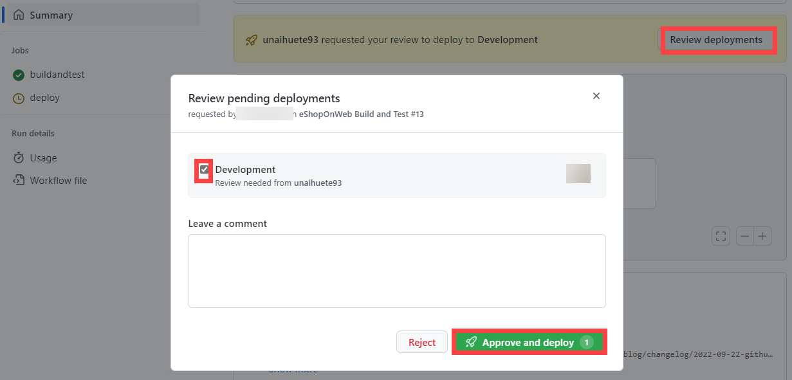

---
lab:
  title: 为 CI/CD 实现 GitHub Actions
  module: 'Module 03: Implement CI with Azure Pipelines and GitHub Actions'
---

# 为 CI/CD 实现 GitHub Actions

# 学生实验室手册

## 实验室要求

- 本实验室需要使用 Microsoft Edge 或[支持 Azure DevOps 的浏览器](https://docs.microsoft.com/en-us/azure/devops/server/compatibility?view=azure-devops#web-portal-supported-browsers)。

- 标识现有的 Azure 订阅或创建一个新的 Azure 订阅。

- 验证你是否拥有 Microsoft 帐户或具有 Azure 订阅中参与者或所有者角色的 Azure AD 帐户。 有关详细信息，请参阅[使用 Azure 门户列出 Azure 角色分配](https://docs.microsoft.com/azure/role-based-access-control/role-assignments-list-portal)和[在 Azure Active Directory 中查看和分配管理员角色](https://docs.microsoft.com/azure/active-directory/roles/manage-roles-portal#view-my-roles)。

- 如果还没有可用于此实验室的 GitHub 帐户，请按照[注册新的 GitHub 帐户](https://github.com/join)中的说明创建一个帐户。

## 实验室概述

在此实验室中，你将学习如何实现部署 Azure Web 应用的 GitHub Action 工作流。

## 目标

完成本实验室后，你将能够：

- 为 CI/CD 实现 GitHub Action 工作流。
- 解释 GitHub Action 工作流的基本特征。

## 预计用时：40 分钟

## 说明

### 练习 0：将 eShopOnWeb 导入 GitHub 存储库

在本练习中，你会将现有的 [eShopOnWeb](https://github.com/MicrosoftLearning/eShopOnWeb) 存储库代码导入你自己的 GitHub 专用存储库。

存储库按以下方式组织：
    - .ado 文件夹包含 Azure DevOps YAML 管道
    - .devcontainer 文件夹容器设置，用于使用容器（在 VS Code 或 GitHub Codespaces 中本地进行）开发
    - .azure 文件夹包含某些实验室方案中使用的 Bicep&ARM 基础结构即代码模板。
    - .github 文件夹容器 YAML GitHub 工作流定义。
    - src 文件夹包含用于实验室方案的 .NET 6 网站。

#### 任务 1：在 GitHub 中创建公共存储库并导入 eShopOnWeb

在此任务中，你将创建一个空的公共 GitHub 存储库，并导入现有的 [eShopOnWeb](https://github.com/MicrosoftLearning/eShopOnWeb) 存储库。

1. 在实验室计算机中，启动 Web 浏览器，导航到 [GitHub 网站](https://github.com/)，使用帐户登录，然后单击“新建”创建新存储库。

    
 
1. 在“创建新存储库”页上，单击“导入存储库”链接（页面标题下方）。

    > 注意：还可以在 https://github.com/new/import 直接打开导入网站

1. 在“将项目导入 GitHub”页上：
    
    | 字段 | 值 |
    | --- | --- |
    | 旧存储库的克隆 URL| https://github.com/MicrosoftLearning/eShopOnWeb |
    | 所有者 | 帐户别名 |
    | 存储库名称 | eShopOnWeb |
    | 隐私 | **公共** | 

1. 单击“开始导入”并等待存储库准备就绪。

1. 在存储库页上，转到“设置”，单击“操作”>“常规”，然后选择“允许所有操作和可重用工作流”选项。 单击“保存” 。

    


### 练习 1：设置 GitHub 存储库和 Azure 访问

在本练习中，你将创建一个 Azure 服务主体，以授权 GitHub 从 GitHub Actions 访问 Azure 订阅。 你还将设置 GitHub 工作流，用于生成、测试网站并将其部署到 Azure。 

#### 任务 1：创建 Azure 服务主体并将其另存为 GitHub 机密

在此任务中，你将创建 GitHub 用于部署所需资源的 Azure 服务主体。 作为替代方法，还可以[在 Azure 中使用 OpenID Connect](https://docs.github.com/actions/deployment/security-hardening-your-deployments/configuring-openid-connect-in-azure) 作为无机密身份验证机制。

1. 在实验室计算机上的浏览器窗口中，打开 Azure 门户 (https://portal.azure.com/) 。
1. 在门户中，查找“资源组”并单击它。
1. 单击“+ 创建”为练习创建新的资源组。
1. 在“创建资源组”选项卡上，为资源组提供以下名称：rg-az400-eshoponweb-NAME（将 NAME 替换为某些唯一别名） 。 单击“查看 + 创建”>“创建”。
1. 在 Azure 门户中，打开 Cloud Shell（搜索栏旁边）。

    > 注意：如果这是你第一次打开 Cloud Shell，则需要配置[永久性存储](https://learn.microsoft.com/en-us/azure/cloud-shell/persisting-shell-storage#create-new-storage)

1. 确保终端在 Bash 模式下运行并执行以下命令，将 SUBSCRIPTION-ID 和 RESOURCE-GROUP 替换为自己的标识符（这两者均可在资源组的“概述”页上找到）：

    `az ad sp create-for-rbac --name GH-Action-eshoponweb --role contributor --scopes /subscriptions/SUBSCRIPTION-ID/resourceGroups/RESOURCE-GROUP --sdk-auth`

    > 注意：此命令将创建具有对之前创建的资源组的参与者访问权限的服务主体。 这样，我们可以确保 GitHub Actions 仅具有仅与此资源组（而不是订阅的其余部分）交互所需的权限

1. 该命令将输出 JSON 对象，稍后将其保留为工作流的 GitHub 机密，复制它。 JSON 包含用于以 Azure AD 应用程序标识（服务主体）的名称对 Azure 进行身份验证的标识符。

    ```JSON
        {
            "clientId": "<GUID>",
            "clientSecret": "<GUID>",
            "subscriptionId": "<GUID>",
            "tenantId": "<GUID>",
            (...)
        }
    ```

1. 在浏览器窗口中，返回到 eShopOnWeb GitHub 存储库。
1. 在存储库页上，转到“设置”，单击“机密”>“操作”。 单击“新建存储库机密”
    - 名称：AZURE_CREDENTIALS
    - 机密：粘贴以前复制的 JSON 对象（GitHub 能够以相同的名称保存多个机密，由 [azure/login](https://github.com/Azure/login) 操作使用）

1. 单击“添加机密”。 现在，GitHub Actions 将能够使用存储库机密来引用服务主体。

#### 任务 2：修改和执行 GitHub 工作流

在此任务中，你将修改给定的 GitHub 工作流并执行该工作流，以在自己的订阅中部署解决方案。

1. 在浏览器窗口中，返回到 eShopOnWeb GitHub 存储库。
1. 在存储库页上，转到“代码”并打开以下文件：eShopOnWeb/.github/workflows/eshoponweb-cicd.yml。 此工作流为给定的 .NET 6 网站代码定义 CI/CD 进程。

1. 取消注释 on 部分（删除“#”）。 工作流每次推送到主分支时都会触发，并提供手动触发（“workflow_dispatch”）。

1. 在 env 部分进行以下更改：
    - 替换 RESOURCE-GROUP 变量中的 NAME。 它应该是在前面步骤中创建的同一资源组。
    - （可选）可以为 LOCATION 选择离你最近的 [azure 区域](https://azure.microsoft.com/en-gb/explore/global-infrastructure/geographies/#geographies)。 例如，“eastus”、“eastasia”、“westus”等。
    - 替换 SUBSCRIPTION-ID 中的 YOUR-SUBS-ID。
    - 将 WEBAPP-NAME 中的 NAME 替换为一些唯一别名。 它将用于使用 Azure 应用服务创建全局唯一网站。

1. 请仔细阅读工作流，并提供注释以帮助理解。

1. 单击“开始提交”和“提交更改”保留默认值（更改主分支）。 工作流将自动执行。

#### 任务 3：查看 GitHub 工作流执行
 
在此任务中，你将查看 GitHub 工作流执行：

1. 在浏览器窗口中，返回到 eShopOnWeb GitHub 存储库。
1. 在存储库页上，转到“操作”，在执行之前将看到工作流设置。 单击该磁贴。

    

1. 等待工作流完成。 在“摘要”中，可以看到两个工作流作业，即从执行中保留的状态和项目。 可以单击每个作业以查看日志。

    

1. 在浏览器窗口中，返回到 Azure 门户 (https://portal.azure.com/) 。 打开之前创建的资源组。 你将看到 GitHub Action 使用 bicep 模板创建了 Azure 应用服务计划和应用服务。 可以看到已发布的网站打开了该应用服务且正在单击“浏览”。

    

#### （可选）任务 4：使用 GitHub 环境添加手动审批预部署

在此任务中，你将使用 GitHub 环境在工作流的部署作业上执行定义的操作之前请求手动批准。

1. 在存储库页上，转到“代码”并打开以下文件：eShopOnWeb/.github/workflows/eshoponweb-cicd.yml。
1. 在“部署作业”部分中，可以找到对一个名为“开发”的环境的引用。 GitHub 使用的[环境](https://docs.github.com/en/actions/deployment/targeting-different-environments/using-environments-for-deployment)为目标添加保护规则（和机密）。

1. 在存储库页上，转到“设置”，打开“环境”，然后单击“新建环境”。

1. 将环境命名为“开发”，然后单击“配置环境”。

1. 在“配置开发”选项卡中，选中“必需审阅者”选项和作为审阅者的 GitHub 帐户。 单击“保存保护规则”。

1. 现在，让我们测试保护规则。 在存储库页上，转到“操作”，单击“eShopOnWeb 生成和测试”工作流，然后单击“运行工作流”>“运行工作流”手动执行。

    

1. 单击工作流的开始执行，并等待 buildandtest 作业完成。 到达 deploy 作业后，你将看到评审请求。

1. 单击“查看部署”，选中“开发”，然后单击“批准和部署”。

    

1. 工作流将遵循 deploy 作业执行并完成。

### 练习 2：删除 Azure 实验室资源

在此练习中，你将使用 Azure Cloud Shell 删除在本实验室中预配的 Azure 资源，避免产生不必要的费用。

1. 在 Azure 门户中，在 Cloud Shell 窗格中打开 Bash Shell 会话 。
1. 运行以下命令，列出在本模块各实验室中创建的所有资源组：

    ```sh
    az group list --query "[?starts_with(name,'rg-az400-eshoponweb')].name" --output tsv
    ```

1. 通过运行以下命令，删除在此模块的实验室中创建的所有资源组：

    ```sh
    az group list --query "[?starts_with(name,'rg-az400-eshoponweb')].[name]" --output tsv | xargs -L1 bash -c 'az group delete --name $0 --no-wait --yes'
    ```

    >**注意**：该命令以异步方式执行（由 --nowait 参数确定），因此，尽管可立即在同一 Bash 会话中运行另一个 Azure CLI 命令，但实际上要花几分钟才能删除资源组。

## 审阅

在此实验室中，你实现了部署 Azure Web 应用的 GitHub Action 工作流。
