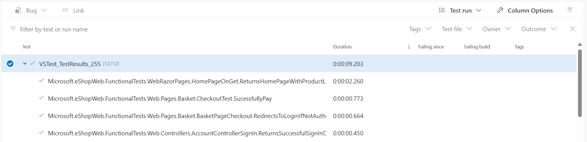

---
lab:
  title: 设置和运行功能测试
  module: 'Module 03: Design and implement a release strategy'
---

# 设置和运行功能测试

## 学生实验室手册

## 实验室要求

- 本实验室需要使用 Microsoft Edge 或[支持 Azure DevOps 的浏览器](https://docs.microsoft.com/azure/devops/server/compatibility)。

- 设置 Azure DevOps 组织：如果还没有可用于本实验室的 Azure DevOps 组织，请按照[创建组织或项目集合](https://learn.microsoft.com/dotnet/architecture/modern-web-apps-azure/test-asp-net-core-mvc-apps)中的说明创建一个。

## 实验室概述

任何复杂程度的软件在响应更改方面皆可能意外失败。 因此，更改后，除最普通（或关键性最低）的应用程序外，其他所有应用程序均需测试。 手动测试是最慢、最不可靠且最昂贵的软件测试方式。

软件应用程序自动测试具有多种类型。 最简单最低级别的测试是单元测试。 级别稍高的测试包括集成测试和功能测试。 其他类型的测试不在本实验室讨论范围之内，例如 UI 测试、负载测试、压力测试和版本验收测试。

若要详细了解不同类型的测试，建议阅读这篇文章：[测试 ASP.NET Core MVC 应用](https://learn.microsoft.com/dotnet/architecture/modern-web-apps-azure/test-asp-net-core-mvc-apps)。

## 目标

完成本实验室后，你将能够为 .Net 应用程序配置 CI 管道，其中包括：

- 单元测试
- 集成测试
- 功能测试

## 预计用时：60 分钟

## 说明

### 练习 0：配置实验室先决条件

在本练习中，你将设置实验室先决条件，其中包括设置新的 Azure DevOps 项目，该项目的存储库基于 [eShopOnWeb](https://github.com/MicrosoftLearning/eShopOnWeb)。

#### 任务 1：（如果已完成，请跳过此任务）创建和配置团队项目

在此任务中，你将创建一个 eShopOnWeb Azure DevOps 项目，供多个实验室使用。

1. 在实验室计算机上，在浏览器窗口中打开 Azure DevOps 组织。 单击“新建项目”。 将项目命名为 eShopOnWeb，并将其他字段保留默认值。 单击“创建”。

#### 任务 2：（如果已完成，请跳过此任务）导入 eShopOnWeb Git 存储库

在此任务中，你将导入将由多个实验室使用的 eShopOnWeb Git 存储库。

1. 在实验室计算机上，在浏览器窗口中打开 Azure DevOps 组织和以前创建的 eShopOnWeb 项目。 单击“Repos”>“文件”，然后单击“导入存储库”。 选择“导入”  。 在“导入 Git 存储库”窗口中，粘贴以下 URL <https://github.com/MicrosoftLearning/eShopOnWeb.git> 并单击“导入”：

1. 存储库按以下方式组织：
    - .ado 文件夹包含 Azure DevOps YAML 管道。
    - 设置 .devcontainer 文件夹容器，使用容器（在 VS Code 或 GitHub Codespaces 中本地进行）开发。
    - infra 文件夹包含某些实验室方案中使用的 Bicep 和 ARM 基础结构即代码模板。****
    - .github 文件夹容器 YAML GitHub 工作流定义。
    - src 文件夹包含实验室方案中使用的 .NET 网站。

#### 任务 3：（如果已完成，请跳过此任务）将主分支设置为默认分支

1. 转到“Repos”>“分支”。
1. 将鼠标指针悬停在主分支上，然后单击列右侧的省略号。
1. 单击“设置为默认分支”。

### 练习 1：在 CI 管道中设置测试

在本练习中，你将在 CI 管道中设置测试。

#### 任务 1：（若完成则跳过）为 CI 导入 YAML 生成定义

在此任务中，你将添加用于实现持续集成的 YAML 生成定义。

让我们首先导入名为 [eshoponweb-ci.yml](https://github.com/MicrosoftLearning/eShopOnWeb/blob/main/.ado/eshoponweb-ci.yml) 的 CI 管道。

1. 转到“管道”>“管道”。
1. 单击“新建管道”按钮。
1. 选择“Azure Repos Git (YAML)”。
1. 选择“eShopOnWeb”存储库。
1. 选择“现有 Azure Pipelines YAML 文件”。
1. 选择主分支和 /.ado/eshoponweb-ci.yml 文件，然后单击“继续”。************

    CI 定义由以下任务构成：
    - DotNet 还原：使用 NuGet 包还原，可以安装项目的所有依赖项，而无需将其存储在源代码管理中。
    - DotNet 生成：生成项目及其所有依赖项。
    - DotNet 测试：用于执行单元测试的 .Net 测试驱动程序。
    - DotNet 发布：将应用程序及其依赖项发布到文件夹以部署到托管系统。 在本例中，它是 Build.ArtifactStagingDirectory。
    - 发布项目 - 网站：发布（在上一步中创建的）应用项目，并将其作为管道项目提供。
    - 发布项目 - Bicep：发布基础结构项目（Bicep 文件），并将其作为管道项目提供。
1. 单击“保存”按钮（不是“保存并运行”），保存管道定义。

#### 任务 2：向 CI 管道添加测试

在此任务中，你将向 CI 管道添加添加集成和功能测试。

可能会发现单元测试任务已纳入管道。

- 单元测试可测试应用程序逻辑的单个部分。 可通过否定列举方式对其进行进一步描述。 单元测试并不测试代码如何处理依赖项或基础结构 - 这是集成测试的用途。

1. 现在，需要在单元测试任务后面添加集成测试任务：

    ```YAML
    - task: DotNetCoreCLI@2
      displayName: Integration Tests
      inputs:
        command: 'test'
        projects: 'tests/IntegrationTests/*.csproj'
    ```

    > 集成测试可测试代码如何利用依赖项或基础结构。 尽管建议封装与数据库和文件系统等基础结构交互的代码，但是仍会剩下一些此类代码，你可能需要对其进行测试。 应用程序依赖项完全解析时，还应验证代码层是否按预期方式交互。 此功能是集成测试的目的。

1. 然后，需要在集成测试任务后面添加功能测试任务：

    ```YAML
    - task: DotNetCoreCLI@2
      displayName: Functional Tests
      inputs:
        command: 'test'
        projects: 'tests/FunctionalTests/*.csproj'
    ```

    > 功能测试从用户角度编写，可基于其要求验证系统的正确性。 该测试不同于集成测试，后者从开发者角度编写，用于验证系统的一些组件是否能共同正常运行。

1. 单击“保存”，在“保存”窗格上，再次单击“保存”，以直接将更改提交到主分支  。

#### 任务 4：检查测试摘要

1. 单击“运行”，然后在“运行管道”选项卡中再次单击“运行”  。

1. 等待管道启动，直到它成功完成生成阶段。

1. 完成后，“测试”选项卡将显示为管道运行的一部分。 单击它以检查摘要。 如下所示：

    

1. 有关更多详细信息，该表在页面底部会显示不同运行测试的列表。

    >注意：如果表为空，则需要重置筛选器，以显示测试运行的所有相关详细信息。

    

## 审阅

在本实验室中，你已了解如何使用 Azure Pipelines 和 .Net 设置和运行不同的测试类型。
