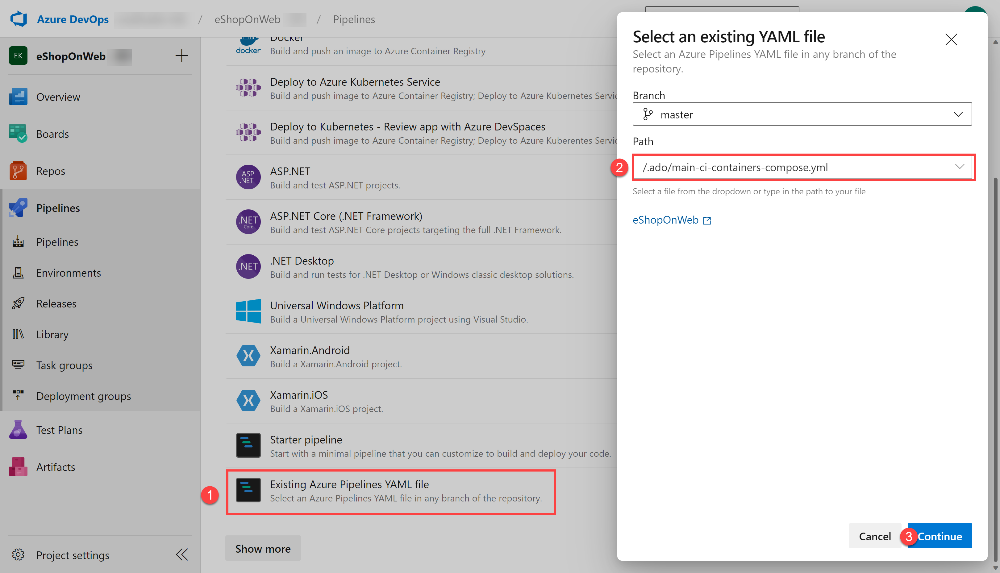

---
lab:
  title: 将 Azure Key Vault 与 Azure DevOps 集成
  module: 'Module 04: Implement a secure continuous deployment using Azure Pipelines'
---

# 将 Azure Key Vault 与 Azure DevOps 集成

## 实验室要求

- 本实验室需要使用 Microsoft Edge 或[支持 Azure DevOps 的浏览器](https://learn.microsoft.com/azure/devops/server/compatibility)。

- 设置 Azure DevOps 组织：如果还没有可用于本实验室的 Azure DevOps 组织，请按照[创建组织或项目集合](https://learn.microsoft.com/azure/devops/organizations/accounts/create-organization)中的说明创建一个。
- 标识现有的 Azure 订阅或创建一个新的 Azure 订阅。

## 实验室概述

Azure Key Vault 可安全存储和管理敏感数据，例如密钥、密码和证书。 Azure Key Vault 支持硬件安全模块以及各种加密算法和密钥长度。 通过使用 Azure Key Vault，可以最大程序降低通过源代码泄漏敏感数据的可能性，这是开发人员经常犯的一个错误。 访问 Azure Key Vault 需要正确的身份验证和授权，从而支持对其内容进行细化的权限管理。

在本实验室中，你将了解如何使用以下步骤将 Azure 密钥保管库与 Azure Pipelines 集成：

- 创建 Azure Key Vault 以将 ACR 密码存储为机密。
- 提供对 Azure 密钥保管库中机密的访问权限。
- 配置权限以读取机密。
- 配置管道，以从 Azure Key Vault 检索密码并将其传递到后续任务。

## 目标

完成本实验室后，你将能够：

- 创建 Azure 密钥保管库。
- 从 Azure DevOps 管道中的 Azure 密钥保管库检索机密。
- 在管道中的后续任务中使用机密。
- 使用机密将容器映像部署到 Azure 容器实例 (ACI)。

## 预计用时：40 分钟

## 说明

### 练习 0：（如已完成，则跳过）配置实验室先决条件

在本练习中，你将设置实验室先决条件，其中包括设置新的 Azure DevOps 项目，该项目的存储库基于 [eShopOnWeb](https://github.com/MicrosoftLearning/eShopOnWeb)。

#### 任务 1：（如果已完成，请跳过此任务）创建和配置团队项目

在此任务中，你将创建一个 eShopOnWeb Azure DevOps 项目，供多个实验室使用。

1. 在实验室计算机上，在浏览器窗口中打开 Azure DevOps 组织。 单击“新建项目”。 将项目命名为 eShopOnWeb，并将其他字段保留默认值。 单击“创建”。

    

#### 任务 2：（如果已完成，请跳过此任务）导入 eShopOnWeb Git 存储库

在此任务中，你将导入将由多个实验室使用的 eShopOnWeb Git 存储库。

1. 在实验室计算机上，在浏览器窗口中打开 Azure DevOps 组织和以前创建的 eShopOnWeb 项目。 单击“Repos”>“文件存储”****、“导入”****。 在“导入 Git 存储库”窗口中，粘贴以下 URL <https://github.com/MicrosoftLearning/eShopOnWeb.git> 并单击“导入”：

    

1. 存储库按以下方式组织：
    - .ado 文件夹包含 Azure DevOps YAML 管道。
    - 设置 .devcontainer 文件夹容器，使用容器（在 VS Code 或 GitHub Codespaces 中本地进行）开发。
    - infra 文件夹包含某些实验室方案中使用的 Bicep 和 ARM 基础结构即代码模板。****
    - .github 文件夹容器 YAML GitHub 工作流定义。
    - src 文件夹包含用于实验室方案的 .NET 8 网站。****

#### 任务 3：（如果已完成，请跳过此任务）将主分支设置为默认分支

1. 转到“Repos”>“分支”****。
1. 将鼠标指针悬停在主分支上，然后单击列右侧的省略号。
1. 单击“设置为默认分支”。

### 练习 1：设置 CI 管道以生成 eShopOnWeb 容器

在本练习中，你将创建一个 CI 管道，用于生成 eShopOnWeb 容器映像并将其推送到 Azure 容器注册表 (ACR)。 管道将使用 Docker Compose 生成映像并将其推送到 ACR。

#### 任务 1：设置和运行 CI 管道

在此任务中，你将导入现有的 CI YAML 管道定义、修改并运行它。 它将创建新的 Azure 容器注册表 (ACR) 并生成/发布 eShopOnWeb 容器映像。

1. 从实验室计算机启动 Web 浏览器，导航到 Azure DevOps eShopOnWeb 项目。 转到“**管道 > 管道**”，然后单击“**创建管道**”（或“**新建管道**”）。

1. 在“你的代码在哪里?”窗口中，选择“Azure Repos Git (YAML)”并选择“eShopOnWeb”存储库。

1. 在“配置”部分，选择“现有 Azure Pipelines YAML 文件”。 选择分支：“主分支”，提供以下路径：/.ado/eshoponweb-ci-dockercompose.yml，然后单击“继续”。************

    

1. 在 YAML 管道定义中，通过将 AZ400-EWebShop-NAME 中的 NAME 替换为唯一的值来自定义资源组名称，并将 YOUR-SUBSCRIPTION-ID 替换为你自己的 Azure subscriptionId。************

1. 单击“保存并运行”，等待管道成功执行。

    > 重要说明：如果看到消息“此管道需要访问资源的权限，然后才能继续运行 Docker Compose to ACI”，请再次单击“查看”、“允许”和“允许”。 这是允许管道创建资源所必需的。

    > **注意**：此生成可能需要花费几分钟时间完成。 生成定义由以下任务构成：
    - AzureResourceManagerTemplateDeployment 使用 bicep 部署 Azure 容器注册表。
    - PowerShell 任务获取 bicep 输出（ACR 登录服务器）并创建管道变量。
    - DockerCompose 任务生成 eShopOnWeb 的容器映像并将其推送到 Azure 容器注册表。

1. 管道将采用基于项目名称的名称。 让我们重命名它，以便更好地识别管道。 转到“**管道 > 管道**”，然后单击最近创建的管道。 单击省略号和“重命名/删除”选项。 将其命名为 **`eshoponweb-ci-dockercompose`**，然后单击“**保存**”。

1. 执行完成后，在 Azure 门户中打开以前定义的资源组，应找到 Azure 容器注册表 (ACR)，其中包含创建的容器映像 eshoppublicapi 和 eshopwebmvc。 仅在部署阶段使用 eshopwebmvc。

    

1. 单击“访问密钥”，启用“管理员用户”（如果尚未这样做），并复制密码值。************ 它将在以下任务中使用，因为我们会将它作为机密保存在 Azure Key Vault 中。

    

#### 任务 2：创建 Azure 密钥保管库

在本任务中，你将使用 Azure 门户创建 Azure 密钥保管库。

对于本实验室场景，我们将有一个 Azure 容器实例 (ACI)，用于拉取并运行存储在 Azure 容器注册表 (ACR) 中的容器映像。 我们打算将 ACR 的密码作为机密存储到密钥保管库中。

1. 在 Azure 门户中的“**搜索资源、服务和文档**”文本框中，键入 **`Key vault`**，然后按 **Enter** 键。
1. 选择“**密钥保管库**”边栏选项卡，单击“**创建 > 密钥保管库**”。
1. 在“创建密钥保管库”边栏选项卡的“基本信息”选项卡中，指定以下设置，然后单击“下一步”：

    | 设置 | 值 |
    | --- | --- |
    | 订阅 | 你在此实验室中使用的 Azure 订阅的名称 |
    | 资源组 | 新资源组 AZ400-EWebShop-NAME 的名称 |
    | 密钥保管库名称 | 任何唯一的有效名称，如 ewebshop-kv-NAME（替换 NAME） |
    | 区域 | 靠近实验室环境位置的 Azure 区域 |
    | 定价层 | **标准** |
    | 保留已删除保管库的天数 | **7** |
    | 清除保护 | **禁用清除保护** |

1. 在“创建密钥保管库”边栏选项卡的“访问配置”选项卡上，选择“保管库访问策略”，然后在“访问策略”部分中，单击“+ 创建”以设置新策略    。

    > **注意**：你需要保护对密钥保管库的访问，只允许得到授权的应用程序和用户进行访问。 若要从保管库访问数据，你需要提供对先前创建的服务主体的读取（获取/列出）权限，以便在管道中进行身份验证。

    1. 在“权限”边栏选项卡上“机密权限”的下方，选中“获取”和“列出”权限。 单击“下一步”。
    2. 在“主体”边栏选项卡上，使用给定的“ID”或“名称”搜索以前创建的服务主体，并从列表中选择它。 单击“下一步”、“下一步”、“创建”（访问策略）  。
    3. 在“查看 + 创建”边栏选项卡上，单击“创建”。

1. 返回到“创建密钥保管库”边栏选项卡，单击“查看 + 创建”>“创建”

    > 注意：等待预配 Azure 密钥保管库。 此过程应该会在 1 分钟内完成。

1. 在“部署完成”边栏选项卡上，单击“转到资源”。
1. 在“Azure 密钥保管库”(ewebshop-kv-NAME) 边栏选项卡左侧垂直菜单中的“对象”部分，单击“机密” 。
1. 在“机密”边栏选项卡上，单击“生成/导入”。
1. 在“创建机密”边栏选项卡上，指定以下设置并单击“创建”（将其他设置保留为默认值）：

    | 设置 | 值 |
    | --- | --- |
    | 上传选项 | **手动** |
    | 名称 | acr-secret |
    | 值 | 在上一任务中复制的 ACR 访问密码 |

#### 任务 3：创建连接到 Azure 密钥保管库的变量组

在此任务中，将在 Azure DevOps 中创建一个变量组，该变量组将使用之前创建的服务连接从密钥保管库中检索 ACR 密码机密。

1. 在实验室计算机上，启动 Web 浏览器并导航到 Azure DevOps 项目 eShopOnWeb。

1. 在 Azure DevOps 门户的垂直导航窗格中，选择“**管道 > 库**”。 单击“+ 变量组”。

1. 在“新建变量组”边栏选项卡上，指定以下设置：

    | 设置 | 值 |
    | --- | --- |
    | 变量组名称 | eshopweb-vg |
    | 链接 Azure 密钥保管库中的机密 | **enable** |
    | Azure 订阅 | 可用 Azure 服务连接 > Azure 订阅 |
    | 密钥保管库名称 | 你的密钥保管库名称|

1. 在“变量”下，单击“+ 添加”，然后选择 acr-secret 机密。 单击“确定”。
1. 单击“保存” 。

    

#### 任务 4：设置 CD 管道以在 Azure 容器实例 (ACI) 中部署容器

在此任务中，你将导入一个 CD 管道，对其进行自定义并运行，以部署之前在 Azure 容器实例中创建的容器映像。

1. 从实验室计算机启动 Web 浏览器，导航到 Azure DevOps eShopOnWeb 项目。 转到“**管道 > 管道**”，然后单击“**新建管道**”。

1. 在“你的代码在哪里?”窗口中，选择“Azure Repos Git (YAML)”并选择“eShopOnWeb”存储库。

1. 在“配置”部分，选择“现有 Azure Pipelines YAML 文件”。 选择分支：“主分支”，提供以下路径：/.ado/eshoponweb-cd-aci.yml，然后单击“继续”。************

1. 在 YAML 管道定义中，自定义：

    - YOUR-SUBSCRIPTION-ID，替换为你的 Azure 订阅 ID。
    - az400eshop-NAME，替换 NAME 使其全局唯一。
    - **YOUR-ACR.azurecr.io** 和 **ACR-USERNAME** 与 ACR 登录服务器（两者都需要 ACR 名称，可以在“ACR”>“访问密钥”上查看）。
    - AZ400-EWebShop-NAME，其中包含之前在实验室中定义的资源组名称。

1. 单击“保存并运行”。
1. 打开管道并等待成功执行。

    > 重要说明：如果看到消息“此管道需要访问资源的权限，然后才能继续运行 Docker Compose to ACI”，请再次单击“查看”、“允许”和“允许”。 这是允许管道创建资源所必需的。

    > 注意：部署可能需要几分钟才能完成。 CD 定义由以下任务构成：
    - 资源：已准备好根据 CI 管道完成自动触发。 它还会下载 bicep 文件的存储库。
    - 变量（对于部署阶段）连接到变量组，以使用 Azure 密钥保管库机密 acr-secret
    - AzureResourceManagerTemplateDeployment 使用 bicep 模板部署 Azure 容器实例 (ACI)，并提供 ACR 登录参数以允许 ACI 从 Azure 容器注册表 (ACR) 下载以前创建的容器映像。

1. 管道将采用基于项目名称的名称。 让我们重命名它，以便更好地识别管道。 转到“**管道 > 管道**”，然后单击最近创建的管道。 单击省略号和“重命名/删除”选项。 将其命名为 eshoponweb-cd-aci，然后单击“保存”。

   > [!IMPORTANT]
   > 请记住删除在 Azure 门户中创建的资源，以避免不必要的费用。

## 审阅

在本实验室中，你已使用以下步骤将 Azure Key Vault 与 Azure DevOps 管道集成：

- 创建 Azure 密钥保管库以将 ACR 密码作为机密存储。
- 提供对 Azure 密钥保管库中机密的访问权限。
- 配置了读取机密的权限。
- 配置了管道以从 Azure 密钥保管库检索密码并将其传递到后续任务。
- 使用机密将容器映像部署到 Azure 容器实例 (ACI)。
- 创建了连接到 Azure 密钥保管库的变量组。
