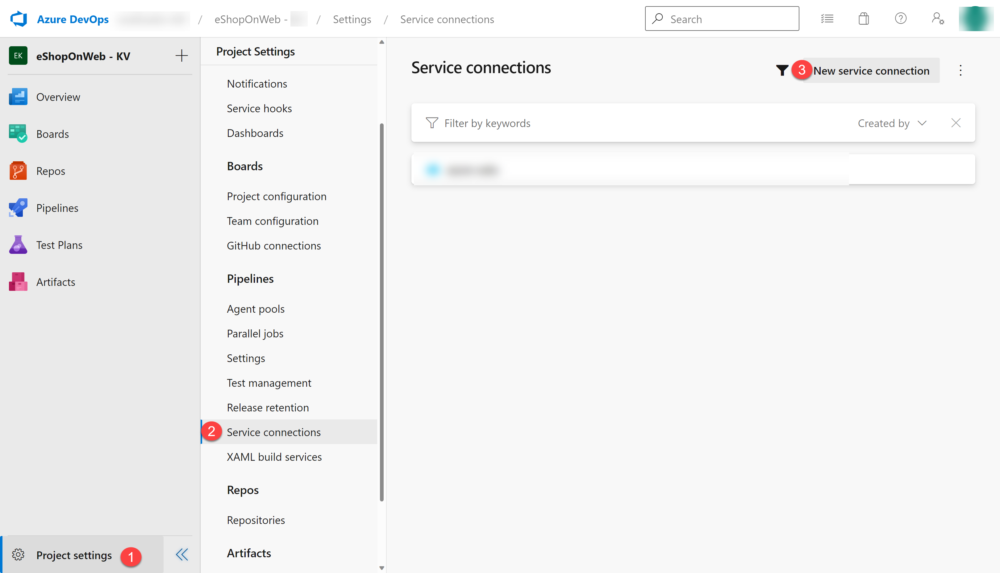

---
lab:
  title: 使用 Azure Bicep 模板进行部署
  module: 'Module 05: Manage infrastructure as code using Azure and DSC'
---

# 使用 Azure Bicep 模板进行部署

## 学生实验室手册

## 实验室要求

- 本实验室需要使用 Microsoft Edge 或[支持 Azure DevOps 的浏览器](https://docs.microsoft.com/azure/devops/server/compatibility)。

- 设置 Azure DevOps 组织：如果还没有可用于本实验室的 Azure DevOps 组织，请按照[创建组织或项目集合](https://docs.microsoft.com/azure/devops/organizations/accounts/create-organization)中的说明创建一个。

- 标识现有的 Azure 订阅或创建一个新的 Azure 订阅。

- 验证你拥有 Microsoft 帐户或 Microsoft Entra 帐户，该帐户在 Azure 订阅中具有所有者角色并且在与 Azure 订阅关联的 Microsoft Entra 租户中具有全局管理员角色。 有关详细信息，请参阅[使用 Azure 门户列出 Azure 角色分配](https://docs.microsoft.com/azure/role-based-access-control/role-assignments-list-portal)和[在 Azure Active Directory 中查看和分配管理员角色](https://docs.microsoft.com/azure/active-directory/roles/manage-roles-portal)。

## 实验室概述

在本实验室中，你将创建一个 Azure Bicep 模板，并使用 Azure Bicep 模块概念将其模块化。 然后，修改主部署模板以使用该模块，最后将所有资源部署到 Azure。

## 目标

完成本实验室后，你将能够：

- 了解 Azure Bicep 模板的结构。
- 创建可重用的 Bicep 模块。
- 修改主模板以使用该模块
- 使用 Azure YAML 管道将所有资源部署到 Azure。

## 预计用时：45 分钟

## 说明

### 练习 0：配置实验室先决条件

在本练习中，你将设置实验室先决条件，其中包括设置新的 Azure DevOps 项目，该项目的存储库基于 [eShopOnWeb](https://github.com/MicrosoftLearning/eShopOnWeb)。

#### 任务 1：（如果已完成，请跳过此任务）创建和配置团队项目

在此任务中，你将创建一个 eShopOnWeb Azure DevOps 项目，供多个实验室使用。

1. 在实验室计算机上，在浏览器窗口中打开 Azure DevOps 组织。 单击“新建项目”。 将项目命名为 eShopOnWeb，并将其他字段保留默认值。 单击“创建”。

    

#### 任务 2：（如果已完成，请跳过此任务）导入 eShopOnWeb Git 存储库

在此任务中，你将导入将由多个实验室使用的 eShopOnWeb Git 存储库。

1. 在实验室计算机上，在浏览器窗口中打开 Azure DevOps 组织和以前创建的 eShopOnWeb 项目。 单击“Repos”>“文件”，然后单击“导入存储库”。 选择“导入”  。 在“导入 Git 存储库”窗口中，粘贴以下 URL <https://github.com/MicrosoftLearning/eShopOnWeb.git> 并单击“导入”：

    

1. 存储库按以下方式组织：
    - .ado 文件夹包含 Azure DevOps YAML 管道。
    - 设置 .devcontainer 文件夹容器，使用容器（在 VS Code 或 GitHub Codespaces 中本地进行）开发。
    - infra 文件夹包含某些实验室方案中使用的 Bicep 和 ARM 基础结构即代码模板。****
    - .github 文件夹容器 YAML GitHub 工作流定义。
    - src 文件夹包含用于实验室方案的 .NET 8 网站。****

#### 任务 3：（如果已完成，请跳过此任务）将主分支设置为默认分支

1. 转到“Repos”>“分支”。
1. 将鼠标指针悬停在主分支上，然后单击列右侧的省略号。
1. 单击“设置为默认分支”。

### 练习 1：了解 Azure Bicep 模板并使用可重用模块对其进行简化

在本实验室中，你将查看 Azure Bicep 模板，并使用可重用模块对其进行简化。

#### 任务 1：创建 Azure Bicep 模板

在此任务中，你将使用 Visual Studio Code 创建 Azure Bicep 模板

1. 在浏览器选项卡中，打开 Azure DevOps 项目，导航到“**存储库**”和“**文件**”。 打开 `infra` 文件夹并找到 `simple-windows-vm.bicep` 文件。

   

1. 查看模板以更好地了解其结构。 有一些具有类型、默认值和验证的参数、一些变量以及相当多具有这些类型的资源：

   - Microsoft.Storage/storageAccounts
   - Microsoft.Network/publicIPAddresses
   - Microsoft.Network/virtualNetworks
   - Microsoft.Network/networkInterfaces
   - Microsoft.Compute/virtualMachines

1. 请注意资源定义是多么简单，以及在整个模板中隐式引用符号名称而不是显式 `dependsOn` 的能力。

#### 任务 2：创建用于存储资源的 bicep 模块

在此任务中，你将创建一个存储模板模块 **storage.bicep**，它将只创建一个存储帐户，并将由主模板导入。 存储模板模块需要将值传递回主模板 main.bicep，并且此值将在存储模板模块的输出元素中进行定义。

1. 首先，我们需要从主模板中删除存储资源。 在浏览器窗口的右上角，单击“**编辑**”按钮：

   

1. 现在删除存储资源：

   ```bicep
   resource storageAccount 'Microsoft.Storage/storageAccounts@2022-05-01' = {
     name: storageAccountName
     location: location
     sku: {
       name: 'Standard_LRS'
     }
     kind: 'Storage'
   }
   ```

1. 提交文件，但是，我们还没有完成它。

   

1. 接下来，将鼠标悬停在 `Infra` 文件夹上，单击省略号图标，然后选择**新建**和**文件**。 输入名称 **storage.bicep**，然后单击“**创建**”。

   

1. 现在，将以下代码片段复制到文件中并提交更改：

   ```bicep
   @description('Location for all resources.')
   param location string = resourceGroup().location

   @description('Name for the storage account.')
   param storageAccountName string

   resource storageAccount 'Microsoft.Storage/storageAccounts@2022-05-01' = {
     name: storageAccountName
     location: location
     sku: {
       name: 'Standard_LRS'
     }
     kind: 'Storage'
   }

   output storageURI string = storageAccount.properties.primaryEndpoints.blob
   ```

#### 任务 3：修改主模板以使用模板模块

在此任务中，你将修改主模板，以引用在上一个任务中创建的模板模块。

1. 导航回 `simple-windows-vm.bicep` 文件，然后再次单击“**编辑**”按钮。

1. 接下来，在变量后面添加以下代码：

   ```bicep
   module storageModule './storage.bicep' = {
     name: 'linkedTemplate'
     params: {
       location: location
       storageAccountName: storageAccountName
     }
   }
   ```

1. 我们还需要修改对虚拟机资源中存储帐户 blob URI 的引用，改用模块的输出。 找到虚拟机资源，将 diagnosticsProfile 部分替换为以下内容：

   ```bicep
   diagnosticsProfile: {
     bootDiagnostics: {
       enabled: true
       storageUri: storageModule.outputs.storageURI
     }
   }
   ```

1. 查看主模板中的以下详细信息：

   - 主模板中的一个模块用于链接到另一个模板。
   - 该模块有一个符号名称 `storageModule`。 此名称用于配置任何依赖项。
   - 使用模板模块时，只能使用“**增量**”部署模式。
   - 模板模块使用的是相对路径。
   - 使用参数将值从主模板传递到模板模块。

1. 提交模板。

### 练习 2：使用 YAML 管道将模板部署到 Azure

在此实验室中，你将创建一个服务连接，并在 Azure DevOps YAML 管道中使用它，将模板部署到 Azure 环境。

#### 任务 1：（如果完成则跳过）创建用于部署的服务连接

在此任务中，你将使用 Azure CLI 创建服务主体，这将允许 Azure DevOps：

- 在 Azure 订阅上部署资源。
- 对稍后创建的密钥保管库机密具有读取访问权限。

> 注意：如果你已有一个服务主体，则可以直接进行下一个任务。

你需要一个服务主体从 Azure Pipelines 部署 Azure 资源。 由于我们要检索管道中的机密，因此创建 Azure 密钥保管库时，我们需要为该服务授予权限。

从管道定义内部连接到 Azure 订阅或从项目设置页面（自动选项）新建服务连接时，Azure Pipelines 会自动创建服务主体。 你也可以从门户或使用 Azure CLI 手动创建服务主体，然后在项目中重复使用。

1. 从实验室计算机启动 Web 浏览器，导航到 [Azure 门户](https://portal.azure.com)，并使用用户帐户登录，该帐户在本实验室将使用的 Azure 订阅中具有所有者角色，并在与此订阅关联的 Microsoft Entra 租户中具有全局管理员角色。
1. 在 Azure 门户中，单击页面顶部搜索文本框右侧的 Cloud Shell 图标。
1. 如果系统提示选择“Bash”或“PowerShell”，请选择“Bash”。

   >**注意**：如果这是第一次启动 Cloud Shell，并看到“未装载任何存储”消息，请选择在本实验室中使用的订阅，然后选择“创建存储”  。

1. 在 Bash 提示符的 Cloud Shell 窗格中，运行以下命令以检索 Azure 订阅 ID 和订阅名称属性的值 ：

    ```bash
    az account show --query id --output tsv
    az account show --query name --output tsv
    ```

    > **注意**：将两个值都复制到文本文件中。 稍后将在本实验室用到它们。

1. 在 Bash 提示符的 Cloud Shell 窗格中，运行以下命令以创建服务主体（将 myServicePrincipalName 替换为任意由字母和数字组成的唯一字符串）和 mySubscriptionID（替换为你的 Azure subscriptionId）：

    ```bash
    az ad sp create-for-rbac --name myServicePrincipalName \
                         --role contributor \
                         --scopes /subscriptions/mySubscriptionID
    ```

    > **注意**：此命令将生成 JSON 输出。 将输出复制到文本文件中。 本实验室中稍后会用到它。

1. 接下来，从实验室计算机启动 Web 浏览器，导航到 Azure DevOps eShopOnWeb 项目。 单击“项目设置 > 服务连接”（在“管道”下）和“新建服务连接”。

    

1. 在“新建服务连接”边栏选项卡上，选择“Azure 资源管理器”和“下一步”（可能需要向下滚动）。

1. 选择“服务主体(手动)”并单击“下一步”。

1. 使用在前面的步骤中收集的信息填写空字段：
    - 订阅 ID 和名称。
    - 服务主体 ID (appId)、服务主体密钥（密码）和租户 ID（租户）。
    - 在“服务连接名称”中，键入 azure subs。 需要 Azure DevOps 服务连接来与 Azure 订阅通信时，将在 YAML 管道中引用此名称。

    

1. 单击“验证并保存”。

#### 任务 2：通过 YAML 管道将资源部署到 Azure

1. 导航回“管道”中心的“管道”窗格 。
1. 在“创建首个管道”窗口中，单击“创建管道” 。

    > 注意：我们将使用向导并基于项目创建新的 YAML 管道定义。

1. 在“你的代码在哪里?”窗格上，单击“Azure Repos Git (YAML)”选项 。
1. 在“选择存储库”窗格中，单击“eShopOnWeb”。
1. 在“配置管道”窗格上，向下滚动并选择“现有 Azure Pipelines YAML 文件” 。
1. 在“选择现有 YAML 文件”边栏选项卡中，指定以下参数：
   - 分支：main
   - 路径： **.ado/eshoponweb-cd-windows-cm.yml**
1. 单击“继续”保存这些设置。
1. 在“变量”部分中，为资源组选择一个名称，设置所需位置，并将服务连接的值替换为之前创建的一个现有服务连接。
1. 单击右上角的“**保存并运行**”按钮，当提交对话框出现时，再次单击“**保存并运行**”。

   

1. 等待部署完成并查看结果。
   

#### 任务 3：删除 Azure 实验室资源

在此任务中，你将使用 Azure Cloud Shell 删除在本实验室中预配的 Azure 资源，避免产生不必要的费用。

1. 在 Azure 门户中，在 Cloud Shell 窗格中打开 Bash Shell 会话 。
1. 通过运行以下命令删除在本模块的实验室中创建的所有资源组（将资源组名称替换为你选择的名称）：

   ```bash
   az group list --query "[?starts_with(name,'AZ400-EWebShop-NAME')].[name]" --output tsv | xargs -L1 bash -c 'az group delete --name $0 --no-wait --yes'
   ```

   > **注意**：该命令以异步方式执行（由 --nowait 参数确定），因此，尽管可立即在同一 Bash 会话中运行另一个 Azure CLI 命令，但实际上要花几分钟才能删除资源组。

## 审阅

在此实验室中，你学习了如何创建 Azure Bicep 模板，使用模板模块对其进行模块化，修改主部署模板以使用模块和更新的依赖项，最后使用 YAML 管道将模板部署到 Azure。
