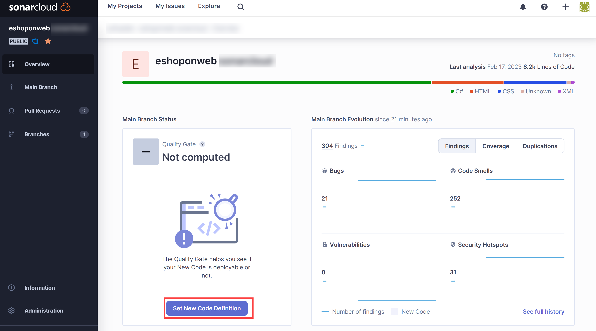
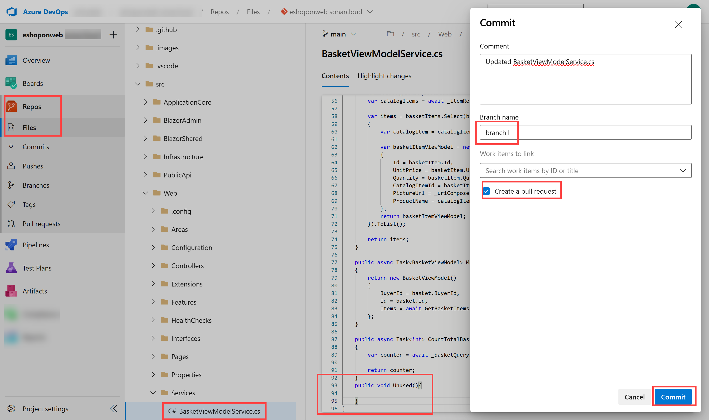
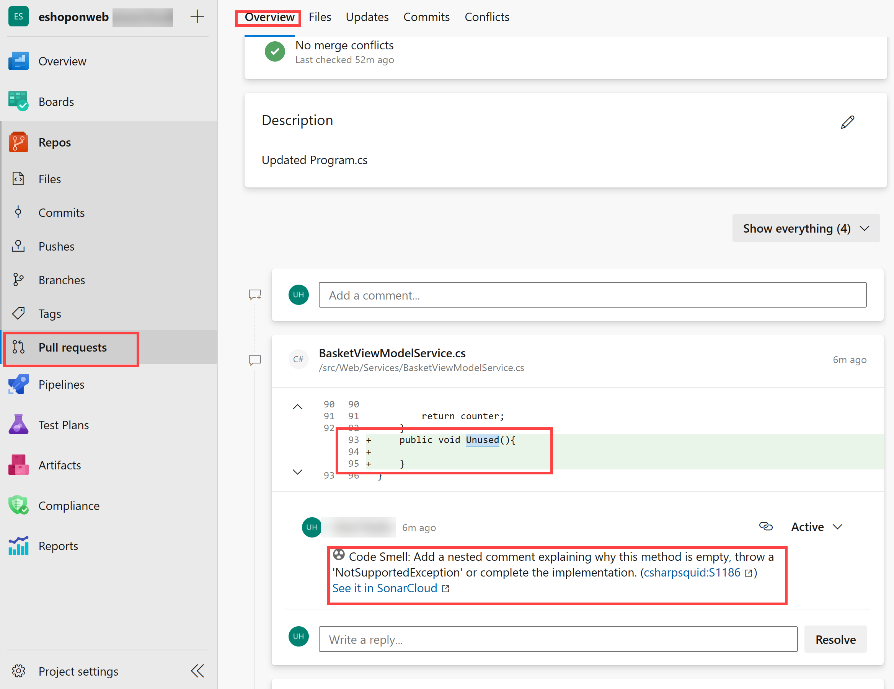

---
lab:
  title: 使用 SonarCloud 和 Azure DevOps 管理技术债务
  module: 'Module 07: Implement security and validate code bases for compliance'
---

# 使用 SonarCloud 和 Azure DevOps 管理技术债务

## 学生实验室手册

## 实验室要求

- 本实验室需要使用 Microsoft Edge 或[支持 Azure DevOps 的浏览器](https://docs.microsoft.com/azure/devops/server/compatibility)。

- 设置 Azure DevOps 组织：如果还没有可用于本实验室的 Azure DevOps 组织，请按照[创建组织或项目集合](https://docs.microsoft.com/azure/devops/organizations/accounts/create-organization)中的说明创建一个。

## 实验室概述

在 Azure DevOps 的上下文中，术语“技术债务”表示达成战术目标的次优手段，这会对在软件开发和部署中实现战略目标的能力产生负面影响。 技术债务会导致代码难以理解、容易出错、更改耗时且难以验证，因而影响工作效率。 如果不进行适当的监督和管理，技术债务会不断累积，从长远来看会严重影响软件的整体质量和开发团队的工作效率。

[SonarCloud](https://sonarcloud.io/){:target="\_blank"} 是基于云的代码质量和安全服务。 SonarCloud 的主要功能包括：

- 支持 23 种编程和脚本语言，包括 Java、JS、C#、C/C++、Objective-C、TypeScript、Python、ABAP、PLSQL 和 T-SQL。
- 提供成千上万条规则，用于根据强大的静态代码分析器来查找难以发现的 bug 和质量问题。
- 可与常用的 CI 服务（包括 Travis、Azure DevOps、BitBucket 和 AppVeyor）进行基于云的集成。
- 可进行深入的代码分析，以了解分支中的所有源文件和拉取请求，并帮助实现绿色 Quality Gate 以及促进生成。
- 加速且可缩放。

在本实验室中，你将了解如何将 Azure DevOps 与 SonarCloud 集成。

> **注意**：在运行本实验室之前，请确保能够运行 Azure Pipelines。 由于 2021 年 2 月对公共项目进行了更改，因此需要请求访问管道： <https://devblogs.microsoft.com/devops/change-in-azure-pipelines-grant-for-public-projects/>

## 目标

完成本实验室后，你将能够：

- 设置 Azure DevOps 项目和 CI 生成从而与 SonarCloud 集成。
- 分析 SonarCloud 报表。
- 将静态分析集成到 Azure DevOps 拉取请求过程中。

## 预计用时：60 分钟

## 说明

### 练习 0：配置实验室先决条件

在本练习中，你将设置实验室先决条件，其中包括设置新的 Azure DevOps 项目，该项目的存储库基于 [eShopOnWeb](https://github.com/MicrosoftLearning/eShopOnWeb)。

#### 任务 1：（如果已完成，请跳过此任务）创建和配置团队项目

在此任务中，你将创建一个 eShopOnWeb Azure DevOps 项目，供多个实验室使用。

1. 在实验室计算机上，在浏览器窗口中打开 Azure DevOps 组织。 单击“新建项目”。 将项目命名为 eShopOnWeb，然后在“工作项进程”下拉列表中选择“Scrum”。 单击“创建”。

    

#### 任务 2：（如果已完成，请跳过此任务）导入 eShopOnWeb Git 存储库

在此任务中，你将导入将由多个实验室使用的 eShopOnWeb Git 存储库。

1. 在实验室计算机上，在浏览器窗口中打开 Azure DevOps 组织和以前创建的 eShopOnWeb 项目。 单击“Repos > 文件”、“导入”。 在“导入 Git 存储库”窗口中，粘贴以下 URL <https://github.com/MicrosoftLearning/eShopOnWeb.git> 并单击“导入”：

    

1. 存储库按以下方式组织：
    - .ado 文件夹包含 Azure DevOps YAML 管道。
    - 设置 .devcontainer 文件夹容器，使用容器（在 VS Code 或 GitHub Codespaces 中本地进行）开发。
    - **infra** 文件夹包含某些实验室方案中使用的 Bicep 和 ARM 基础结构即代码模板。
    - .github 文件夹容器 YAML GitHub 工作流定义。
    - **src** 文件夹包含用于实验室方案的 .NET 8 网站。

### 练习 1：配置 SonarCloud 安装程序

#### 任务 1：将 Azure DevOps 项目更改为公共

在此任务中，需要将 Azure DevOps 项目的可见性更改为公共，因为 Sonarcloud 免费用于公共 ADO 项目。

1. 在实验室计算机上，在显示 Azure DevOps 门户的 Web 浏览器窗口中，打开 eShopOnWeb 项目，然后单击“项目设置”（左下角）。 将“可见性”更改为“公共”。 单击“保存”


#### 任务 2：生成 Azure DevOps 个人访问令牌

在此任务中，你将生成 Azure DevOps 个人访问令牌，用于对此练习下一任务中要安装的 Postman 应用进行身份验证。

1. 在实验室计算机上显示 Azure DevOps 门户的 Web 浏览器窗口中，单击 Azure DevOps 页面的右上角的“用户设置”图标，在下拉菜单中单击“个人访问令牌”，在“个人访问令牌”窗格中，单击“+ 新建令牌”   。

    

1. 在“新建个人访问令牌”窗格上，单击“显示所有范围”链接，指定以下设置，然后单击“创建”（将其他设置全部保留为默认值）  ：

     | 设置 | 值 |
     | --- | --- |
     | 名称 | “使用 SonarCloud 和 Azure DevOps 管理技术债务”实验室 |
     | 作用域 | 自定义 |
     | 范围 | **代码** |
     | 权限 | **完整** |

1. 在“成功”窗格上，将个人访问令牌的值复制到剪贴板。

     > **注意**：确保记下令牌的值。 关闭此窗格后，将无法再检索它。

1. 在“成功”窗格中，单击“关闭” 。

#### 任务 3：安装和配置 SonarCloud Azure DevOps 扩展

在此任务中，你将在 Azure DevOps 项目中安装和配置 SonarCloud Azure DevOps 扩展。

1. 在实验室计算机上，启动 Web 浏览器，导航到 Visual Studio 市场中的 [SonarCloud 扩展页](https://marketplace.visualstudio.com/items?itemName=SonarSource.sonarcloud)，单击“免费获取”，确保 Azure DevOps 组织的名称出现在“选择 Azure Devops 组织”下拉列表中，然后单击“安装”  。
1. 安装完成后，单击“前往组织”。 这会将浏览器重定向到显示了组织主页的 Azure DevOps 门户。

    > **注意**：如果你没有从市场中安装扩展的相应权限，系统会向帐户管理员发送请求，以请求其批准安装。

    > **注意**：SonarCloud 扩展包含生成任务、生成模板和自定义仪表板小组件。

1. 在 Web 浏览器窗口中，导航到 SonarCloud 主页 ([https://sonarcloud.io/](https://sonarcloud.io/))。
1. 在 SonarCloud 主页面上，单击“登录”。
1. 在“登录或注册 SonarCloud”上，单击“Azure DevOps”选项。
1. 如果系统提示“是否允许此应用访问你的信息”，请单击“是”。 如果出现提示，请依次选择“代表组织同意”和“接受” 。

    > **注意**：在 SonarCloud 中，你将创建组织，并在其中新建项目。 在 SonarCloud 中设置的组织和项目将与在 Azure DevOps 中设置的组织和项目一样。

1. 单击“从 Azure 导入组织”。

    

1. 在“创建组织”页面上的“Azure DevOps 组织名称”文本框中，键入你的 Azure DevOps 组织的名称，在“个人访问令牌”文本框中，粘贴在上一任务中记下的 Azure DevOps 令牌的值，然后单击“继续”。 Sonarcloud 将使用此令牌来分析 Azure DevOps 中托管的代码

1. 在“导入组织详细信息”部分的“密钥”文本框中，键入将用于指定 Sonarcloud 组织的字符串，为其指定与 Azure DevOps 组织相同的名称，然后单击“继续”。

    > **注意**：此密钥在 SonarCloud 系统中必须唯一。 确保“密钥”文本框的右侧显示了绿色对勾。 这表示密钥符合唯一性前提条件。

1. 在“选择计划”部分，选择要在本实验室中使用的计划（建议使用免费计划），然后单击“创建组织”  。

    > **注意**：现在，你已创建了与 Azure DevOps 组织完全相同的 SonarCloud 组织。

    > **注意**：接下来，在新创建的组织中，你将创建 SonarCloud 项目，该项目与 Azure DevOps 项目 SonarExamples 完全相同。

1. 在“分析项目 - 选择存储库”页的 Azure DevOps 项目列表中，选中“eshoponweb / eshoponweb”项旁边的复选框，然后单击“设置”。************
1. 在“选择分析方法”页上，单击“使用 Azure DevOps 管道”磁贴。

    

    > **注意**：如果已安装扩展，可忽略创建扩展部分。

1. 在“使用 Azure Pipelines 分析项目”页的“添加新的 Sonarcloud 服务终结点”上，按照 Azure DevOps 项目中所述的步骤将服务连接命名为 SonarSC，选中“授予对所有管道的访问权限”复选框，然后单击“验证并保存”。

    

    > 注意：此步骤定义 Azure Pipeline 将如何与 Sonarcloud 通信。 Sonarcloud 提供了一个令牌，管道使用该令牌与服务通信。

1. 在实验室计算机上，从 eShopOnWeb Azure DevOps 项目的左侧垂直菜单栏中，导航到“管道 > 管道”部分，单击“创建管道”（或“新建管道）”。

1. 在“你的代码在哪里?”窗口中，选择“Azure Repos Git (YAML)”并选择“eShopOnWeb”存储库。

1. 在“配置”部分，选择“现有 Azure Pipelines YAML 文件”。 提供路径 /.ado/eshoponweb-sonar-ci.yml，然后单击“继续”。 根据下一步中提到的详细信息检查管道（某些设置应进行替换）

1. 返回到 Sonarcloud 网站，在“使用 Azure Pipelines 分析项目”页上的“配置 Azure Pipelines”部分中，单击“.NET”。 这将显示“准备分析配置”、“运行代码分析”和“发布 Quality Gate 结果”所需执行的一系列步骤  。 需要这些说明才能修改上一步中提供的 YAML 管道上的“准备分析配置”任务。

1. 修改管道后，单击“运行”。

    

1. 可能需要将 Azure DevOps 项目的“可见性”更改回“专用”，以便让代理运行管道（“项目设置”>“概述”）

1. 在 Azure DevOps“管道”>“管道”中，单击最近创建的管道，将其重命名为 eshoponweb-sonar-ci。

    

#### 任务 3：检查管道结果

在此任务中，你将检查管道结果。

1. 等待管道执行完成，查看“摘要”选项卡的内容，然后单击“扩展”选项卡标题。

    > 注意：由于我们尚未在 Sonarcloud 中设置质量门信息（“无”），你将不会看到该信息。

1. 在“扩展”选项卡上，单击“详细 SonarCloud 报表” 。 这将自动打开新的浏览器选项卡，其中显示了 SonarCloud 项目报表页。

    > **注意**：另外，你可以浏览 SonarCloud 项目。

1. 验证报表是否不包含 Quality Gate 结果，如果不包含，则说明原因。

    > **注意**：为了能够看到 Quality Gate 结果，在运行第一个报表后，我们需要设置“新建代码定义”****。 这样，后续的管道运行将包含 Quality Gate 结果。 默认质量门将确保代码中没有新的漏洞/bug，并忽略以前存在的漏洞/bug。你可以创建自己的自定义质量门。

1. 单击“设置新代码定义”，然后选择“上一版本”。

    

1. 切换到 Azure DevOps 门户中的 Web 浏览器，其中显示了最新的生成运行，单击“运行新的”，然后在“运行管道”窗格中，单击“运行”。
1. 在生成运行窗格上，查看“摘要”选项卡的内容，然后单击“扩展”选项卡标头 。
1. 在“扩展”选项卡上，单击“详细 SonarCloud 报表” 。 这将自动打开新的浏览器选项卡，其中显示了 SonarCloud 项目报表页。
1. 验证报告和 Azure DevOps“扩展”选项卡现在是否“包含质量门结果” 。

    

### 练习 2：分析 SonarCloud 报表

在此练习中，你将分析 SonarCloud 报表。

#### 任务 1：分析 SonarCloud 报表

在本任务中，你将分析 SonarCloud 报表。

1. 在 SonarCloud 项目的“概述”选项卡上，我们看到了关于主分支评估的报告摘要。 如果单击“主分支”图标（左侧栏）并选择“总体代码”，将看到更详细的报告 。

    

    > **注意**：该页面还包含指标，例如“代码异味”、“覆盖率”、“复制”和“大小”（代码行）   。 下表简要说明了每个术语。

    | 术语 | 说明 |
    | --- | --- |
    | Bug | 表示代码错误的问题。 如果尚未发生该问题，则该问题将会并且可能会在最糟糕的时刻发生。 需修复该问题 |
    | **漏洞** | 与安全性相关的问题，该问题对于攻击者而言是潜在后门 |
    | 代码异味 | 代码中与可维护性相关的问题。 如果不修复该问题，则意味着即使做最乐观的估计，维护人员进行后续更改时也会更艰难。 而在最坏的情况下，维护人员会因代码的状态困惑，导致进行更改时引入更多错误 |
    | **Coverage** | 表示单元测试等测试所验证代码的百分比。 为有效防止 bug，应进行这些测试，并覆盖大部分代码 |
    | 复制 | 复制图标显示复制了源代码的哪些部分 |
    | 安全热点 | 需要手动检查以评估是否存在漏洞的安全敏感代码 |

1. 单击表示 bug 计数的数字。 这会自动显示“问题”选项卡的内容。
1. 在“问题”选项卡的右侧，单击以打开 bug。 阅读提供的说明和信息，以分析和解决 bug。

1. 将鼠标指针悬停在代码和行号之间的垂直红线上，了解代码覆盖率的差距。

    > **注意**：示例项目非常小，没有历史数据。 但数千个 [SonarCloud 公共项目](https://sonarcloud.io/explore/projects)具有更值得研究且更实际的结果。

### 练习 3：实现与 SonarCloud 的 Azure DevOps 拉取请求集成

在此练习中，你将在 Azure DevOps 和 SonarCloud 之间设置拉取请求集成。

> **注意**：为配置 SonarCloud 分析来分析 Azure DevOps 拉取请求中包含的代码，需要执行以下任务：

- 将 Azure DevOps 个人访问令牌添加到 SonarCloud 项目，该令牌可授权其对拉取请求的访问权限（已在本实验室中创建）。
- 配置 Azure DevOps 分支策略，该策略控制拉动请求触发的生成

#### 任务 1：配置 SonarCloud 中的拉取请求集成

在此任务中，你将通过为 SonarCloud 项目分配 Azure DevOps 个人访问令牌来配置 SonarCloud 中的拉取请求集成。

1. 切换到显示 SonarCloud 中 eShopOnWeb 项目的 Web 浏览器窗口。
1. 在项目的仪表板页面上，单击“管理”选项卡的图标，然后在下拉菜单中，单击“常规设置” 。
1. 在“常规设置”页面，单击“拉取请求” 。
1. 在“拉取请求”设置的“常规”部分的“提供程序”下拉列表中，选择“Azure DevOps Services”，然后单击“保存”    。
1. 在“拉取请求”设置的“与 Azure DevOps Services 集成”部分的“个人访问令牌”文本框中，粘贴先前生成的 Azure DevOps 个人访问令牌，然后单击“保存”

    

#### 任务 2：为与 SonarCloud 的集成配置分支策略

在此任务中，你将为与 SonarCloud 集成配置 Azure DevOps 分支策略。

1. 切换到显示 Azure DevOps 门户中 eShopOnWeb 项目的 Web 浏览器窗口。
1. 在 Azure DevOps 门户最左侧的垂直菜单栏中，单击“Repos”，然后在“存储库”部分，单击“分支”  。
1. 在“分支”窗格的分支列表中，将鼠标指针悬停在主分支条目的右边缘上，这样会显示指示“更多选项”菜单的垂直省略号字符，单击省略号，然后在弹出的菜单中，单击“分支策略”。
1. 在主窗格上，单击“生成验证”部分右侧的“+”。
1. 在“添加生成策略”窗格的“生成管道”下拉列表中，选择在此实验室先前部分中创建的管道，然后在“显示名称”文本框中，键入“SonarCloud 分析”并单击“保存”    。

    > 注意：Azure DevOps 现已配置为在创建针对主分支的任意拉取请求时触发 SonarCloud 分析。

#### 任务 4：验证拉取请求集成

在此任务中，你将通过创建拉取请求和查看生成的结果来验证 Azure DevOps 和 SonarCloud 之间的拉取请求集成。

> **注意**：你将更改存储库中的文件，并创建用于触发 SonarCloud 分析的请求。

1. 在 Azure DevOps 门户左侧的垂直菜单栏中，单击“Repos”。 这将显示“文件”窗格。
1. 在中央窗格中的文件夹层次结构中，导航到 src/Web/Services/BasketViewModelService.cs 文件夹中的 Program.cs 文件，然后单击“编辑”。
1. 在“BasketViewModelService.cs”窗格上，将以下空方法添加到最后一个“}”之前的代码中：

    ```csharp
    public void Unused(){

    }
    ```

1. 在“Program.cs”窗格中，单击“提交” 。
1. 在“提交”窗格上的“分支名称”文本框中，键入“branch1”，选中“创建拉取请求”复选框，然后单击“提交”    。

    

1. 在“新建拉取请求”窗格上，选择“创建” 。
1. 在“更新的 Program.cs”窗格的“概述”选项卡上，监视生成流程的进度，直至完成 。
1. 管道将成功，但 1 个可选检查将失败。
1. Sonarcloud 还会使用注释来修饰拉取请求，说明最近不建议的做法。 还可以在 Sonarcloud 中查看完整报告以了解详细信息。

     

#### 任务 4：阻止对未通过代码质量检查进行响应的拉取请求

在此任务中，你将配置如何阻止对未通过代码质量检查进行响应的拉取请求。

> **注意**：此时，即使未通过代码质量检查，仍可完成提取请求并提交相应的更改。 除非通过相关的代码质量检查，否则你需修改 Azure DevOps 配置，以阻止提交。

1. 在 Azure Devops 门户的左下角，单击“项目设置”。
1. 在“项目设置”垂直菜单的“Repos”部分，单击“存储库”  。
1. 在“所有存储库”窗格中，单击“eShopOnWeb”。
1. 在“eShopOnWeb”窗格上，单击“策略”选项卡标题。
1. 在“策略”列表上，向下滚动到分支列表，然后单击表示主分支的条目。
1. 在主窗格上，向下滚动到“状态检查”部分并单击“+”。
1. 在“添加状态策略”窗格的“待检查的状态”下拉列表中，选择“SonarCloud/quality gate”条目，确保将“策略要求”选项设置为“必需”，然后单击“保存”

    > 注意：此时，用户只有在代码质量检查成功后才能合并拉取请求。 因此，需要在相应的 SonarCloud 项目中修复 SonarCloud 识别的所有问题，或将其标记为“已确认”或“已解决” 。

## 审阅

在本实验室中，你了解了如何将 Azure DevOps Services 与 SonarCloud 集成。
