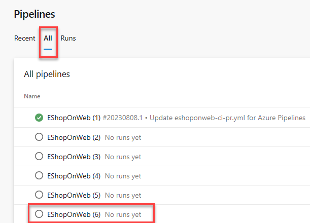
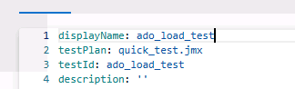

---
lab:
  title: 使用 Azure 负载测试监视应用程序性能
  module: 'Module 08: Implement continuous feedback'
---

# 使用 Azure 负载测试监视应用程序性能

## 实验室要求

- 本实验室需要使用 Microsoft Edge 或[支持 Azure DevOps 的浏览器](https://docs.microsoft.com/azure/devops/server/compatibility)。

- 设置 Azure DevOps 组织：如果还没有可用于本实验室的 Azure DevOps 组织，请按照[创建组织或项目集合](https://docs.microsoft.com/azure/devops/organizations/accounts/create-organization)中的说明创建一个。

- 标识现有的 Azure 订阅或创建一个新的 Azure 订阅。

- 验证你拥有 Microsoft 帐户或 Microsoft Entra 帐户，该帐户在 Azure 订阅中具有所有者角色并且在与 Azure 订阅关联的 Microsoft Entra 租户中具有全局管理员角色。 有关详细信息，请参阅[使用 Azure 门户列出 Azure 角色分配](https://docs.microsoft.com/azure/role-based-access-control/role-assignments-list-portal)和[在 Azure Active Directory 中查看和分配管理员角色](https://docs.microsoft.com/azure/active-directory/roles/manage-roles-portal#view-my-roles)。

## 实验室概述

**Azure 负载测试**是一项完全托管的负载测试服务，可用于生成大规模负载。 该服务可以模拟应用程序的流量，且无需其托管位置。 开发人员、测试人员和质量保证 (QA) 工程师可以使用该服务来优化应用程序性能、可缩放性或容量。
使用 URL 快速为 Web 应用程序创建负载测试，而无需事先了解测试工具。 Azure 负载测试抽取了大规模运行负载测试的复杂性和基础设施。
对于更高级的负载测试方案，可以通过重用现有的 Apache JMeter 测试脚本（一种常用的开源负载和性能工具）来创建负载测试。 例如，测试计划可能包含多个应用程序请求、你要调用非 HTTP 终结点，或者你要使用输入数据和参数使测试更加动态。

在本实验室中，可了解如何使用 Azure 负载测试来模拟针对具有不同负载方案的实时运行 Web 应用程序的性能测试。 最后，可了解如何将 Azure 负载测试集成到 CI/CD 管道中。

## 目标

完成本实验室后，你将能够：

- 部署 Azure 应用服务 Web 应用。
- 编写并运行基于 YAML 的 CI/CD 管道。
- 部署 Azure 负载测试。
- 使用 Azure 负载测试调查 Azure Web 应用性能。
- 将 Azure 负载测试集成到 CI/CD 管道中。

## 预计用时：60 分钟

## 说明

### 练习 0：配置实验室先决条件

在本练习中，将设置实验室先决条件。

#### 任务 1：（如果已完成，请跳过此任务）创建和配置团队项目

在此任务中，你将创建一个 eShopOnWeb Azure DevOps 项目，供多个实验室使用。

1. 在实验室计算机上，在浏览器窗口中打开 Azure DevOps 组织。 单击“新建项目”。 将项目命名为 eShopOnWeb，然后在“工作项进程”下拉列表中选择“Scrum”。 单击“创建”。

   

#### 任务 2：（如果已完成，请跳过此任务）导入 eShopOnWeb Git 存储库

在此任务中，你将导入将由多个实验室使用的 eShopOnWeb Git 存储库。

1. 在实验室计算机上，在浏览器窗口中打开 Azure DevOps 组织和以前创建的 eShopOnWeb 项目。 单击“Repos”>“文件存储”****、“导入”****。 在“**导入 Git 存储库**”窗口中，粘贴以下 URL <https://github.com/MicrosoftLearning/eShopOnWeb.git> 并单击“**导入**”：

   

1. 存储库按以下方式组织：
   - .ado 文件夹包含 Azure DevOps YAML 管道
   - .devcontainer 文件夹容器设置，用于使用容器（在 VS Code 或 GitHub Codespaces 中本地进行）开发
   - infra 文件夹包含某些实验室方案中使用的 Bicep 和 ARM 基础结构即代码模板。****
   - .github 文件夹容器 YAML GitHub 工作流定义。
   - src 文件夹包含用于实验室方案的 .NET 8 网站。****

#### 任务 3：（如果已完成，请跳过此任务）将主分支设置为默认分支

1. 转到“Repos”>“分支”****。
1. 将鼠标指针悬停在主分支上，然后单击列右侧的省略号。
1. 单击“设置为默认分支”。

#### 任务 4：创建 Azure 资源

在本任务中，你将在 Azure 门户中使用 Cloud Shell 创建 Azure Web 应用。

1. 从实验室计算机中启动 Web 浏览器，导航到“[**Azure 门户**](https://portal.azure.com)”，然后登录。
1. 在 Azure 门户的工具栏中，单击搜索文本框右侧的“Cloud Shell”图标。
1. 如果系统提示选择“Bash”或“PowerShell”，请选择“Bash”。

   > **注意**：如果这是第一次启动 Cloud Shell，并看到“未装载任何存储”消息，请选择在本实验室中使用的订阅，然后选择“创建存储”  。

1. 在 Cloud Shell 窗格中的 Bash 提示符下，运行以下命令以创建资源组（将 `<region>` 占位符替换为离你最近的 Azure 区域的名称，例如“eastus”） 。

   ```bash
   RESOURCEGROUPNAME='az400m08l14-RG'
   LOCATION='<region>'
   az group create --name $RESOURCEGROUPNAME --location $LOCATION
   ```

1. 若要创建 Windows 应用服务计划，请运行以下命令：

   ```bash
   SERVICEPLANNAME='az400l14-sp'
   az appservice plan create --resource-group $RESOURCEGROUPNAME \
       --name $SERVICEPLANNAME --sku B3
   ```

1. 创建具有唯一名称的 Web 应用。

   ```bash
   WEBAPPNAME=az400eshoponweb$RANDOM$RANDOM
   az webapp create --resource-group $RESOURCEGROUPNAME --plan $SERVICEPLANNAME --name $WEBAPPNAME
   ```

   > **注意**：记录 Web 应用的名称。 本实验室中稍后会用到它。

### 练习 1：在 Azure DevOps 中使用 YAML 将 CI/CD 管道配置为代码

在本练习中，你将在 Azure DevOps 中使用 YAML 将 CI/CD 管道配置为代码。

#### 任务 1：添加 YAML 生成和部署定义

在此任务中，你将向现有项目添加 YAML 生成定义。

1. 导航回“管道”中心的“管道”窗格 。
1. 单击“新建管道”（或“创建管道”，如果这是你创建的第一个管道）。****

   > 注意：我们将使用向导并基于项目创建新的 YAML 管道定义。

1. 在“你的代码在哪里?”窗格上，单击“Azure Repos Git (YAML)”选项 。
1. 在“选择存储库”窗格中，单击“eShopOnWeb”。
1. 在“配置管道”窗格上，向下滚动并选择“入门管道” 。
1. 选择入门管道中的所有行，然后将其删除。
1. 从下面复制完整的模板管道，知道需要先修改参数再保存更改 ：

   ```yml
   #Template Pipeline for CI/CD
   # trigger:
   # - main

   resources:
     repositories:
       - repository: self
         trigger: none

   stages:
     - stage: Build
       displayName: Build .Net Core Solution
       jobs:
         - job: Build
           pool:
             vmImage: ubuntu-latest
           steps:
             - task: DotNetCoreCLI@2
               displayName: Restore
               inputs:
                 command: "restore"
                 projects: "**/*.sln"
                 feedsToUse: "select"

             - task: DotNetCoreCLI@2
               displayName: Build
               inputs:
                 command: "build"
                 projects: "**/*.sln"

             - task: DotNetCoreCLI@2
               displayName: Publish
               inputs:
                 command: "publish"
                 publishWebProjects: true
                 arguments: "-o $(Build.ArtifactStagingDirectory)"

             - task: PublishBuildArtifacts@1
               displayName: Publish Artifacts ADO - Website
               inputs:
                 pathToPublish: "$(Build.ArtifactStagingDirectory)"
                 artifactName: Website

     - stage: Deploy
       displayName: Deploy to an Azure Web App
       jobs:
         - job: Deploy
           pool:
             vmImage: "windows-2019"
           steps:
             - task: DownloadBuildArtifacts@1
               inputs:
                 buildType: "current"
                 downloadType: "single"
                 artifactName: "Website"
                 downloadPath: "$(Build.ArtifactStagingDirectory)"
   ```

1. 将光标置于 YAML 定义末尾的新行上。 **确保将光标置于上一任务级别的缩进处**。

   > **注意**：这将是添加新任务的位置。

1. 单击门户右侧的“显示助手”。**** 在任务列表中，搜索并选择“Azure 应用服务部署”任务。****
1. 在“Azure 应用服务部署”窗格中，指定以下设置，并单击“添加”：

   - 在“Azure 订阅”下拉列表中，选择刚刚创建的服务连接****。
   - 验证“应用服务类型”**** 指向 Windows 上的 Web 应用。
   - 在“**应用服务名称** ”下拉列表中，选择之前在实验室 (\*\*az400eshoponweb...) 中部署的 Web 应用的名称。
   - 在“包或文件夹”文本框中，将默认值更新为 `$(Build.ArtifactStagingDirectory)/**/Web.zip`。
   - 展开“**“应用程序和配置设置**”，然后在“应用设置”文本框中添加以下键值对：`-UseOnlyInMemoryDatabase true -ASPNETCORE_ENVIRONMENT Development`。

1. 单击“添加”按钮，确认“助手”窗格中的设置。

   > **注意**：这会自动将部署任务添加到 YAML 管道定义。

1. 添加到编辑器的代码片段应如下所示，它反映了 azureSubscription 和 WebappName 参数的名称：

   ```yml
   - task: AzureRmWebAppDeployment@4
     inputs:
       ConnectionType: "AzureRM"
       azureSubscription: "SERVICE CONNECTION NAME"
       appType: "webApp"
       WebAppName: "az400eshoponWeb369825031"
       packageForLinux: "$(Build.ArtifactStagingDirectory)/**/Web.zip"
       AppSettings: "-UseOnlyInMemoryDatabase true -ASPNETCORE_ENVIRONMENT Development"
   ```

   > **注意**：在本实验室的上下文中，packageForLinux 参数具有误导性，但是对于 Windows 或 Linux，它是有效的。

1. 保存对 yml-file 的更新之前，请为它提供一个更清晰的名称。 在 yaml 编辑器窗口顶部，它会显示 EShopOnweb/azure-pipelines-#.yml。**** （其中 # 是一个数字，通常为 1，但在你的设置中可能有所不同）。选择**该文件名**，并将其重命名为 **m08l14-pipeline.yml**

1. 单击“保存”，在“保存”窗格上，再次单击“保存”，以直接将更改提交到主分支  。

   > 注意：由于原始 CI-YAML 未配置为自动触发新的生成，因此必须手动启动此生成。

1. 在 Azure DevOps 左侧菜单中，导航到“管道”，然后再次选择“管道”。 接下来，选择“所有”**** 以打开所有管道定义，而不仅仅是最近的定义。

   > 注意：如果你保留了以前实验室练习的所有管道，此新管道可能已重复使用了管道的默认 eShopOnWeb (#) 序列名称，如以下屏幕截图所示。******** 选择一个管道（很可能是序列号最高的管道，选择“编辑”并验证它指向 m08l14-pipeline.yml 代码文件）。

   

1. 通过在显示的窗格中单击“运行”并再次单击“运行”进行确认，来确认运行此管道。********
1. 请注意，此时出现了两个不同的阶段，即“生成 .Net Core 解决方案”和“部署到 Azure Web 应用”。
1. 等待管道启动。

1. 忽略在构建阶段显示的任何警告。**** 等待它成功完成构建阶段。 （你可以选择实际的构建阶段，以从日志中查看更多详细信息。）

1. 一旦部署阶段需要启动，系统会提示你“需要权限”，并显示一个橙色条：

   ```text
   This pipeline needs permission to access a resource before this run can continue to Deploy to an Azure Web App
   ```

1. 单击“查看”
1. 在“正在等待审阅”窗格中，单击“允许”。
1. 验证“允许弹出”窗口中的消息，然后单击“允许”进行确认。
1. 这将启动部署阶段。 等待该过程成功完成。

#### 任务 2：查看已部署的站点

1. 切换回显示 Azure 门户的 Web 浏览器窗口，导航到显示 Azure Web 应用的属性的边栏选项卡。
1. 在 Azure Web 应用边栏选项卡上，单击“概述”，然后在“概述”边栏选项卡上，单击“浏览”以在新的 Web 浏览器选项卡中打开站点 。
1. 验证新浏览器选项卡中的已部署站点是否按预期加载，显示 eShopOnWeb 电子商务网站。

### 练习 2：部署和设置 Azure 负载测试

在本练习中，在 Azure 中部署 Azure 负载测试资源，并为实时运行的 Azure 应用服务配置不同的负载测试方案。

> **重要说明**：Azure 负载测试是**付费服务**。 运行负载测试会产生费用。 请确保在完成实验室后清理资源，从而避免产生额外费用。 对于每个在一个月内任何时段处于活动状态的“负载测试资源”，你将被按月收费，并有权访问包含的 50 VUH。 有关详细信息，请参阅 [Azure 负载测试定价页](https://azure.microsoft.com/pricing/details/load-testing)。

#### 任务 1：部署 Azure 负载测试

在此任务中，将 Azure 负载测试资源部署到 Azure 订阅中。

1. 在 Azure 门户 (<https://portal.azure.com>) 中，导航到“创建 Azure 资源”****。
1. 在“搜索服务和市场”搜索字段中，输入“**`Azure Load Testing`**”。
1. 从搜索结果中选择 Microsoft 发布的“Azure 负载测试”。
1. 在“Azure 负载测试”页中，单击“创建”以启动部署过程。
1. 在“创建负载测试资源”页中，提供资源部署所需的详细信息：

   - 订阅：选择自己的 Azure 订阅
   - 资源组：选择在前面的练习中用于部署 Web 应用服务的资源组
   - **名称**：`eShopOnWebLoadTesting`
   - 区域：选择一个靠近你所在区域的区域

   > 注意：Azure 负载测试服务并非在所有 Azure 区域中都可用。

1. 单击“查看和创建”，以验证设置。
1. 单击“创建”进行确认，并部署 Azure 负载测试资源。
1. 随即会切换到“正在进行部署”页。 请等待几分钟，直到部署成功完成。
1. 在部署进度页中单击“转到资源”，导航到“eShopOnWebLoadTesting”Azure 负载测试资源********。

   > 注意：如果在部署 Azure 负载测试资源期间关闭了边栏选项卡或关闭了 Azure 门户，则可以从 Azure 门户的“搜索”字段或“资源”/“最近使用的资源列表”中再次找到该资源。

#### 任务 2：创建“Azure 负载测试”测试

在此任务中，使用不同的负载配置设置创建不同的“Azure 负载测试”测试。

1. 在 Azure 负载测试 **eShopOnWebLoadTesting** 的“资源”边栏选项卡中，导航到“**测试**”下的“**测试**”。 单击“**+创建**”菜单选项，然后选择“**创建基于 URL 的测试**”。
1. 取消选中“**启用高级设置**”复选框，以显示高级设置。
1. 完成以下参数和设置以创建负载测试：

   - **** 测试 URL：输入你在上一练习中部署的 Azure 应用服务的 URL (az400eshoponweb...azurewebsites.net)，包括 https://****
   - 指定负载：虚拟用户
   - 虚拟用户数：50
   - **** 测试持续时间（分钟）：5
   - **** 爬坡时间（分钟）：1

1. 通过单击“查看并创建”来确认测试的配置（不要在其他选项卡中进行任何更改）。**** 再次单击“创建”。****
1. 这将启动“负载测试”测试，这些测试将运行 5 分钟。
1. 运行测试后，导航回“eShopOnWebLoadTesting”Azure 负载测试资源页，然后导航到“测试”，选择“测试”并查看测试“Get_eShopOnweb...”****************
1. 在顶部菜单中，单击“创建”、“创建基于 URL 的测试”，以创建第二个负载测试。********
1. 完成以下参数和设置以创建另一个负载测试：

   - **** 测试 URL：输入在上一练习中部署的 Azure 应用服务的 URL (eShopOnWeb...azurewebsites.net)，包括 https://****
   - 指定负载：每秒请求数 (RPS)
   - 每秒请求数 (RPS)：100
   - 响应时间（毫秒）：500
   - **** 测试持续时间（分钟）：5
   - **** 爬坡时间（分钟）：1

1. 通过单击“查看 + 创建”来确认测试的配置，然后再次单击“创建”。********
1. 该测试将运行大约 5 分钟。

#### 任务 3：验证 Azure 负载测试结果

在此任务中，验证 Azure 负载测试 TestRun 的结果。

完成这两个快速测试后，让我们对它们进行一些更改，并验证结果。

1. 从“Azure 负载测试”导航到“测试”。******** 选择任一测试定义，通过单击其中一个测试打开更详细的视图。**** 随即会重定向到更详细的测试页。 在此处，可以通过从生成的列表中选择“TestRun_mm/dd/yy-hh:hh”来验证实际运行的详细信息。
1. 在详细的 TestRun 页中，确定 Azure 负载测试模拟的实际结果。 其中一些值为：

   - 负载请求数/总请求数
   - 持续时间
   - 响应时间（以秒为单位显示结果，反映第 90 个百分位的响应时间 - 这意味着，对于 90% 的请求，响应时间在给定结果内）
   - 吞吐量（以每秒请求数为单位）

1. 其中一些值使用仪表板图形线视图和图表视图表示，详见下面的内容。
1. 花几分钟时间比较两个模拟测试的结果，并确定更多用户对应用服务性能的影响 。

### 练习 3：在 Azure Pipelines 中使用 CI/CD 自动执行负载测试

通过将负载测试添加到 CI/CD 管道，开始在 Azure 负载测试中自动执行负载测试。 在 Azure 门户中运行负载测试后，导出配置文件，并在 Azure Pipelines 中配置 CI/CD 管道（GitHub Actions 也有类似的功能）。

完成本练习后，便有了一个 CI/CD 工作流，该工作流配置为使用 Azure 负载测试运行负载测试。

#### 任务 1：标识 Azure DevOps 服务连接详细信息

在此任务中，向 Azure DevOps 服务连接授予所需的权限。

1. 从 Azure DevOps 门户导航到 eShopOnWeb 项目****<https://aex.dev.azure.com>****。
1. 在左下角，选择“项目设置”。
1. 在“管道”部分下，选择“服务连接” 。
1. 请注意服务连接，其中包含在实验室练习开始时用于部署 Azure 资源的 Azure 订阅的名称。
1. 选择“服务连接”。 在“**概述**”选项卡中，导航到“**详细信息**”，然后选择“**管理服务连接角色**”。
1. 这会将你重定向到 Azure 门户，可以从中打开访问控制 (IAM) 边栏选项卡中的资源组详细信息。

#### 任务 2：向 Azure 负载测试资源授予权限

Azure 负载测试使用 Azure RBAC 授予对负载测试资源执行特定活动的权限。 要从 CI/CD 管道运行负载测试，请将**负载测试参与者**角色授予 Azure DevOps 服务连接。

1. 选择“+ 添加”和“添加角色分配”。********
1. 在“角色”选项卡中，选择作业功能角色列表中的“负载测试参与者” 。
1. 在“**成员”选项卡**上，选择“**选择成员**”，查找并选择你的用户帐户，然后单击“**选择**”。
1. 在“查看 + 分配”选项卡中，选择“查看 + 分配”，以添加角色分配。

现在可以使用 Azure Pipelines 工作流定义中的服务连接来访问 Azure 负载测试资源。

#### 任务 3：导出负载测试输入文件并将其导入 Azure Repos

若要在 CI/CD 工作流中使用 Azure 负载测试运行负载测试，则需要在源代码管理存储库中添加负载测试配置设置和任何输入文件。 如果有现成的负载测试，可以从 Azure 门户下载配置设置和所有输入文件。

执行以下步骤，以在 Azure 门户中下载现有负载测试的输入文件：

1. 在 Azure 门户中，转到你的 Azure 负载测试资源 。
1. 在左窗格中，选择“测试”以查看负载测试列表，然后选择测试 。
1. 选择使用的测试运行旁边的省略号 (...)，然后选择“下载输入文件” 。
1. 浏览器会下载包含负载测试输入文件的压缩文件夹。
1. 使用任何 zip 工具提取输入文件。 此文件夹包含以下文件：

   - config.yaml：负载测试 YAML 配置文件。 你将在 CI/CD 工作流定义中引用此文件。
   - quick_test.jmx：JMeter 测试脚本

1. 将所有提取的输入文件提交到源代码管理存储库。 为此，请导航到 Azure DevOps 门户**** (<https://aex.dev.azure.com/>)，然后导航到“eShopOnWeb”DevOps 项目****。
1. 选择“Repos”。 在源代码文件夹结构中，请注意 tests 子文件夹。 请注意省略号 (...)，然后选择“新建”>“文件夹”。
1. 将 jmeter 指定为文件夹名称，并将 placeholder.txt 指定为文件名（注意：不能将文件夹创建为空文件夹）
1. 单击“提交”以确认创建占位符文件和 jmeter 文件夹。
1. 在文件夹结构中，导航到新建的 jmeter 子文件夹 。 单击省略号 (...)，并选择“上传文件” 。
1. 使用“浏览”选项导航到提取的 zip 文件的位置，并选择 config.yaml 和 quick_test.jmx  。
1. 单击“提交”确认文件上传到源代码管理。
1. 在 Repos 中，浏览到刚刚创建的 **/tests/jmeter** 子文件夹。
1. 打开负载测试 **config.yaml** 文件。 单击“编辑”以允许编辑文件。
1. 将 **displayName** 和 **testId** 属性替换为值 **ado_load_test**

  

#### 任务 4：更新 CI/CD 工作流 YAML 定义文件

1. 为了创建和运行负载测试，Azure Pipelines 工作流定义使用 Azure DevOps 市场中的 Azure 负载测试任务扩展。 打开 Azure DevOps 市场中的 [Azure 负载测试任务扩展](https://marketplace.visualstudio.com/items?itemName=AzloadTest.AzloadTesting)，然后选择“免费获取”。
1. 选择你的 Azure DevOps 组织，然后选择“安装”以安装扩展。
1. 在 Azure DevOps 门户和项目中，导航到“管道”并选择在本练习开始时创建的管道。 单击 **“编辑”** 。
1. 在 YAML 脚本中，导航到第 56 行，然后按 Enter/RETURN 添加新的空行。 （这就在 YAML 文件的部署阶段之前）。
1. 在第 57 行，选择右侧的“任务助手”，然后搜索“Azure 负载测试”。
1. 使用方案的正确设置完成图形窗格：

   - Azure 订阅：选择运行 Azure 资源的订阅
   - 负载测试文件：“$(Build.SourcesDirectory)/tests/jmeter/config.yaml”
   - 负载测试资源组：保存 Azure 负载测试资源的资源组
   - 负载测试资源名称：`eShopOnWebLoadTesting`
   - 负载测试运行名称：ado_run
   - 负载测试运行说明：从 ADO 进行负载测试

1. 单击“添加”，确认将参数注入为 YAML 的代码片段
1. 如果 YAML 代码片段的缩进导致错误（红色波浪线条），请通过添加 2 个空格或制表符来正确定位代码片段，以修复这些错误。
1. 下面的示例代码片段显示了 YAML 代码应该是什么样子

   ```yml
        - task: AzureLoadTest@1
         inputs:
           azureSubscription: 'AZURE DEMO SUBSCRIPTION'
           loadTestConfigFile: '$(Build.SourcesDirectory)/tests/jmeter/config.yaml'
           resourceGroup: 'az400m08l14-RG'
           loadTestResource: 'eShopOnWebLoadTesting'
           loadTestRunName: 'ado_run'
           loadTestRunDescription: 'load testing from ADO'
   ```

1. 在插入的 YAML 代码片段下方，按 ENTER/RETURN 添加新的空行。
1. 在此空行下方，为发布任务添加一个代码片段，其中显示了管道运行期间 Azure 负载测试任务的结果：

   ```yml
   - publish: $(System.DefaultWorkingDirectory)/loadTest
     artifact: loadTestResults
   ```

1. 如果 YAML 代码片段的缩进导致错误（红色波浪线条），请通过添加 2 个空格或制表符来正确定位代码片段，以修复这些错误。
1. 将这两个代码片段添加到 CI/CD 管道后，保存更改。
1. 保存后，单击“运行”以触发管道。
1. 确认分支（主分支）并单击“运行”按钮启动管道运行。
1. 在管道状态页中，单击“生成”阶段以打开管道中不同任务的详细日志记录详细信息。
1. 等待管道启动生成阶段，并到达管道流中的 AzureLoadTest 任务。
1. 在任务运行时，浏览到 Azure 门户中的 Azure 负载测试，并查看管道如何创建名为 adoloadtest1 的新 RunTest 。 可以选择它以显示 TestRun 作业的结果值。
1. 导航回 Azure DevOps CI/CD 管道运行视图，其中 AzureLoadTest 任务已成功完成。 在详细日志记录输出中，负载测试的结果值也可见：

   ```text
   Task         : Azure Load Testing
   Description  : Automate performance regression testing with Azure Load Testing
   Version      : 1.2.30
   Author       : Microsoft Corporation
   Help         : https://docs.microsoft.com/azure/load-testing/tutorial-cicd-azure-pipelines#azure-load-testing-task
   ==============================================================================
   Test '0d295119-12d0-482d-94be-a7b84787c004' already exists
   Uploaded test plan for the test
   Creating and running a testRun for the test
   View the load test run in progress at: https://portal.azure.com/#blade/Microsoft_Azure_CloudNativeTesting/NewReport//resourceId/%2fsubscriptions%4b75-a1e0-27fb2ea7f9f4%2fresourcegroups%2faz400m08l14-RG%2fproviders%2fmicrosoft.loadtestservice%2floadtests%2feshoponwebloadtesting/testId/0d295119-12d0-787c004/testRunId/161046f1-d2d3-46f7-9d2b-c8a09478ce4c
   TestRun completed

   -------------------Summary ---------------
   TestRun start time: Mon Jul 24 2023 21:46:26 GMT+0000 (Coordinated Universal Time)
   TestRun end time: Mon Jul 24 2023 21:51:50 GMT+0000 (Coordinated Universal Time)
   Virtual Users: 50
   TestStatus: DONE

   ------------------Client-side metrics------------

   Homepage
   response time         : avg=1359ms min=59ms med=539ms max=16629ms p(90)=3127ms p(95)=5478ms p(99)=13878ms
   requests per sec      : avg=37
   total requests        : 4500
   total errors          : 0
   total error rate      : 0
   Finishing: AzureLoadTest

   ```

1. 现已在管道运行过程中执行自动负载测试。 在上一个任务中，你会指定失败的条件，这意味着，如果 Web 应用的性能低于特定阈值，我们不允许启动部署阶段。

#### 任务 5：将失败/成功条件添加到负载测试管道

在此任务中，你将使用负载测试失败条件在应用程序不符合质量要求时收到警报（结果是管道运行失败）。

1. 在 Azure DevOps 中，导航到 eShopOnWeb 项目，然后打开 Repos****。
1. 在 Repos 中，浏览到之前创建和使用的 /tests/jmeter 子文件夹。
1. 打开负载测试 \*config.yaml** 文件。 单击 **编辑\*\*，以允许编辑文件。
1. 请替换`failureCriteria: []`（如果存在），否则追加以下代码片段：

   ```text
   failureCriteria:
     - avg(response_time_ms) > 300
     - percentage(error) > 50
   ```

1. 再次单击“提交”进行提交，保存对 config.yaml 进行的更改。
1. 导航回“管道”并再次运行 eShopOnWeb 管道********。 几分钟后，它将完成运行，并且 AzureLoadTest 任务的状态为“失败” 。
1. 打开管道的详细日志记录视图，并验证 AzureLoadtest 的详细信息。 类似的示例输出如下：

   ```text
   Creating and running a testRun for the test
   View the load test run in progress at: https://portal.azure.com/#blade/Microsoft_Azure_CloudNativeTesting/NewReport//resourceId/%2fsubscriptions%2fb86d9ae1-7552-47fb2ea7f9f4%2fresourcegroups%2faz400m08l14-RG%2fproviders%2fmicrosoft.loadtestservice%2floadtests%2feshoponwebloadtesting/testId/0d295119-12d0-a7b84787c004/testRunId/f4bec76a-8b49-44ee-a388-12af34f0d4ec
   TestRun completed

   -------------------Summary ---------------
   TestRun start time: Mon Jul 24 2023 23:00:31 GMT+0000 (Coordinated Universal Time)
   TestRun end time: Mon Jul 24 2023 23:06:02 GMT+0000 (Coordinated Universal Time)
   Virtual Users: 50
   TestStatus: DONE

   -------------------Test Criteria ---------------
   Results           :1 Pass 1 Fail

   Criteria                  :Actual Value        Result
   avg(response_time_ms) > 300                       1355.29               FAILED
   percentage(error) > 50                                                  PASSED


   ------------------Client-side metrics------------

   Homepage
   response time         : avg=1355ms min=58ms med=666ms max=16524ms p(90)=2472ms p(95)=5819ms p(99)=13657ms
   requests per sec      : avg=37
   total requests        : 4531
   total errors          : 0
   total error rate      : 0
   ##[error]TestResult: FAILED
   Finishing: AzureLoadTest

   ```

1. 请注意负载测试输出的最后一行显示 ##[error]TestResult: 失败；由于我们定义的 FailCriteria 为平均响应时间 > 300，或者错误百分比 > 20，而现在的平均响应时间超过了 300，因此任务被标记为失败 。

   > **注意**：假设在现实应用场景中，你将验证应用服务的性能，如果性能低于特定阈值（通常意味着 Web 应用上有更多负载），则可以触发到其他 Azure 应用服务的新部署。 由于我们无法控制 Azure 实验室环境的响应时间，因此我们决定还原逻辑来保证失败。

1. 管道任务的“失败”状态实际上反映了 Azure 负载测试要求条件验证的成功。

   > [!IMPORTANT]
   > 请记得删除在 Azure 门户中创建的资源，以避免不必要的费用。

## 审阅

在本练习中，你使用了 Azure Pipelines 将 Web 应用部署到 Azure 应用服务，并使用 TestRuns 部署了 Azure 负载测试资源。 接下来，将 JMeter 负载测试 config.yaml 文件集成到 Azure Repos 源代码管理，并使用 Azure 负载测试扩展 CI/CD 管道。 在上一个练习中，你学习了如何定义 LoadTest 的成功条件。
